# SeSaMe：构建模拟心理健康自评真实数据的框架

发布时间：2024年03月25日

`LLM应用` `心理健康` `移动健康`

> SeSaMe: A Framework to Simulate Self-Reported Ground Truth for Mental Health Sensing Studies

# 摘要

> 随着移动和可穿戴技术的飞速发展，我们现在已经能够悄无声息地监测人们的心理状态、行为习惯和情绪变化。这些监测手段通常依赖于长期收集个人自述的抑郁、压力、焦虑等数据，用以训练机器学习模型。但持续的自述要求给参与者带来了不小的负担，常常导致参与者流失、数据标签缺失或回答不真实。本研究提出了一种名为SeSaMe（利用心理模型进行量表分数模拟）的新框架，旨在减轻数字心理健康研究中参与者的负担。SeSaMe通过运用预训练的大型语言模型，能够模拟出参与者在心理评估量表上的反应。研究人员可以向这些模型提供参与者的行为倾向信息，让模型构建出参与者的心理模型，进而模拟出他们在量表上的回答。我们利用GPT-4展示了SeSaMe的应用，通过其他量表的回答作为行为信息来模拟某一量表的回答。我们还对比了人类与SeSaMe模拟回答在心理量表上的一致性，并验证了SeSaMe模拟回答作为训练机器学习模型真实数据的效用，通过复现之前研究中的抑郁和焦虑筛查任务。研究结果显示，SeSaMe是一个充满前景的方法，尽管其准确性可能因量表和预测目标的不同而有所变化。我们还发现，在大多数评估场景下，使用模拟数据训练的模型性能与使用真实数据相当。文章最后讨论了SeSaMe在解决被动感知研究中真实数据收集挑战方面的潜在影响。

> Advances in mobile and wearable technologies have enabled the potential to passively monitor a person's mental, behavioral, and affective health. These approaches typically rely on longitudinal collection of self-reported outcomes, e.g., depression, stress, and anxiety, to train machine learning (ML) models. However, the need to continuously self-report adds a significant burden on the participants, often resulting in attrition, missing labels, or insincere responses. In this work, we introduce the Scale Scores Simulation using Mental Models (SeSaMe) framework to alleviate participants' burden in digital mental health studies. By leveraging pre-trained large language models (LLMs), SeSaMe enables the simulation of participants' responses on psychological scales. In SeSaMe, researchers can prompt LLMs with information on participants' internal behavioral dispositions, enabling LLMs to construct mental models of participants to simulate their responses on psychological scales. We demonstrate an application of SeSaMe, where we use GPT-4 to simulate responses on one scale using responses from another as behavioral information. We also evaluate the alignment between human and SeSaMe-simulated responses to psychological scales. Then, we present experiments to inspect the utility of SeSaMe-simulated responses as ground truth in training ML models by replicating established depression and anxiety screening tasks from a previous study. Our results indicate SeSaMe to be a promising approach, but its alignment may vary across scales and specific prediction objectives. We also observed that model performance with simulated data was on par with using the real data for training in most evaluation scenarios. We conclude by discussing the potential implications of SeSaMe in addressing some challenges researchers face with ground-truth collection in passive sensing studies.

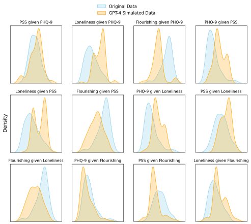

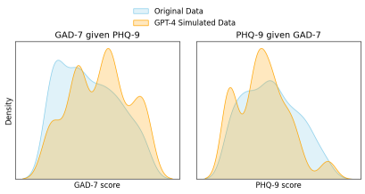

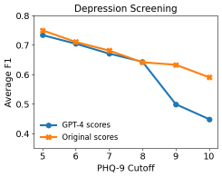

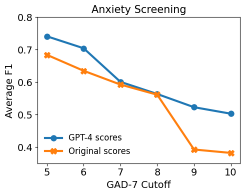

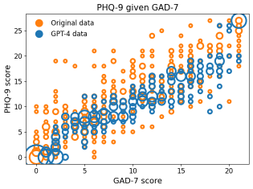

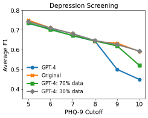

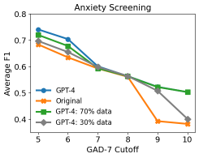

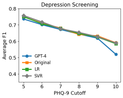

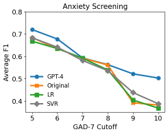

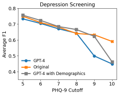

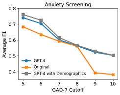

[Arxiv](https://arxiv.org/abs/2403.17219)