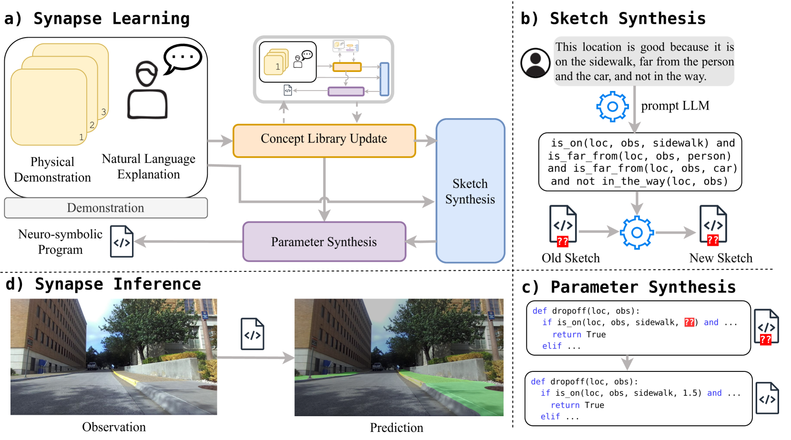
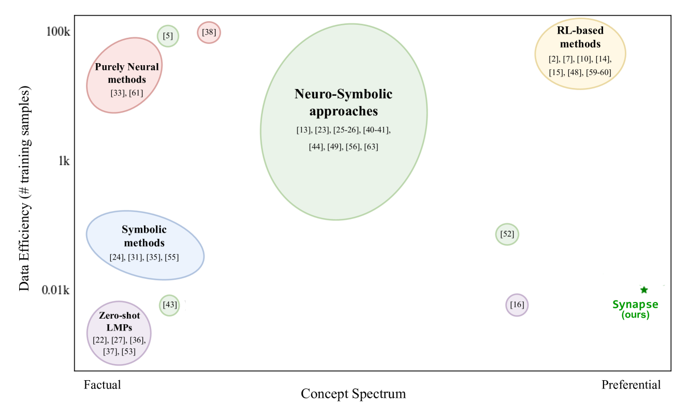
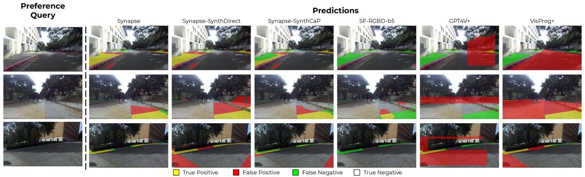
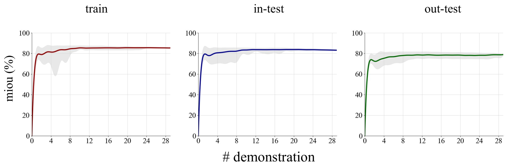
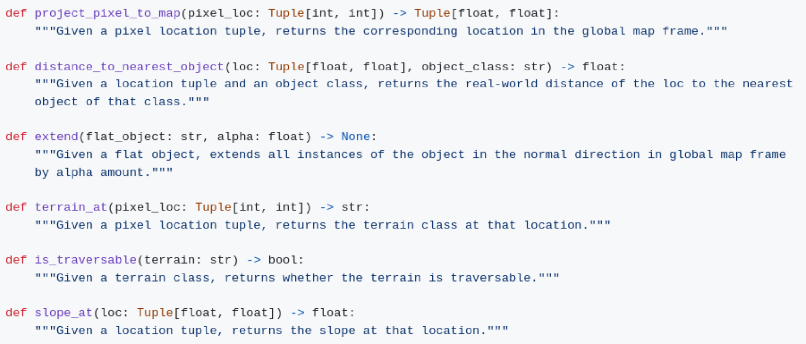

# Synapse项目致力于从视觉演示中提炼并学习优先级较高的概念。

发布时间：2024年03月25日

`Agent` `自动驾驶` `机器人技术`

> Synapse: Learning Preferential Concepts from Visual Demonstrations

> 本文探讨了从视觉输入中挖掘用户个性化偏好（如“理想停车位”、“便利下车点”）的偏好学习问题，这一任务虽与识别客观实体（如“红色立方体”）类似，但因其主观性和个人特有训练数据匮乏，难度更大。我们采用名为Synapse的创新神经符号框架，设计用于从少量示例中高效习得优先级概念。Synapse运用特定领域的神经符号程序，在图像操作的基础上，结合视觉解析、大型语言模型及程序合成技术，以学习体现个体偏好的程序。通过深入广泛的实验，包括针对移动机器人和自动驾驶领域移动相关概念的用户案例研究，我们验证了Synapse明显优于现有基准及其他消融实验版本。项目的代码和更多详情可在项目官网https://amrl.cs.utexas.edu/synapse 获取。

> This paper addresses the problem of preference learning, which aims to learn user-specific preferences (e.g., "good parking spot", "convenient drop-off location") from visual input. Despite its similarity to learning factual concepts (e.g., "red cube"), preference learning is a fundamentally harder problem due to its subjective nature and the paucity of person-specific training data. We address this problem using a new framework called Synapse, which is a neuro-symbolic approach designed to efficiently learn preferential concepts from limited demonstrations. Synapse represents preferences as neuro-symbolic programs in a domain-specific language (DSL) that operates over images, and leverages a novel combination of visual parsing, large language models, and program synthesis to learn programs representing individual preferences. We evaluate Synapse through extensive experimentation including a user case study focusing on mobility-related concepts in mobile robotics and autonomous driving. Our evaluation demonstrates that Synapse significantly outperforms existing baselines as well as its own ablations. The code and other details can be found on the project website https://amrl.cs.utexas.edu/synapse .

[Arxiv](https://arxiv.org/abs/2403.16689)