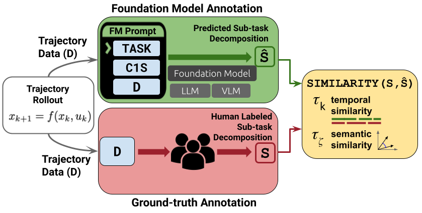
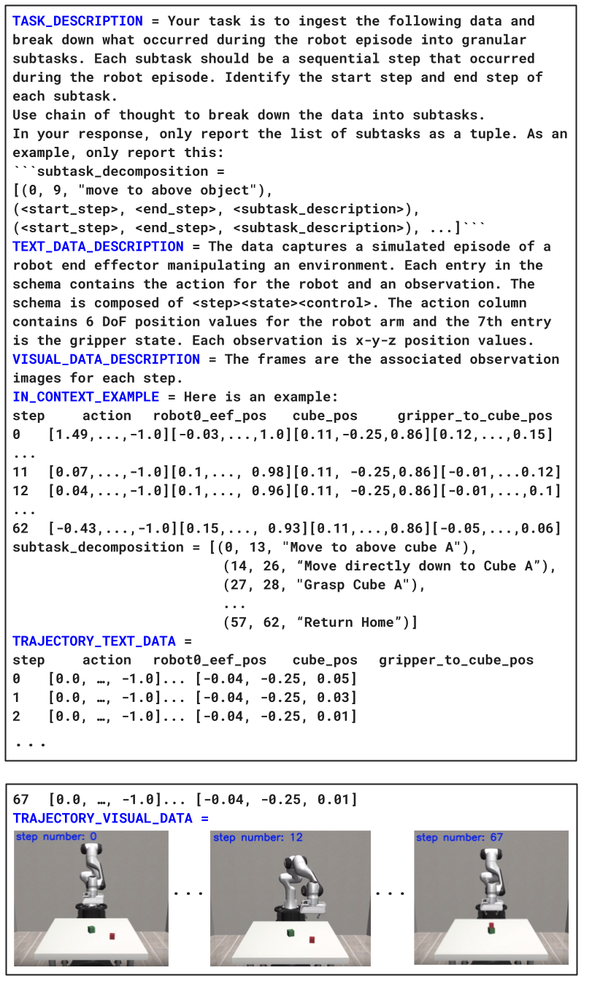
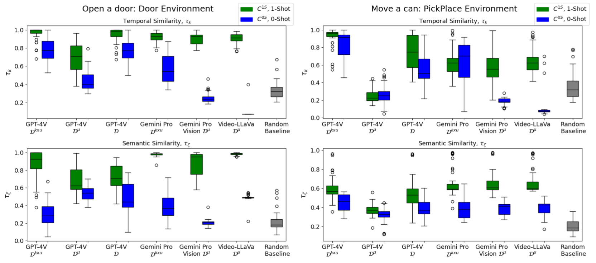

# 在对机器人子任务进行事后分析时，我们关注基础模型的时间和语义评估指标。

发布时间：2024年03月25日

`LLM应用` `机器人` `运动规划`

> Temporal and Semantic Evaluation Metrics for Foundation Models in Post-Hoc Analysis of Robotic Sub-tasks

> 最新的任务与运动规划研究揭示，通过在语言指导下训练机器人轨迹控制策略，并结合优质标注数据，能显著提升任务执行的成功率。然而，这类数据的匮乏限制了这些方法在更广泛应用场景中的推广。为应对这一挑战，我们提出了一个创新的自动化框架，该框架通过运用最新的基础模型提示技术，将轨迹数据分解为具有时间界限和自然语言描述的子任务，这些基础模型包括大型语言模型和视觉语言模型。我们的框架为完整轨迹中的低级子任务提供了时间和语言双重描述。我们开发了SIMILARITY算法，用于生成两个新的评估指标——时间相似性和语义相似性，以严格衡量两个子任务分解之间的语言描述在时间和语义上的匹配度。在多个机器人实验环境中，我们的框架在时间相似性和语义相似性上均取得了超过90%的高分，远超随机基线的30%，这一成果证明了我们方法的有效性。我们的研究成果为构建多样化、大规模的语言监督机器人数据集铺平了道路，从而有望推动任务与运动规划技术的发展。

> Recent works in Task and Motion Planning (TAMP) show that training control policies on language-supervised robot trajectories with quality labeled data markedly improves agent task success rates. However, the scarcity of such data presents a significant hurdle to extending these methods to general use cases. To address this concern, we present an automated framework to decompose trajectory data into temporally bounded and natural language-based descriptive sub-tasks by leveraging recent prompting strategies for Foundation Models (FMs) including both Large Language Models (LLMs) and Vision Language Models (VLMs). Our framework provides both time-based and language-based descriptions for lower-level sub-tasks that comprise full trajectories. To rigorously evaluate the quality of our automatic labeling framework, we contribute an algorithm SIMILARITY to produce two novel metrics, temporal similarity and semantic similarity. The metrics measure the temporal alignment and semantic fidelity of language descriptions between two sub-task decompositions, namely an FM sub-task decomposition prediction and a ground-truth sub-task decomposition. We present scores for temporal similarity and semantic similarity above 90%, compared to 30% of a randomized baseline, for multiple robotic environments, demonstrating the effectiveness of our proposed framework. Our results enable building diverse, large-scale, language-supervised datasets for improved robotic TAMP.

[Arxiv](https://arxiv.org/abs/2403.17238)