# 致力于打造人机协同决策的新高度，本研究设计并评估了一种基于大型语言模型赋能的审议式人工智能系统，以助力于人工智能辅助决策过程。

发布时间：2024年03月25日

`Agent` `决策支持系统` `人工智能伦理`

> Towards Human-AI Deliberation: Design and Evaluation of LLM-Empowered Deliberative AI for AI-Assisted Decision-Making

# 摘要

> 在AI辅助决策中，人类通常只是审慎考量AI建议的整体采纳与否，而鲜少深入分析，在意见不合时，也难以向AI精确传达复杂矛盾的观点。为此，我们创新性地提出了“人机协同审议”框架，鼓励人在决策时对与AI存在的冲突观点进行深度反思和讨论。这一框架借鉴人类审议理论，引导人类和AI在各维度层次上交换意见、开展审议讨论并及时更新决策。为了赋予AI审议交流的能力，我们专门设计了审议型AI，通过大型语言模型（LLMs）作为媒介，衔接人类与特定领域的模型，确保对话互动既灵活又信息传递准确。在一项关于研究生招生任务的初步评估中，审议型AI展现出了相较于传统可解释AI（XAI）助手在提升人类合理依赖程度和任务完成质量上的优势。通过对参与者行为、感知、体验和开放反馈的综合分析，我们为今后AI辅助决策工具的设计提供了具有指导意义的见解。

> In AI-assisted decision-making, humans often passively review AI's suggestion and decide whether to accept or reject it as a whole. In such a paradigm, humans are found to rarely trigger analytical thinking and face difficulties in communicating the nuances of conflicting opinions to the AI when disagreements occur. To tackle this challenge, we propose Human-AI Deliberation, a novel framework to promote human reflection and discussion on conflicting human-AI opinions in decision-making. Based on theories in human deliberation, this framework engages humans and AI in dimension-level opinion elicitation, deliberative discussion, and decision updates. To empower AI with deliberative capabilities, we designed Deliberative AI, which leverages large language models (LLMs) as a bridge between humans and domain-specific models to enable flexible conversational interactions and faithful information provision. An exploratory evaluation on a graduate admissions task shows that Deliberative AI outperforms conventional explainable AI (XAI) assistants in improving humans' appropriate reliance and task performance. Based on a mixed-methods analysis of participant behavior, perception, user experience, and open-ended feedback, we draw implications for future AI-assisted decision tool design.

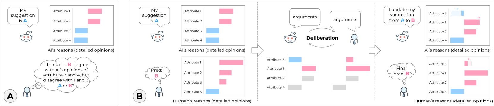

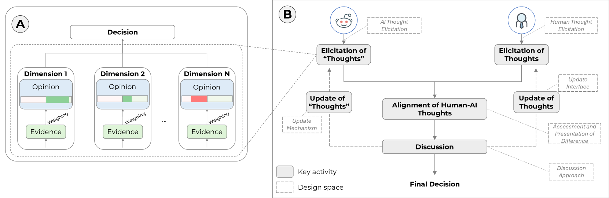

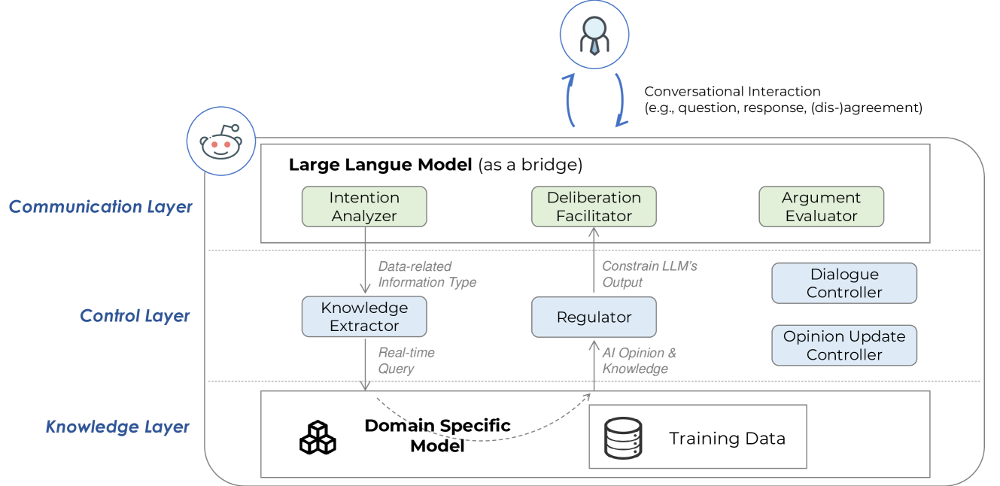

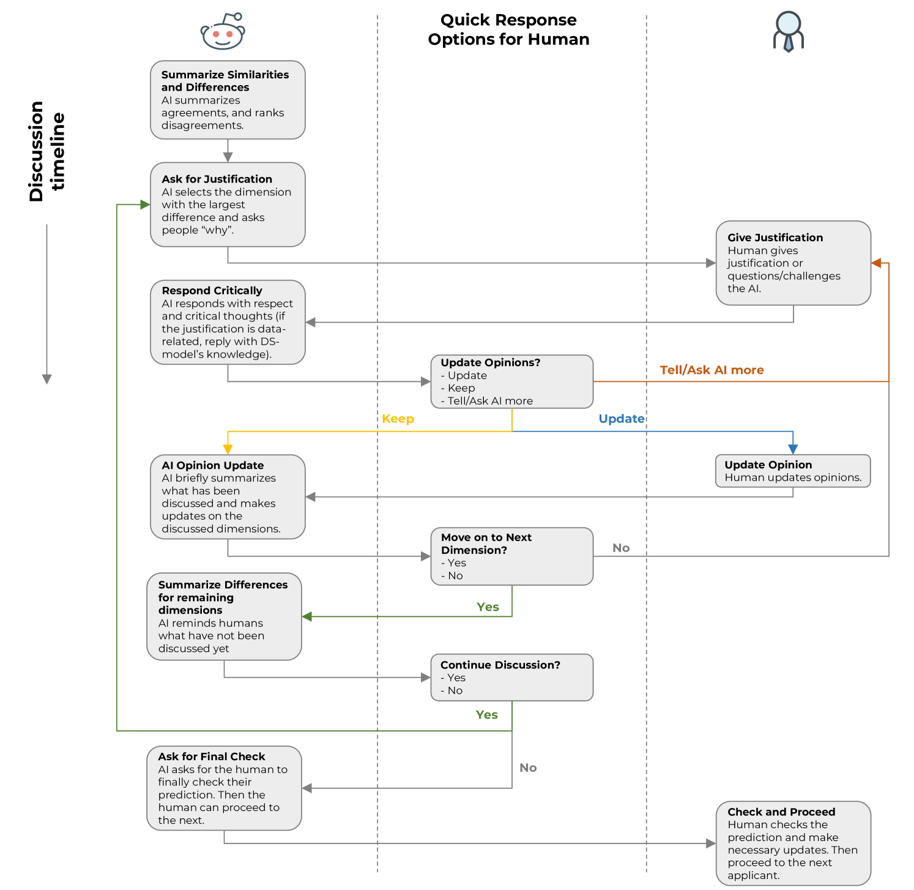

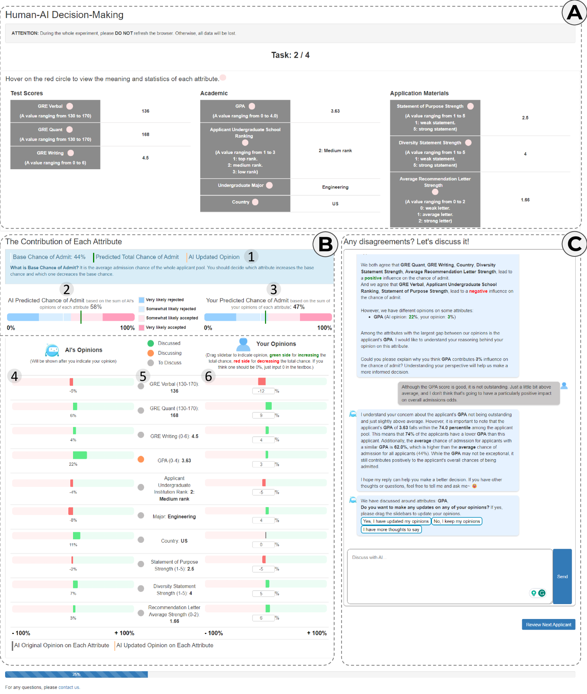

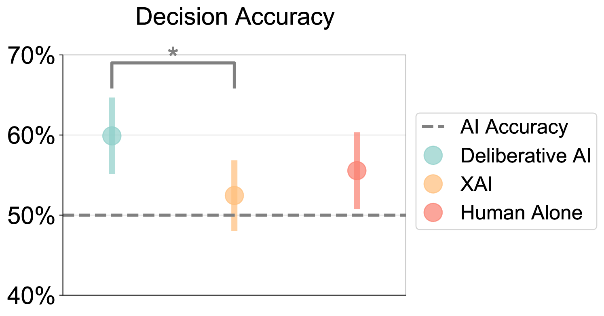

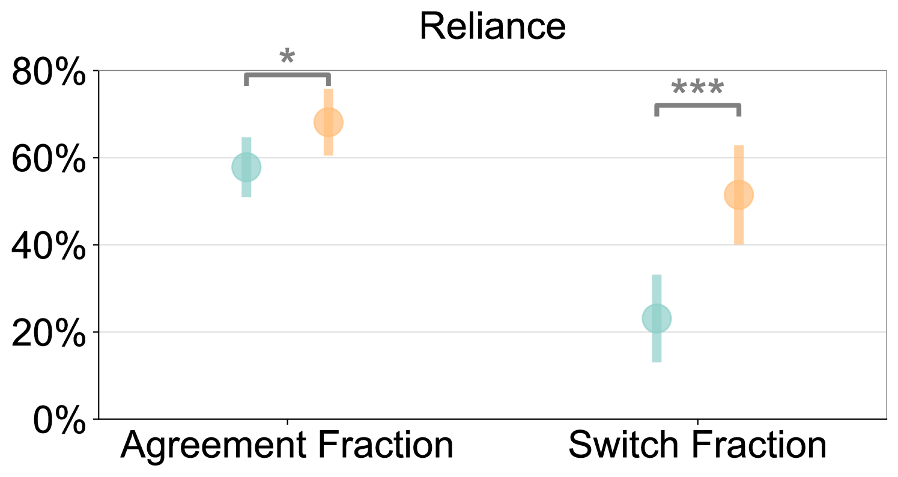

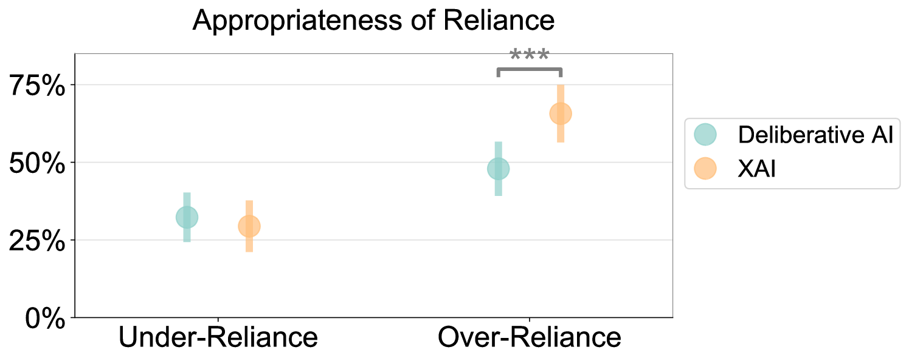

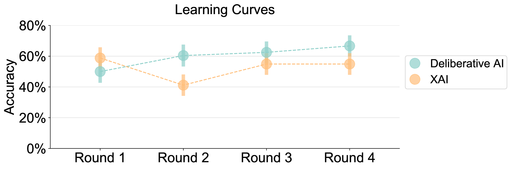

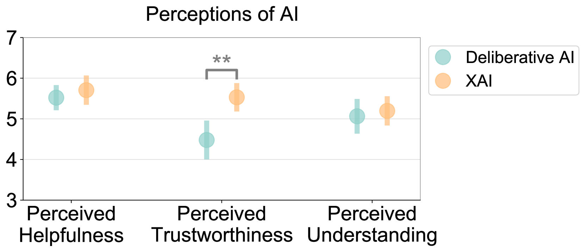

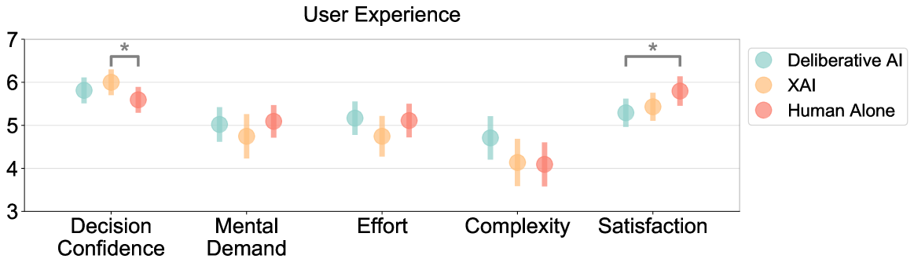

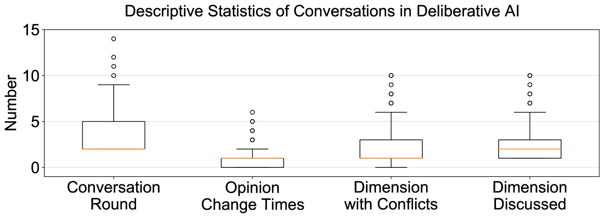

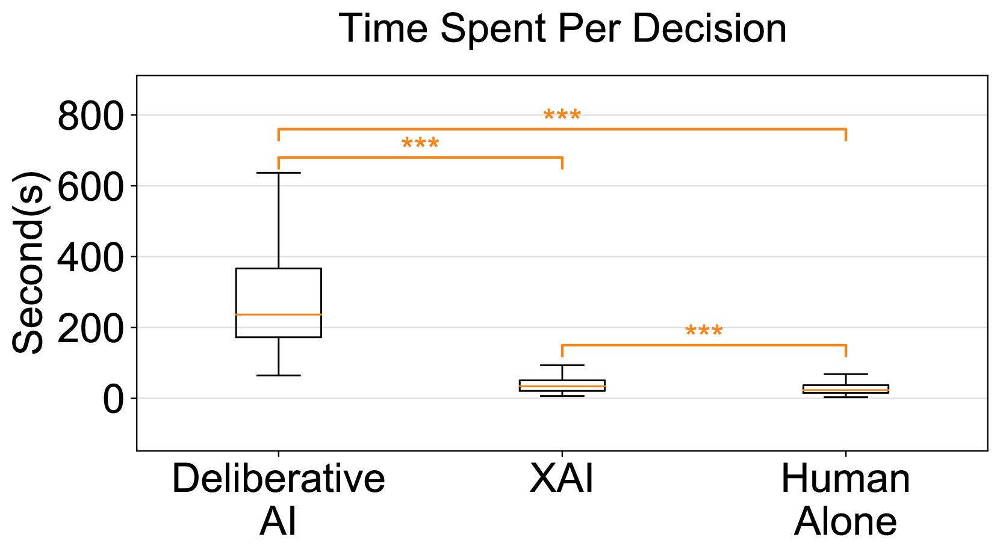

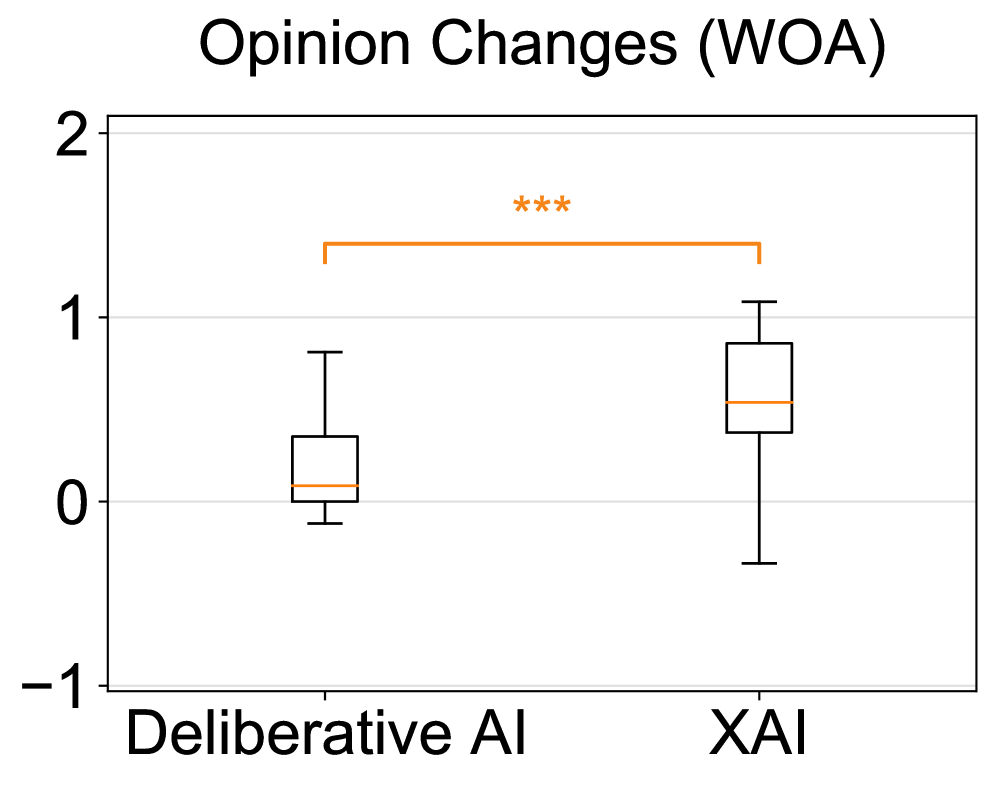

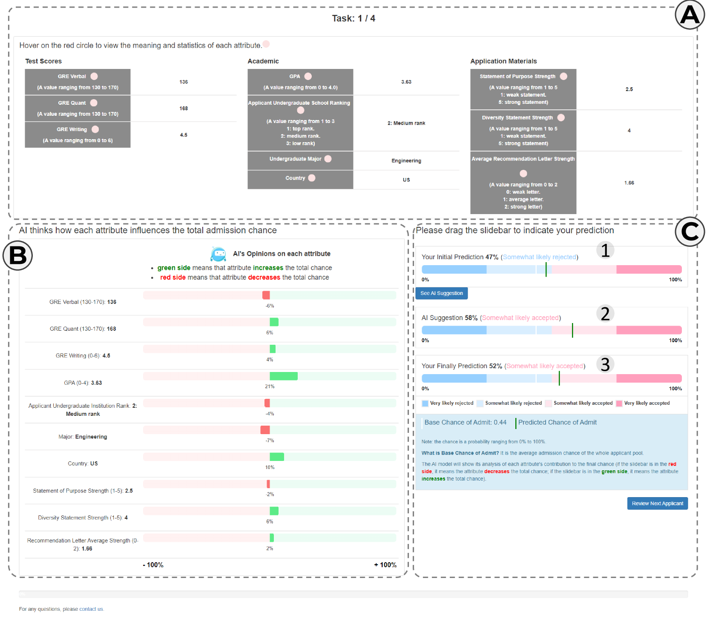

[Arxiv](https://arxiv.org/abs/2403.16812)