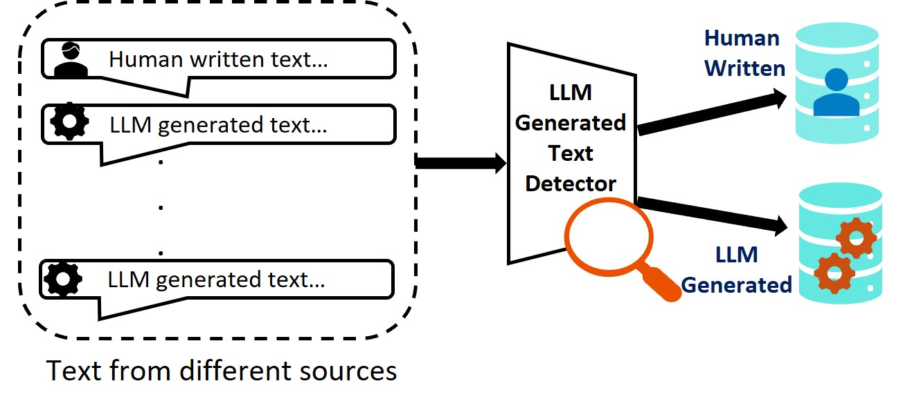

# 在 SemEval-2024 第 8 项任务中，TrustAI 对多领域机器生成文本检测技术进行了深入且全面的研究分析。

发布时间：2024年03月25日

`LLM应用` `文本生成检测`

> TrustAI at SemEval-2024 Task 8: A Comprehensive Analysis of Multi-domain Machine Generated Text Detection Techniques

# 摘要

> LLMs在面对各类用户查询时，生成流畅内容的能力令人瞩目，但同时也引发了对虚假信息扩散和个人隐私泄露等问题的关注。在本论文中，我们针对SemEval2024任务8提出了我们的解决方案，旨在跨多元语境下识别各领域中的机器生成文本，无论其是单语还是多语环境。我们系统地探究了包括统计学方法、神经网络模型以及预训练模型在内的多种检测手段，并详尽描述了实验架构与深入的误差分析过程，以此验证这些方法的实际效能。实验结果显示，我们在子任务A的测试集中取得了86.9%的准确度，而在子任务B中达到了83.7%的准确度。此外，我们还着重指出了未来研究中需要关注的关键挑战和重要因素。

> The Large Language Models (LLMs) exhibit remarkable ability to generate fluent content across a wide spectrum of user queries. However, this capability has raised concerns regarding misinformation and personal information leakage. In this paper, we present our methods for the SemEval2024 Task8, aiming to detect machine-generated text across various domains in both mono-lingual and multi-lingual contexts. Our study comprehensively analyzes various methods to detect machine-generated text, including statistical, neural, and pre-trained model approaches. We also detail our experimental setup and perform a in-depth error analysis to evaluate the effectiveness of these methods. Our methods obtain an accuracy of 86.9\% on the test set of subtask-A mono and 83.7\% for subtask-B. Furthermore, we also highlight the challenges and essential factors for consideration in future studies.

[Arxiv](https://arxiv.org/abs/2403.16592)