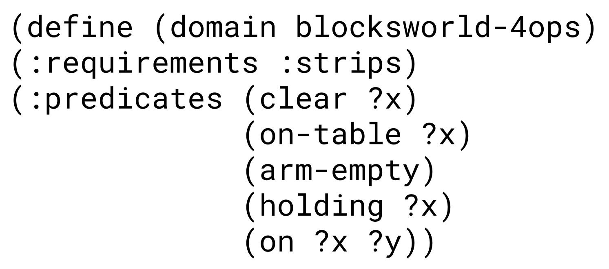
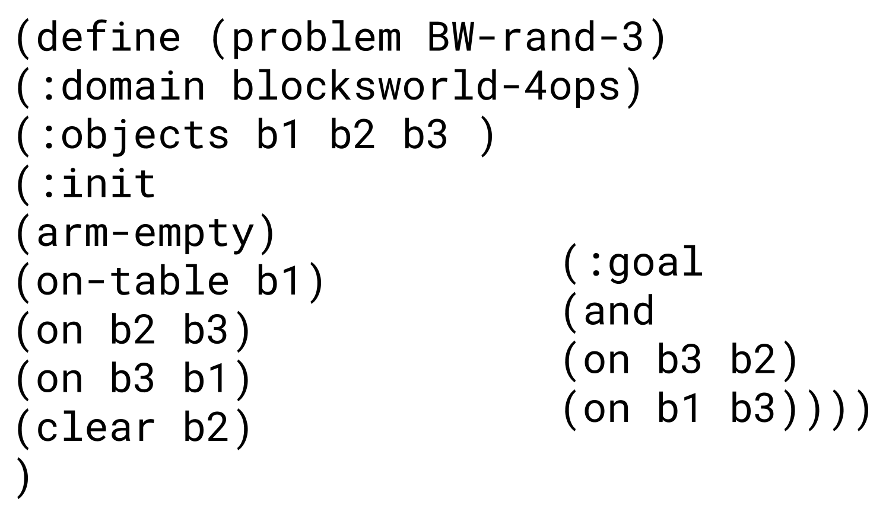
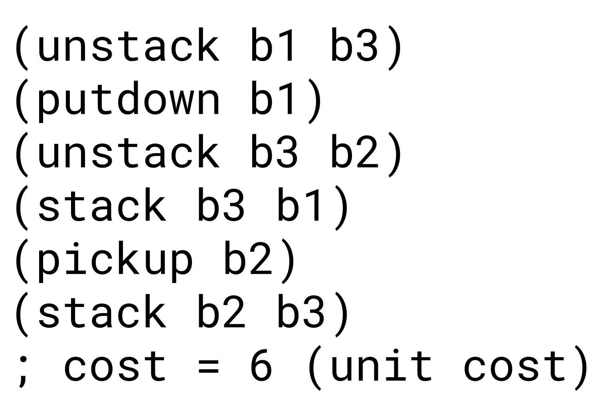
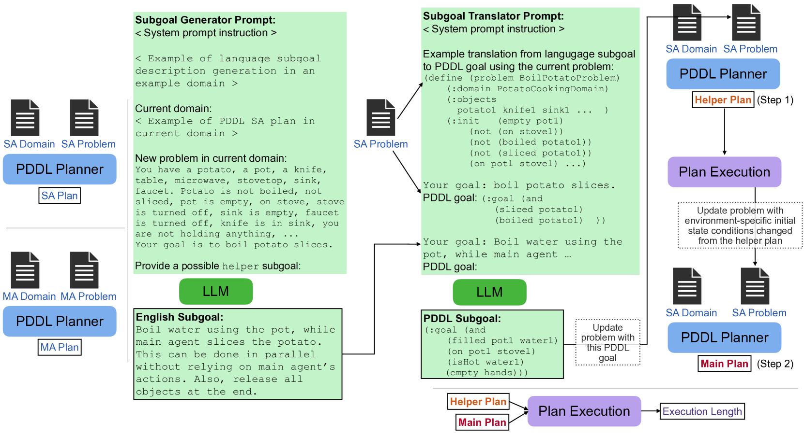

# TwoStep：结合传统规划器与大型语言模型实现多智能体任务协同规划

发布时间：2024年03月25日

`Agent` `人工智能` `多代理系统`

> TwoStep: Multi-agent Task Planning using Classical Planners and Large Language Models

> 传统规划如PDDL能确保在初始状态下通过一系列动作达到目标状态，如果有解决方案的话。但PDDL并未充分考虑动作执行的时间因素，例如，如果两个代理的动作后条件不冲突，它们本可以同时执行动作。人类专家能将目标拆分成独立的子目标，并分配给不同的代理，以此利用并行行动加速计划的执行。而大型语言模型（LLMs）虽然不能保证行动的成功执行，却能借助常识推理串联行动序列。我们结合了传统规划的严谨和LLMs的推理能力，模仿人类对多代理规划目标的分解直觉。实验表明，这种基于LLM的目标分解方法在规划时间上比直接处理多代理PDDL问题要快，同时执行步骤比单一代理计划更少，且成功率不减。此外，我们还发现，LLMs对子目标的近似处理能达到与人类专家相当的多代理执行步骤。详情和资源请访问 https://glamor-usc.github.io/twostep。

> Classical planning formulations like the Planning Domain Definition Language (PDDL) admit action sequences guaranteed to achieve a goal state given an initial state if any are possible. However, reasoning problems defined in PDDL do not capture temporal aspects of action taking, for example that two agents in the domain can execute an action simultaneously if postconditions of each do not interfere with preconditions of the other. A human expert can decompose a goal into largely independent constituent parts and assign each agent to one of these subgoals to take advantage of simultaneous actions for faster execution of plan steps, each using only single agent planning. By contrast, large language models (LLMs) used for directly inferring plan steps do not guarantee execution success, but do leverage commonsense reasoning to assemble action sequences. We combine the strengths of classical planning and LLMs by approximating human intuitions for two-agent planning goal decomposition. We demonstrate that LLM-based goal decomposition leads to faster planning times than solving multi-agent PDDL problems directly while simultaneously achieving fewer plan execution steps than a single agent plan alone and preserving execution success. Additionally, we find that LLM-based approximations of subgoals can achieve similar multi-agent execution steps than those specified by human experts. Website and resources at https://glamor-usc.github.io/twostep

[Arxiv](https://arxiv.org/abs/2403.17246)