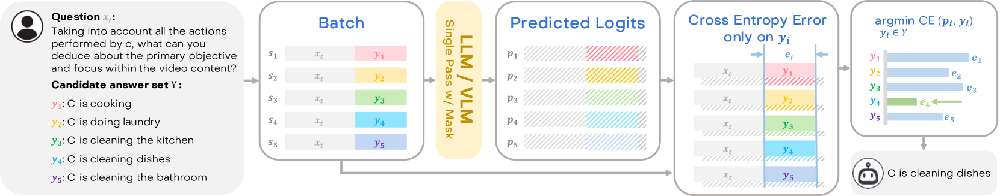
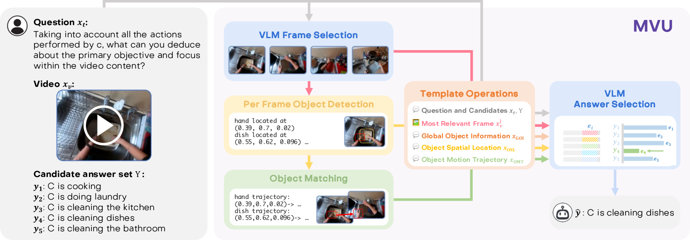
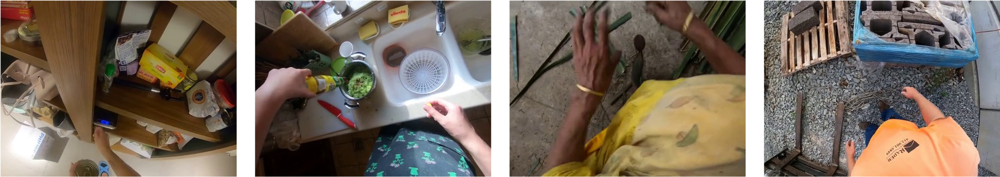
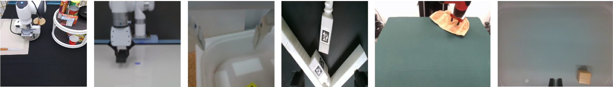

# 通过单次多模态语言模型推理解析长视频内容

发布时间：2024年03月25日

`LLM应用` `视频理解` `多模态`

> Understanding Long Videos in One Multimodal Language Model Pass

> 近年来，富含世界知识的大型语言模型（LLMs）助力各类方法在长视频理解领域取得卓越成果，但其高昂的推理代价不容忽视。为此，我们在本研究中创新性地提出了“可能性选择”这一简便策略，它能在自回归LLMs中加速处理长视频基准测试中常见的多选任务。惊喜的是，这种优化不仅提升了推理速度，即便不借助任何特定视频信息，所得到的模型在长视频任务上的精度也相当出色。借此契机，我们进一步引入了从预训练模型中提炼出的与视频相关的对象中心信息，并以自然语言作为桥梁实现信息融合。最终形成的多模态视频理解（MVU）框架，在长视频及细粒度动作识别基准测试上均达到了业界领先水平。相关代码已开源，访问地址：https://github.com/kahnchana/mvu

> Large Language Models (LLMs), known to contain a strong awareness of world knowledge, have allowed recent approaches to achieve excellent performance on Long-Video Understanding benchmarks, but at high inference costs. In this work, we first propose Likelihood Selection, a simple technique that unlocks faster inference in autoregressive LLMs for multiple-choice tasks common in long-video benchmarks. In addition to faster inference, we discover the resulting models to yield surprisingly good accuracy on long-video tasks, even with no video specific information. Building on this, we inject video-specific object-centric information extracted from off-the-shelf pre-trained models and utilize natural language as a medium for information fusion. Our resulting Multimodal Video Understanding (MVU) framework demonstrates state-of-the-art performance across long-video and fine-grained action recognition benchmarks. Code available at: https://github.com/kahnchana/mvu

[Arxiv](https://arxiv.org/abs/2403.16998)