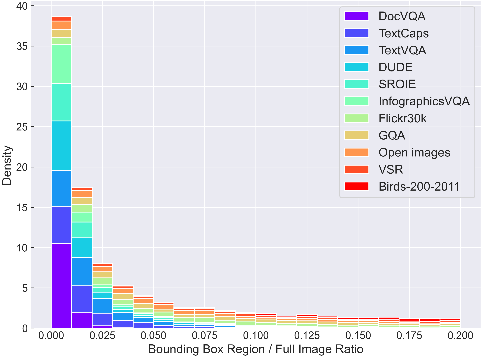
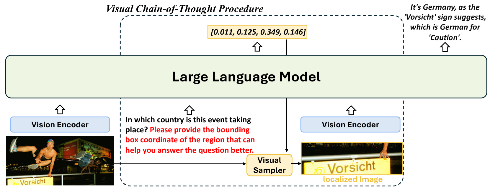
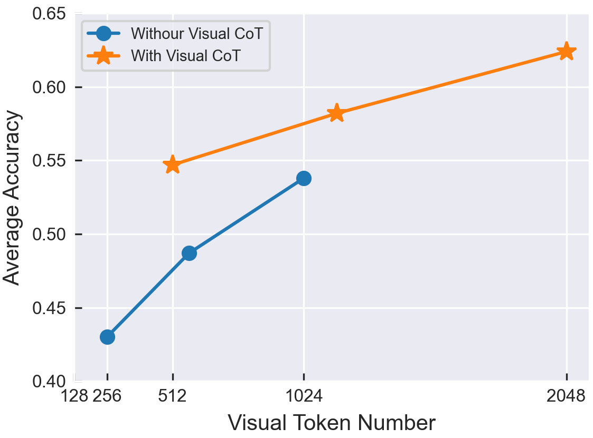
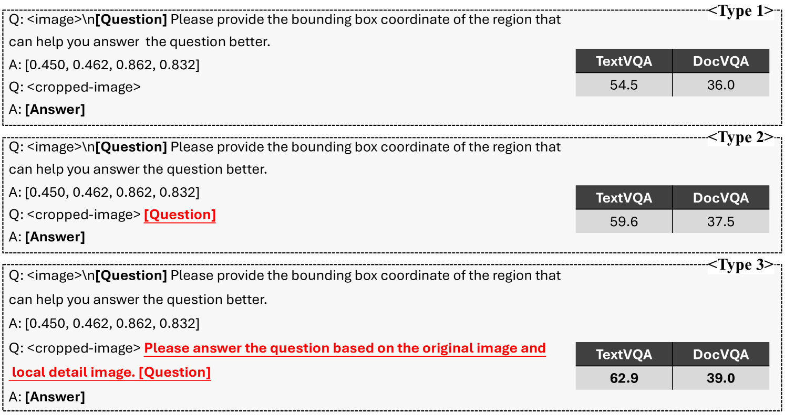
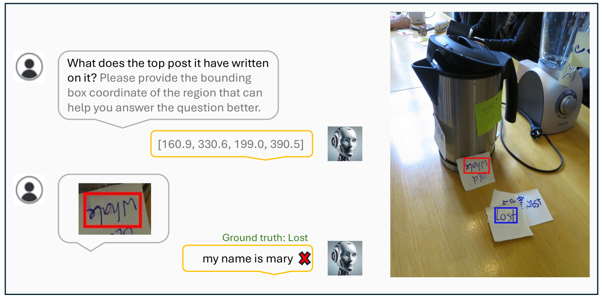
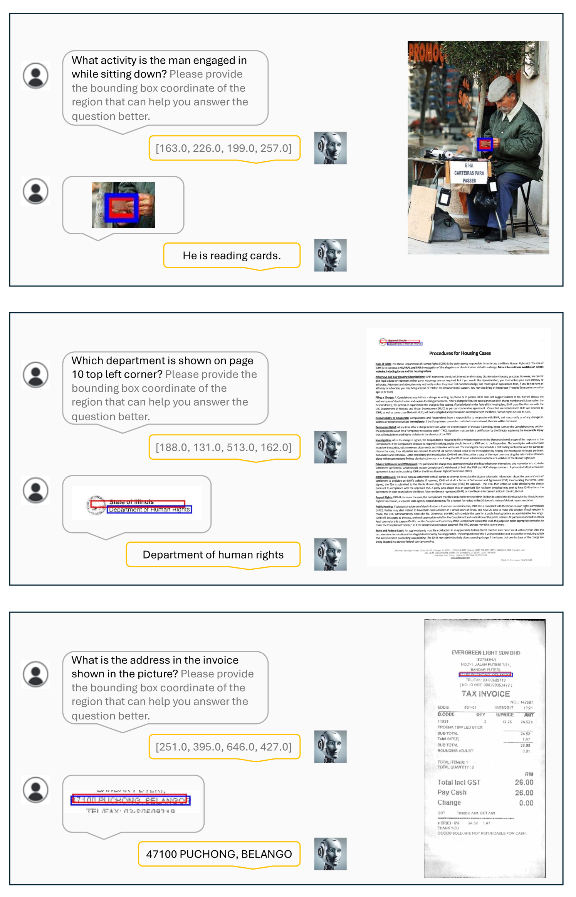

# Visual CoT：激活多模态语言模型中的链式思维推理能力，旨在解锁其在处理多模态信息时进行深度逻辑推理的潜力。

发布时间：2024年03月25日

`Agent` `计算机视觉` `多模态机器学习`

> Visual CoT: Unleashing Chain-of-Thought Reasoning in Multi-Modal Language Models

> 本研究提出了一种创新的Visual CoT方法，利用多模态大型语言模型（MLLMs）的推理能力，通过融入视觉链式思维（CoT）来解决复杂视觉问题。尽管MLLMs已在各类视觉任务中展现出潜力，但在处理复杂视觉输入及模型可解释性方面仍存在局限。因此，我们设计了一种能聚焦视觉输入并生成可解读推理过程的多轮处理流程。我们创建并发布了包含37.3万对标注有关键区域边框的问题-答案对的Visual CoT数据集，以评测MLLMs在特定局部区域识别任务中的性能。大量实验证明了此框架的有效性，并为优化推理策略提供了新见解。为了推动相关领域的深入研究，我们已开放Visual CoT数据集、基准测试工具及预训练模型资源。

> This paper presents Visual CoT, a novel pipeline that leverages the reasoning capabilities of multi-modal large language models (MLLMs) by incorporating visual Chain-of-Thought (CoT) reasoning. While MLLMs have shown promise in various visual tasks, they often lack interpretability and struggle with complex visual inputs. To address these challenges, we propose a multi-turn processing pipeline that dynamically focuses on visual inputs and provides interpretable thoughts. We collect and introduce the Visual CoT dataset comprising 373k question-answer pairs, annotated with intermediate bounding boxes highlighting key regions essential for answering the questions. Importantly, the introduced benchmark is capable of evaluating MLLMs in scenarios requiring specific local region identification. Extensive experiments demonstrate the effectiveness of our framework and shed light on better inference strategies. The Visual CoT dataset, benchmark, and pre-trained models are available to foster further research in this direction.

[Arxiv](https://arxiv.org/abs/2403.16999)