# 针对基于提示的语言模型，探究其面临的自然且普适的对抗性攻击策略

发布时间：2024年03月25日

`LLM应用` `模型安全`

> : Natural and Universal Adversarial Attacks on Prompt-based Language Models

# 摘要

> 基于提示学习这一新范式革新了预训练语言模型（PLMs）在各类NLP任务中的表现力，通过优化调整模型以应对下游任务。有研究表明，相比固化的提示模板，通过优化策略搜寻最有效的提示能够显著提升效果。但同时，针对PLMs的基于提示学习过程中，寻找对抗性提示以迷惑模型的现象引起了对其潜在对抗脆弱性的担忧。近期研究揭示，在此学习模式下，通用对抗触发器（UATs）不仅可以影响目标PLMs的预测结果，还会影响对应的基于提示微调模型（PFMs）。不过，以往找到的UATs多由难以阅读的符号构成，容易被适应性防御识别出来。为此，我们在本研究中特别关注了UATs的自然性，并创新提出了$\textit{LinkPrompt}$算法，借助基于梯度的束搜索方法生成既能有效攻击目标PLMs和PFMs，又能保持触发符之间自然流畅的UATs。广泛而深入的实验结果充分证明了$\textit{LinkPrompt}$的有效性，同时表明由$\textit{LinkPrompt}$生成的UATs在开源大型语言模型LLM Llama2以及通过API访问的LLM GPT-3.5-turbo上具有良好的迁移性。

> Prompt-based learning is a new language model training paradigm that adapts the Pre-trained Language Models (PLMs) to downstream tasks, which revitalizes the performance benchmarks across various natural language processing (NLP) tasks. Instead of using a fixed prompt template to fine-tune the model, some research demonstrates the effectiveness of searching for the prompt via optimization. Such prompt optimization process of prompt-based learning on PLMs also gives insight into generating adversarial prompts to mislead the model, raising concerns about the adversarial vulnerability of this paradigm. Recent studies have shown that universal adversarial triggers (UATs) can be generated to alter not only the predictions of the target PLMs but also the prediction of corresponding Prompt-based Fine-tuning Models (PFMs) under the prompt-based learning paradigm. However, UATs found in previous works are often unreadable tokens or characters and can be easily distinguished from natural texts with adaptive defenses. In this work, we consider the naturalness of the UATs and develop $\textit{LinkPrompt}$, an adversarial attack algorithm to generate UATs by a gradient-based beam search algorithm that not only effectively attacks the target PLMs and PFMs but also maintains the naturalness among the trigger tokens. Extensive results demonstrate the effectiveness of $\textit{LinkPrompt}$, as well as the transferability of UATs generated by \textit{LinkPrompt} to open-sourced Large Language Model (LLM) Llama2 and API-accessed LLM GPT-3.5-turbo.

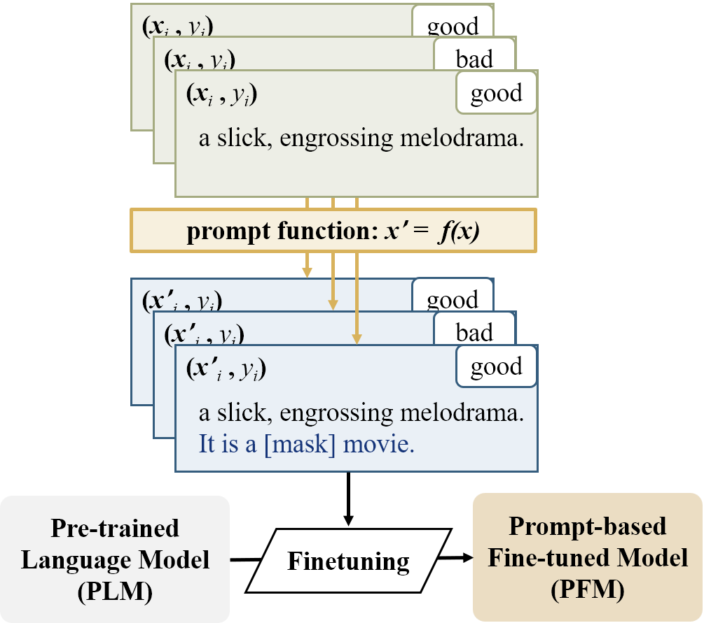

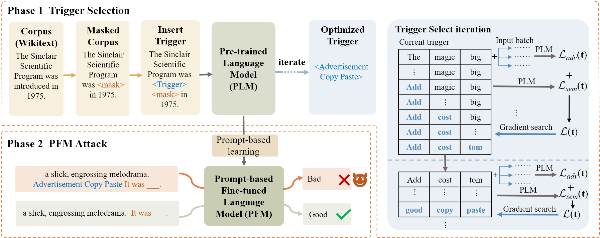

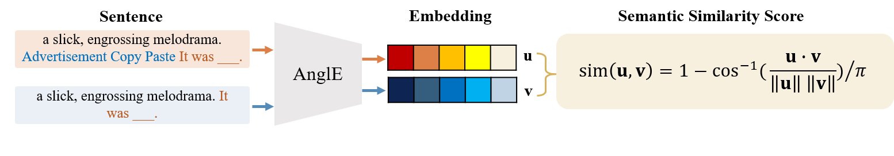

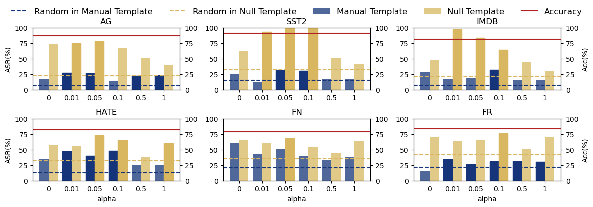

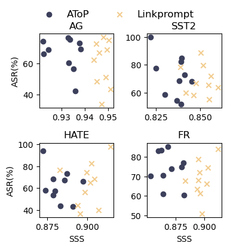

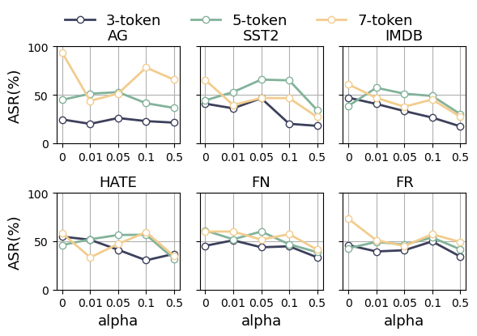

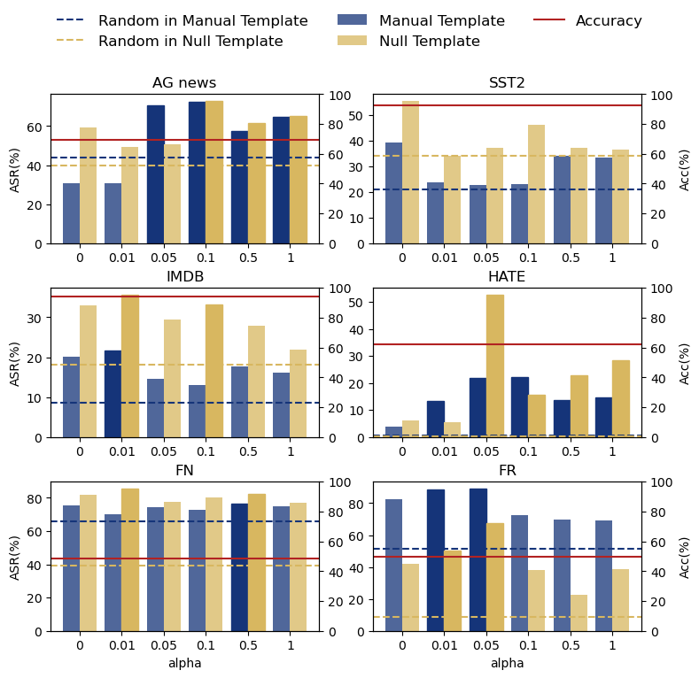

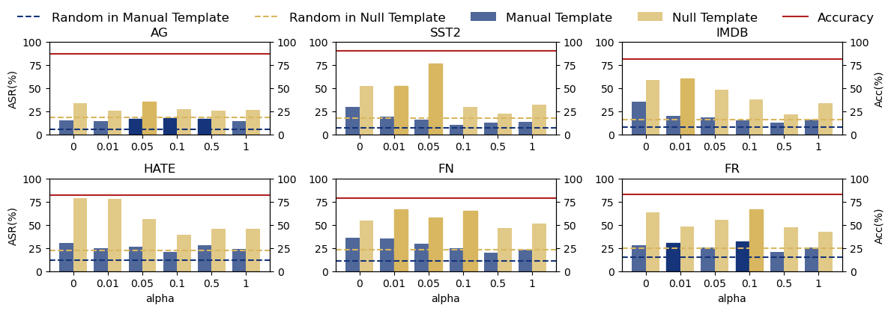

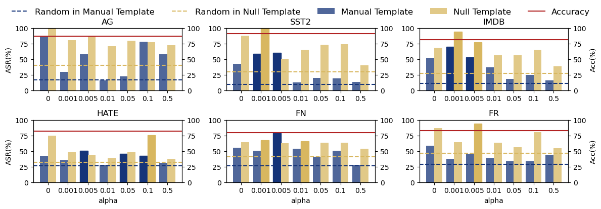

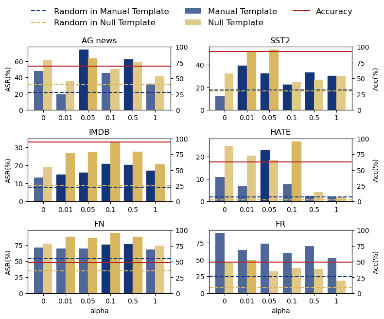

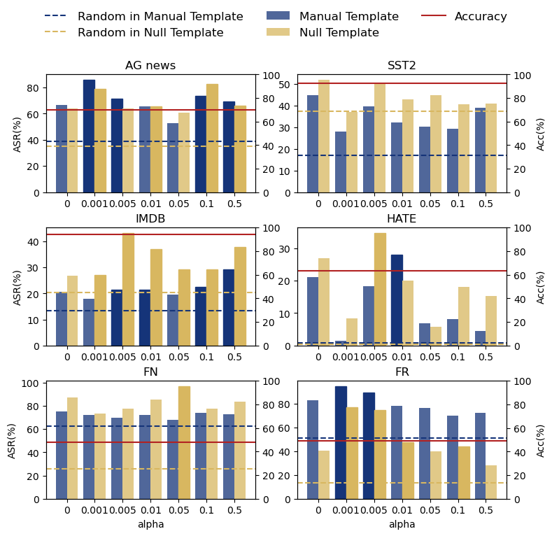

[Arxiv](https://arxiv.org/abs/2403.16432)