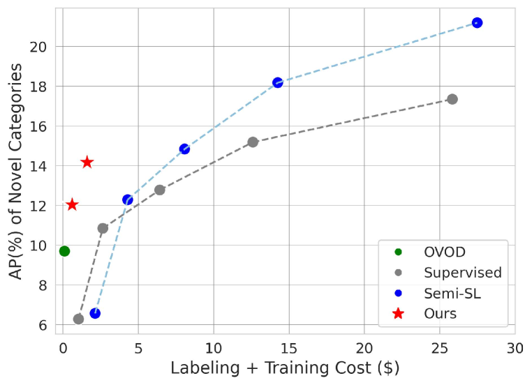
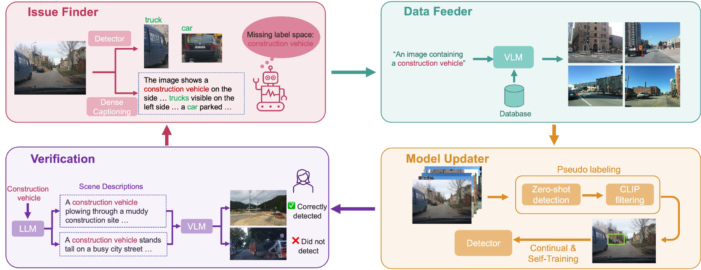
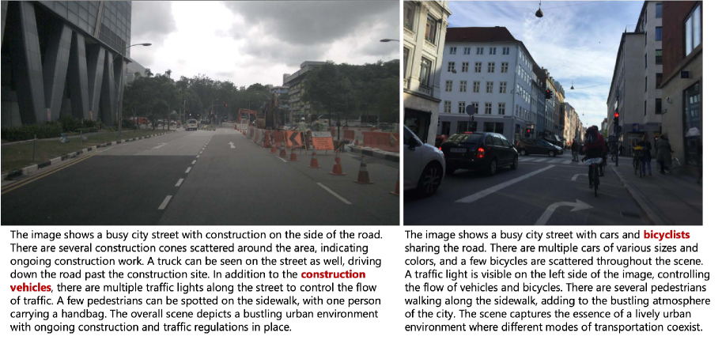
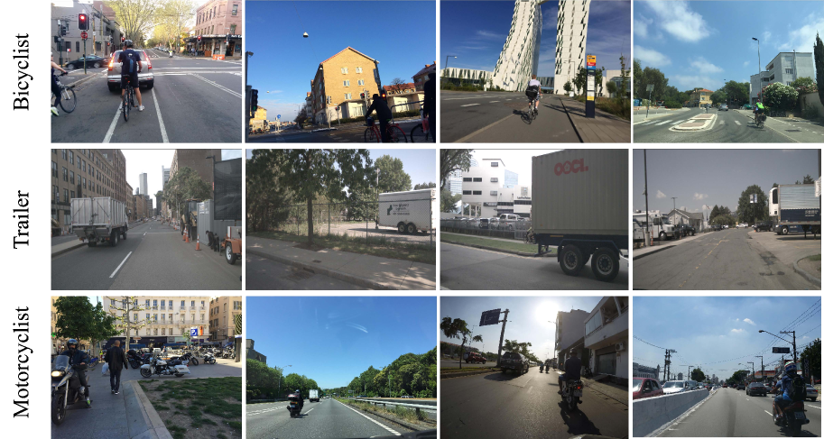
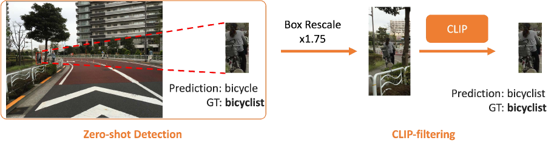
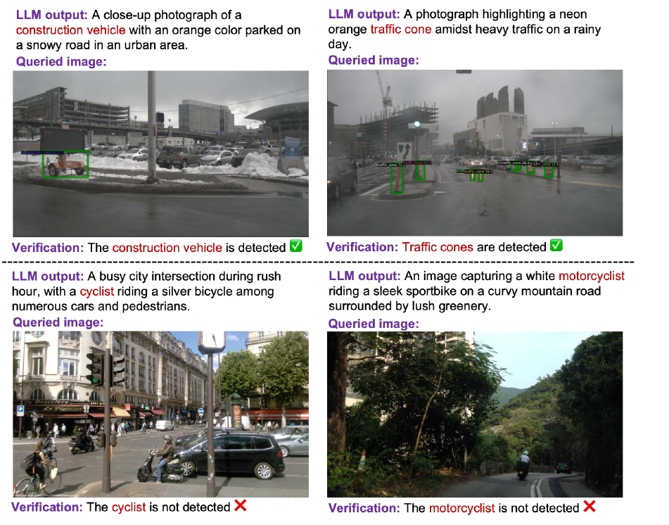
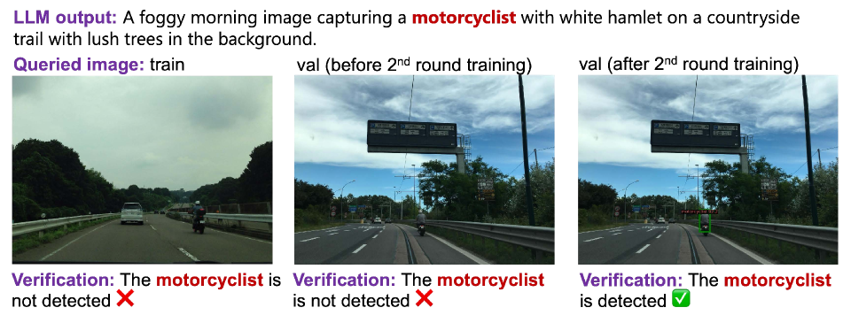
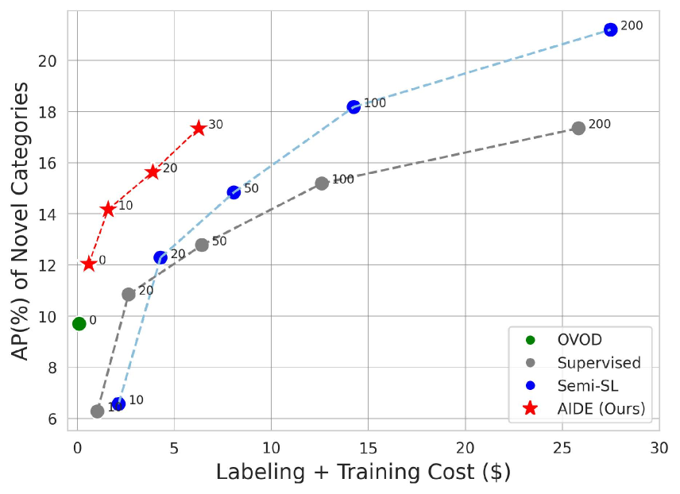

# AIDE：自动驾驶领域中的物体检测自动化数据引擎

发布时间：2024年03月26日

`Agent` `自动驾驶` `数据标注`

> AIDE: An Automatic Data Engine for Object Detection in Autonomous Driving

> 自动驾驶系统视强大的感知模型为安全的根基。但道路上的罕见或未知物体，常常让感知模型面临挑战。为此，我们需要不断投入大量人力来筛选和标注数据，这个过程代价不菲。我们提出运用最新的视觉-语言技术和大型语言模型，打造一个名为自动数据引擎（AIDE）的系统，它能自动发现问题、智能管理数据、通过自动标注优化模型，并通过创造多样场景对模型进行验证。这个系统能够不断迭代升级，实现模型的自我提升。此外，我们还为开放世界的AV数据集检测建立了一个基准，全面评价了各种学习模式，并证明了我们方法在降低成本的同时，性能卓越。

> Autonomous vehicle (AV) systems rely on robust perception models as a cornerstone of safety assurance. However, objects encountered on the road exhibit a long-tailed distribution, with rare or unseen categories posing challenges to a deployed perception model. This necessitates an expensive process of continuously curating and annotating data with significant human effort. We propose to leverage recent advances in vision-language and large language models to design an Automatic Data Engine (AIDE) that automatically identifies issues, efficiently curates data, improves the model through auto-labeling, and verifies the model through generation of diverse scenarios. This process operates iteratively, allowing for continuous self-improvement of the model. We further establish a benchmark for open-world detection on AV datasets to comprehensively evaluate various learning paradigms, demonstrating our method's superior performance at a reduced cost.

[Arxiv](https://arxiv.org/abs/2403.17373)