# 本研究探讨了时间变化社交网络中影响意见扩散的三种影响者典型角色。

发布时间：2024年03月26日

`Agent` `社交网络` `伦理问题`

> A Study of Three Influencer Archetypes for the Control of Opinion Spread in Time-Varying Social Networks

# 摘要

> 本研究探讨了时变社交网络中信息传播的影响，代理们倾向于关注观点相近的其他代理，同时切断与观点差异较大的邻居的联系。从古至今，意见控制和说服策略层出不穷，包括教育、说服、宣传、营销以及利用错误信息、虚假信息和恶意信息进行操纵。但随着大型语言模型和生成性AI技术的兴起，意见控制的自动化在近年来变得易于广泛应用，它们能够将意见控制者的量化指令转换成具有恰当细微差别的实际内容。社交网络中的自动代理可用于多种目的，如打破信息孤岛、建立有价值的新连接或影响目标群体的意见，这些都引发了亟需关注和深入讨论的伦理问题。本文通过分析人类在这些情境中常见的三种典型影响策略，探讨了这些不同控制方法对网络中代理意见的影响，并展示了当前生成性AI在创造符合自动意见控制者指令的微妙内容方面的有效性，同时报告了处理相关伦理问题的框架。

> In this work we consider the impact of information spread in time-varying social networks, where agents request to follow other agents with aligned opinions while dropping ties to neighbors whose posts are too dissimilar to their own views. Opinion control and rhetorical influence has a very long history, employing various methods including education, persuasion, propaganda, marketing, and manipulation through mis-, dis-, and mal-information. The automation of opinion controllers, however, has only recently become easily deployable at a wide scale, with the advent of large language models (LLMs) and generative AI that can translate the quantified commands from opinion controllers into actual content with the appropriate nuance. Automated agents in social networks can be deployed for various purposes, such as breaking up echo chambers, bridging valuable new connections between agents, or shaping the opinions of a target population -- and all of these raise important ethical concerns that deserve serious attention and thoughtful discussion and debate. This paper attempts to contribute to this discussion by considering three archetypal influencing styles observed by human drivers in these settings, comparing and contrasting the impact of these different control methods on the opinions of agents in the network. We will demonstrate the efficacy of current generative AI for generating nuanced content consistent with the command signal from automatic opinion controllers like these, and we will report on frameworks for approaching the relevant ethical considerations.

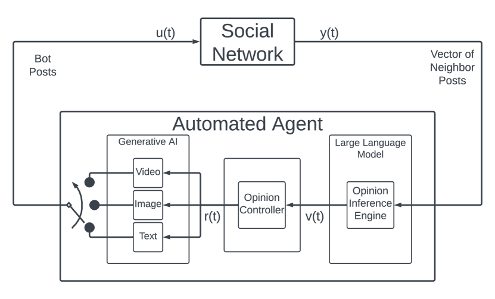

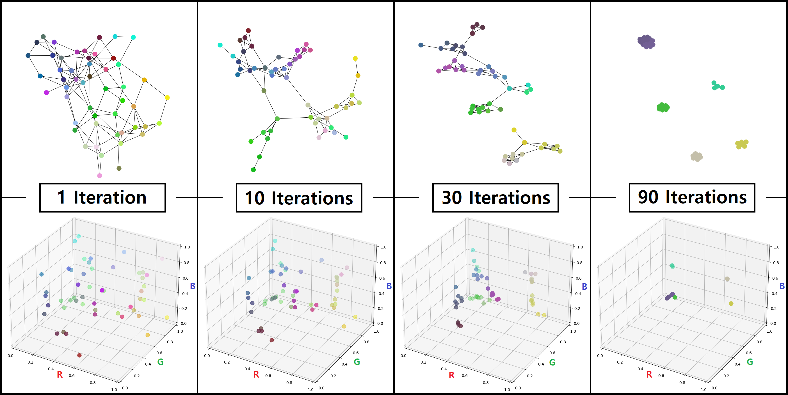

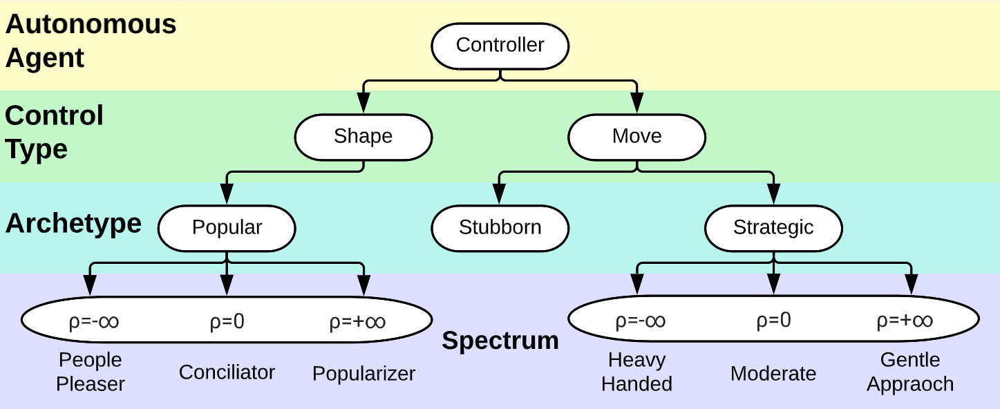

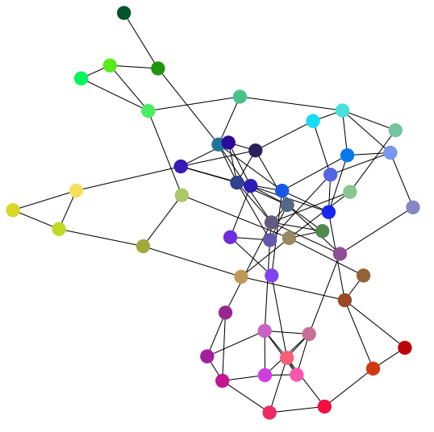

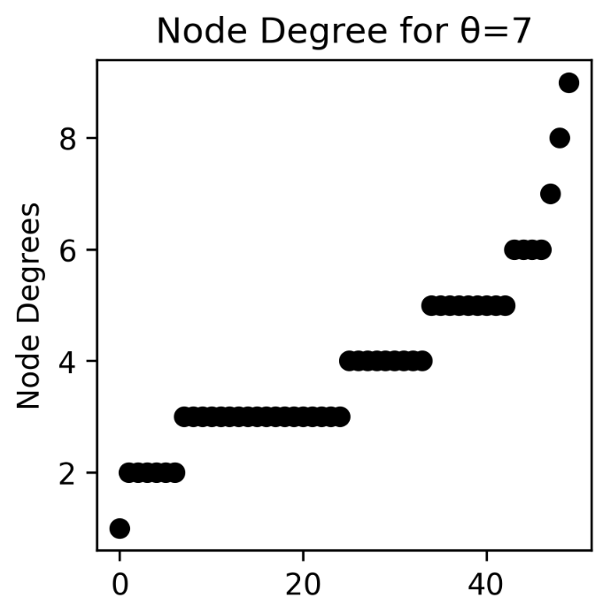

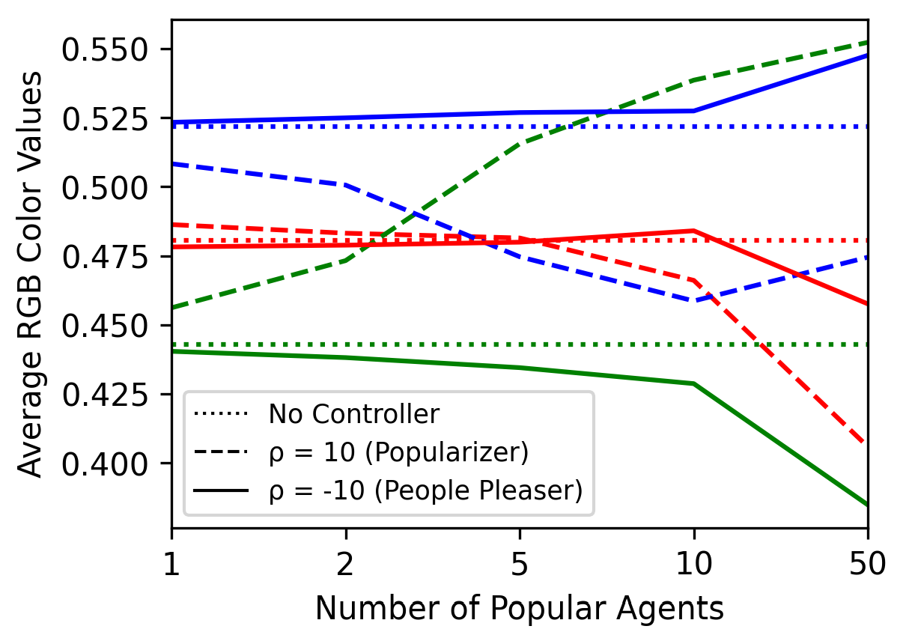

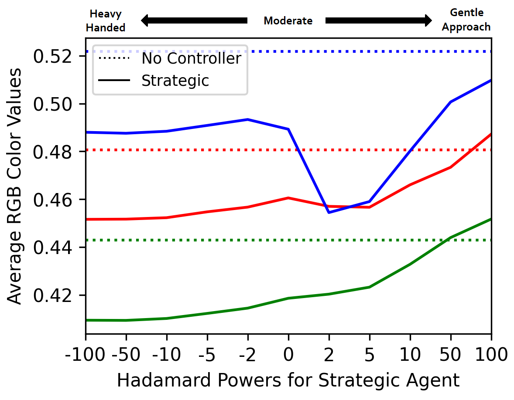

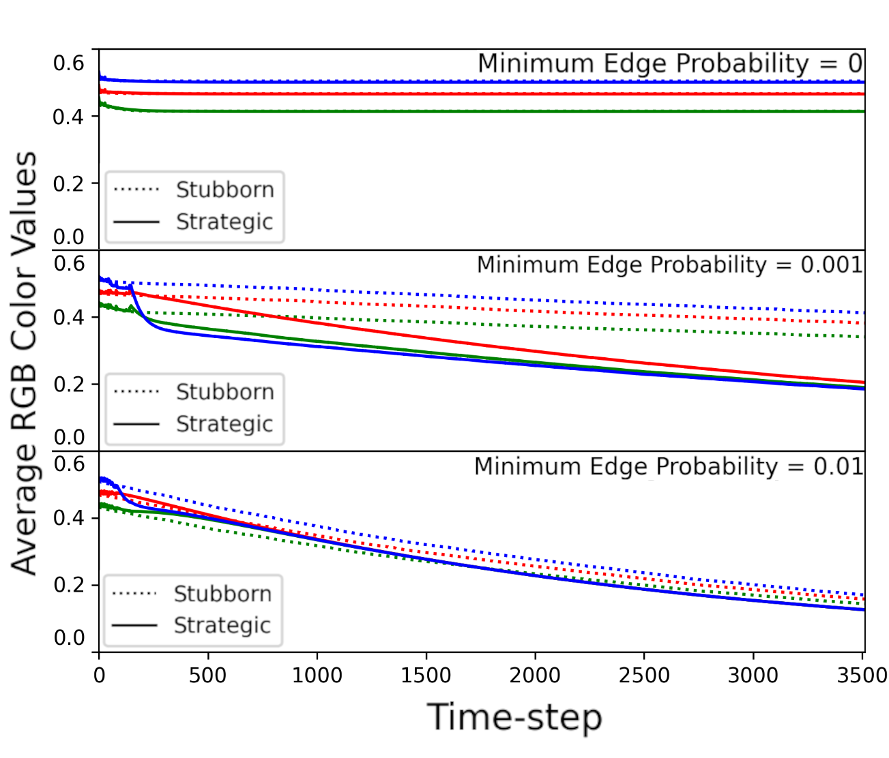

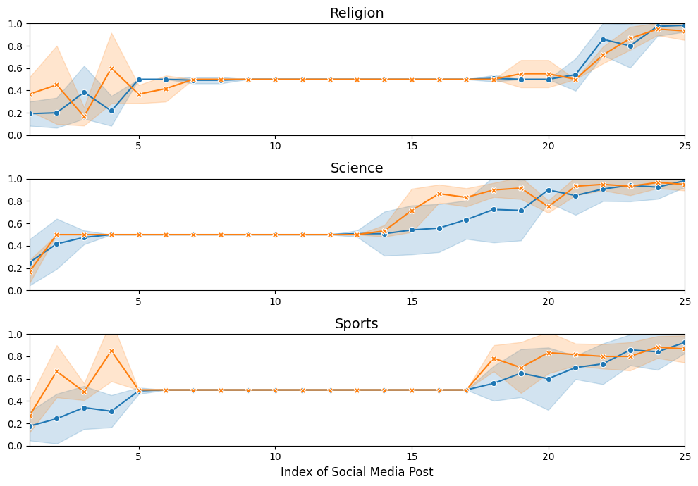

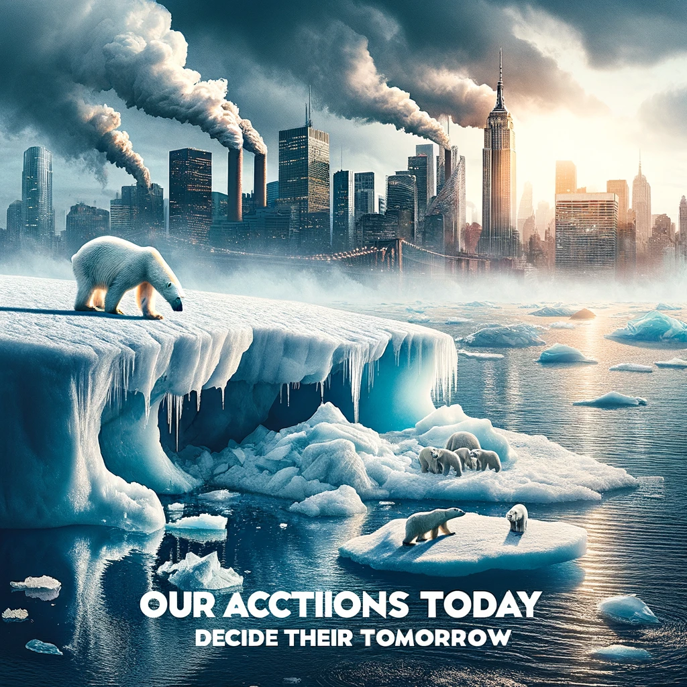

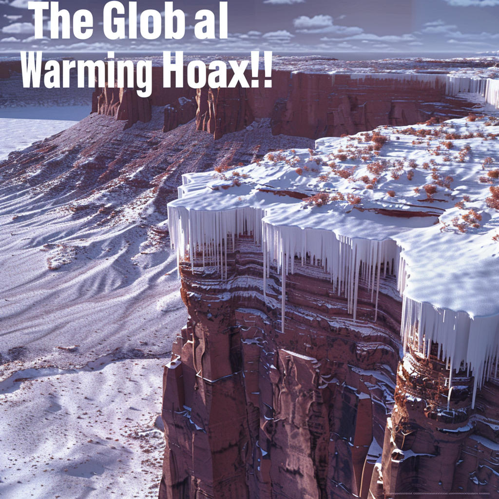

[Arxiv](https://arxiv.org/abs/2403.18163)