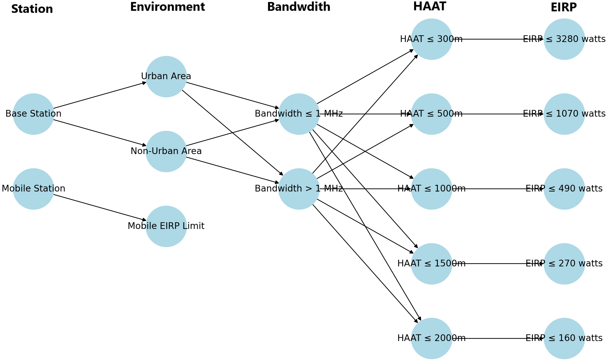
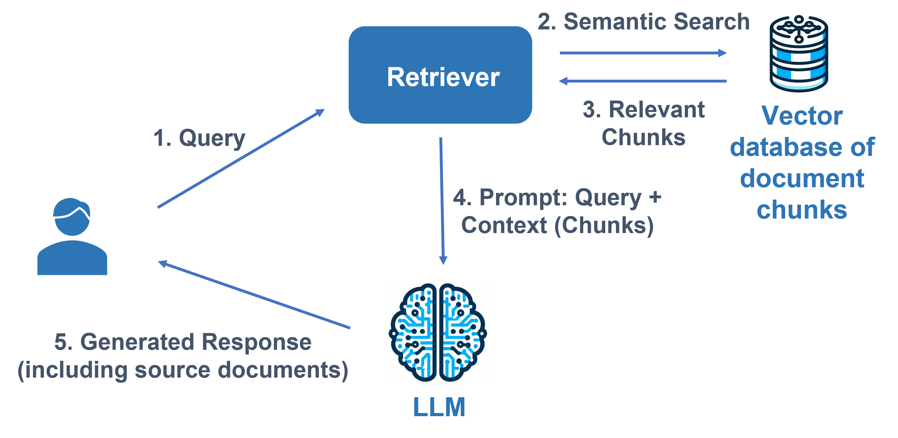

# 借助大型语言模型（LLMs），我们能够加快无线电频谱监管的工作流程，提升效率。

发布时间：2024年03月26日

`LLM应用` `无线通信` `监管科技`

> Accelerating Radio Spectrum Regulation Workflows with Large Language Models (LLMs)

> 无线频谱监管面临着技术飞速发展、频谱需求激增以及众多利益相关者利益冲突等复杂挑战，同时涉及重大的经济影响。为应对这些问题，监管者需与各方有效沟通，紧跟全球技术动态，开展技术评估，并及时颁发许可证，同时遵循众多法律和政策框架。本文通过实例展示了大型语言模型（LLMs）如何加速频谱监管流程，并探讨了LLMs在该领域的多种潜在角色，同时指出了需要克服的挑战。文章还结合实际案例和深刻见解，通过相关实验，强调了LLMs在革新频谱管理方面的巨大潜力。

> Wireless spectrum regulation is a complex and demanding process due to the rapid pace of technological progress, increasing demand for spectrum, and a multitude of stakeholders with potentially conflicting interests, alongside significant economic implications. To navigate this, regulators must engage effectively with all parties, keep pace with global technology trends, conduct technical evaluations, issue licenses in a timely manner, and comply with various legal and policy frameworks.
  In light of these challenges, this paper demonstrates example applications of Large Language Models (LLMs) to expedite spectrum regulatory processes. We explore various roles that LLMs can play in this context while identifying some of the challenges to address. The paper also offers practical case studies and insights, with appropriate experiments, highlighting the transformative potential of LLMs in spectrum management.

[Arxiv](https://arxiv.org/abs/2403.17819)