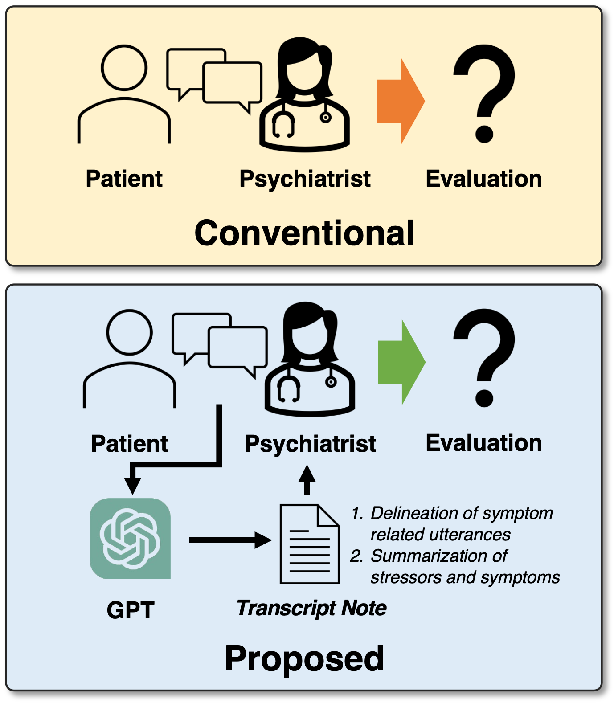
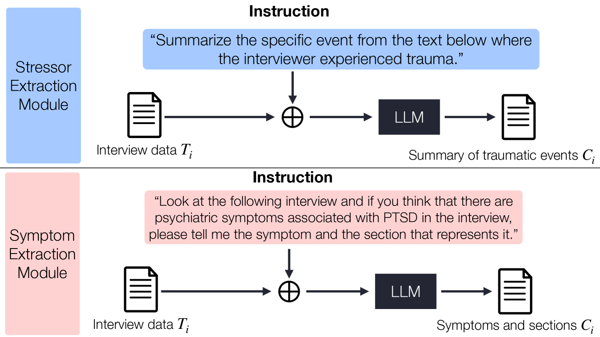
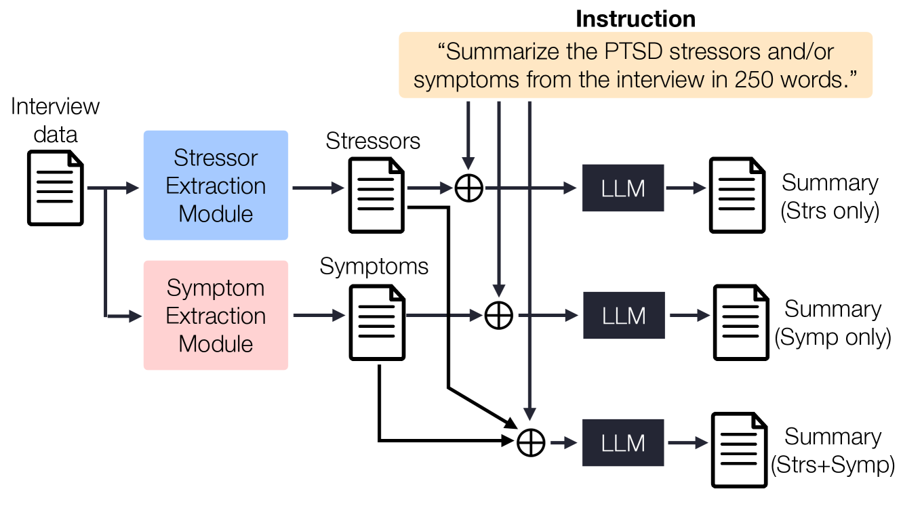
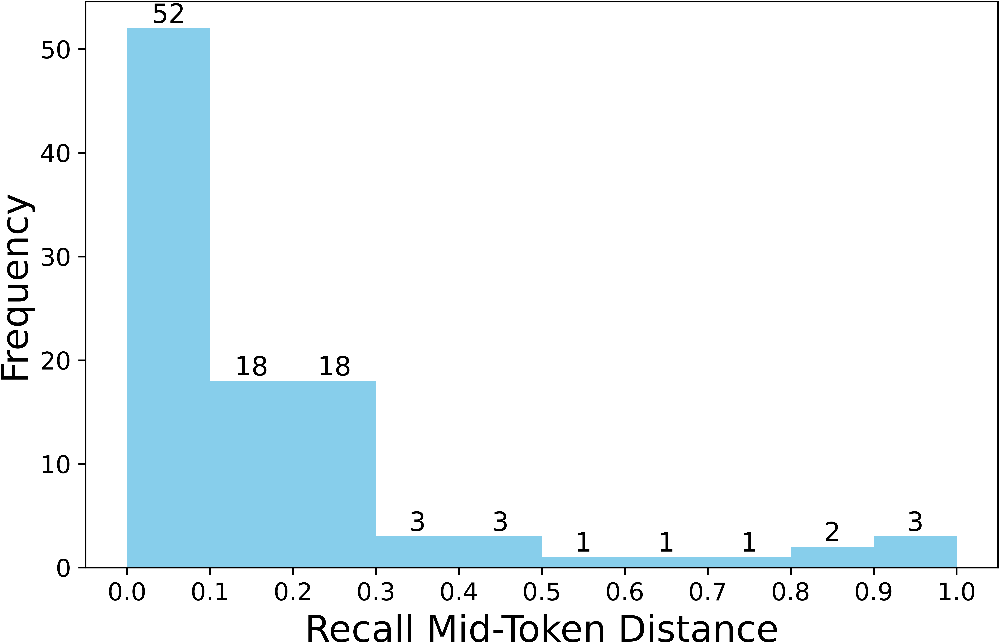
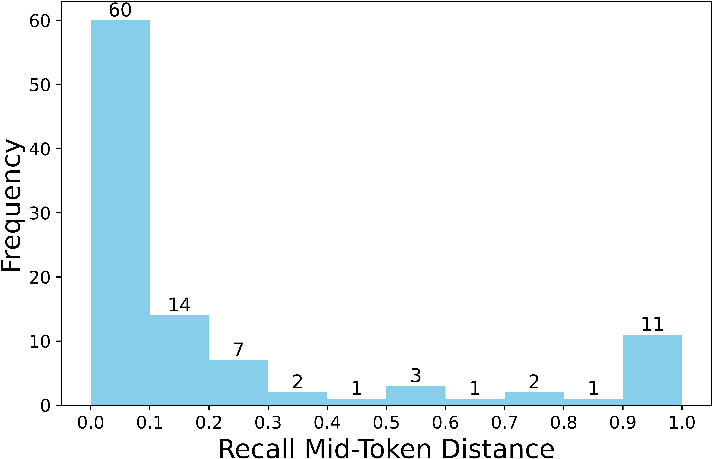
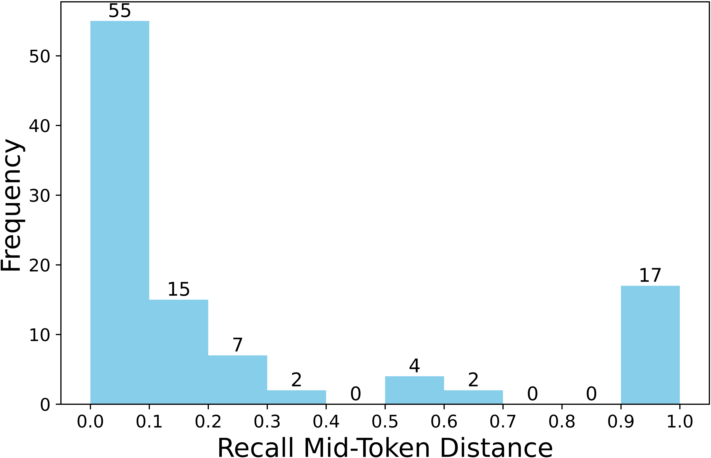
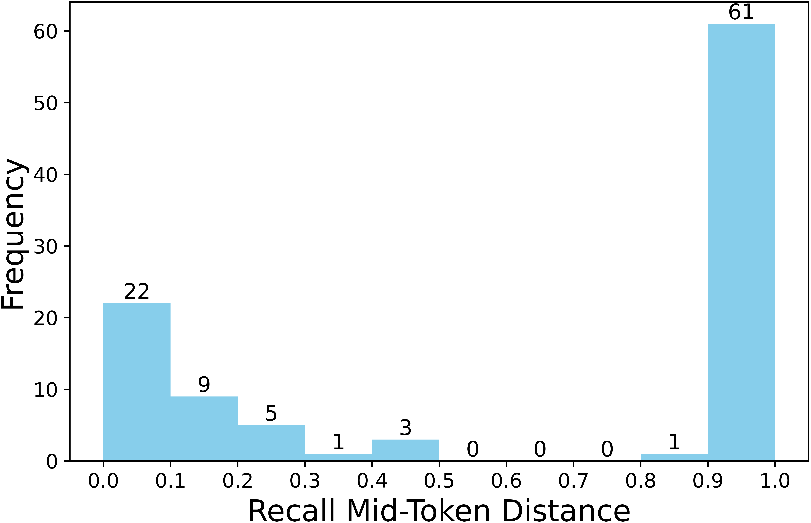

# 为了提升精神病学访谈的质量，本研究致力于调整大型语言模型，以便更准确地描绘症状并进行有效总结。

发布时间：2024年03月26日

`LLM应用` `精神病学` `心理健康`

> Aligning Large Language Models for Enhancing Psychiatric Interviews through Symptom Delineation and Summarization

> 大型语言模型（LLMs）的最新进展推动了它们在多个领域的广泛应用。考虑到精神病学访谈是专业人士与受访者之间的目标明确、结构化交流，这一领域尚未被充分挖掘，LLMs有望在此发挥巨大价值。本研究通过分析北韩叛逃者的咨询数据，探讨了LLMs在提升精神病学访谈方面的潜力，这些数据涉及创伤性事件和心理健康问题。我们重点研究了LLMs是否能够（1）识别并命名暗示精神病症状的对话片段，以及（2）根据访谈记录，概括压力因素和症状。为此，我们邀请心理健康专家对访谈记录进行标注，以便训练和评估LLMs。实验结果显示，经过恰当引导的LLMs在症状识别和总结任务上均能取得显著成效。本研究不仅为将LLMs应用于精神病学访谈的新领域贡献了力量，也证明了它们在辅助心理健康专业人士方面的潜在效能。

> Recent advancements in Large Language Models (LLMs) have accelerated their usage in various domains. Given the fact that psychiatric interviews are goal-oriented and structured dialogues between the professional interviewer and the interviewee, it is one of the most underexplored areas where LLMs can contribute substantial value. Here, we explore the use of LLMs for enhancing psychiatric interviews, by analyzing counseling data from North Korean defectors with traumatic events and mental health issues. Specifically, we investigate whether LLMs can (1) delineate the part of the conversation that suggests psychiatric symptoms and name the symptoms, and (2) summarize stressors and symptoms, based on the interview dialogue transcript. Here, the transcript data was labeled by mental health experts for training and evaluation of LLMs. Our experimental results show that appropriately prompted LLMs can achieve high performance on both the symptom delineation task and the summarization task. This research contributes to the nascent field of applying LLMs to psychiatric interview and demonstrates their potential effectiveness in aiding mental health practitioners.

[Arxiv](https://arxiv.org/abs/2403.17428)