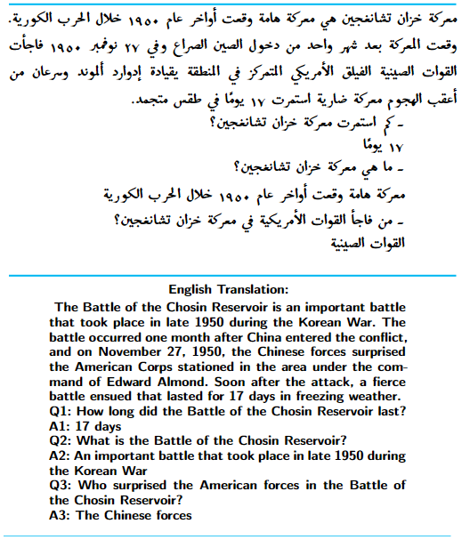
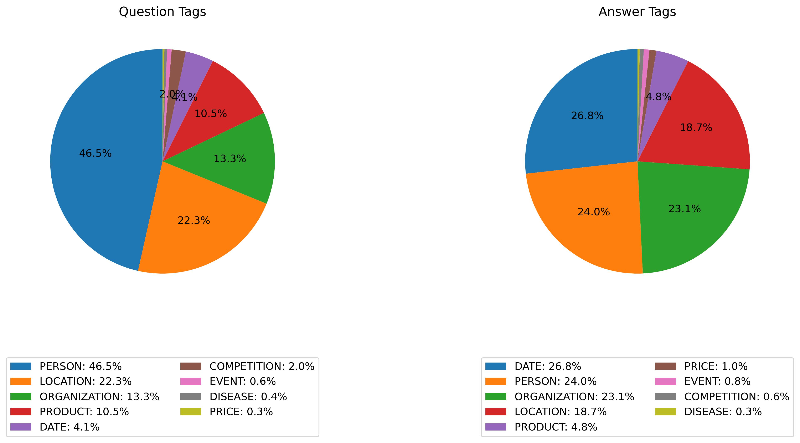
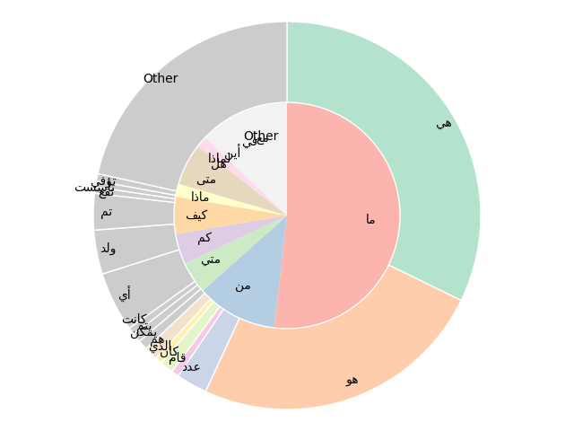
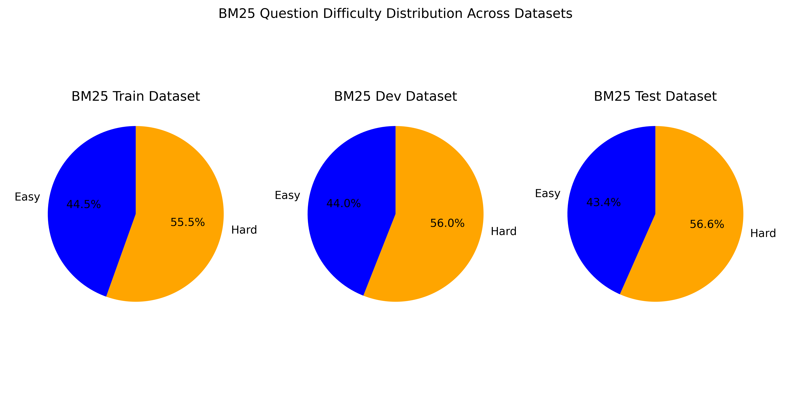
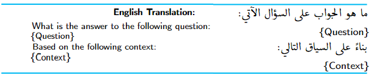

# ArabicaQA：一个全面的阿拉伯语问答数据集

发布时间：2024年03月26日

`LLM应用` `问答系统`

> ArabicaQA: A Comprehensive Dataset for Arabic Question Answering

# 摘要

> 本文填补了阿拉伯语自然语言处理资源的一项重要空白，首次推出了大规模的阿拉伯语机器阅读理解和开放领域问答数据集——阿拉伯语问答（ArabicaQA）。这个包含89,095个可回答问题和3,701个不可回答问题的全面数据集，问题设计力求与可回答类型相似，同时附加了开放领域问题的标签，为阿拉伯语NLP资源带来了突破性进展。我们还推出了首个针对阿拉伯文本检索挑战而设计的、基于阿拉伯语维基百科语料训练的密集段落检索模型——AraDPR。此外，我们对大型语言模型在阿拉伯语问答任务中的性能进行了深入的基准评估。总结来说，ArabicaQA、AraDPR以及对LLMs在阿拉伯语问答中的评估，为阿拉伯语NLP的发展做出了重要贡献。相关数据集和代码已公开，欢迎各界进行进一步的研究与探索，链接为：https://github.com/DataScienceUIBK/ArabicaQA。

> In this paper, we address the significant gap in Arabic natural language processing (NLP) resources by introducing ArabicaQA, the first large-scale dataset for machine reading comprehension and open-domain question answering in Arabic. This comprehensive dataset, consisting of 89,095 answerable and 3,701 unanswerable questions created by crowdworkers to look similar to answerable ones, along with additional labels of open-domain questions marks a crucial advancement in Arabic NLP resources. We also present AraDPR, the first dense passage retrieval model trained on the Arabic Wikipedia corpus, specifically designed to tackle the unique challenges of Arabic text retrieval. Furthermore, our study includes extensive benchmarking of large language models (LLMs) for Arabic question answering, critically evaluating their performance in the Arabic language context. In conclusion, ArabicaQA, AraDPR, and the benchmarking of LLMs in Arabic question answering offer significant advancements in the field of Arabic NLP. The dataset and code are publicly accessible for further research https://github.com/DataScienceUIBK/ArabicaQA.

[Arxiv](https://arxiv.org/abs/2403.17848)