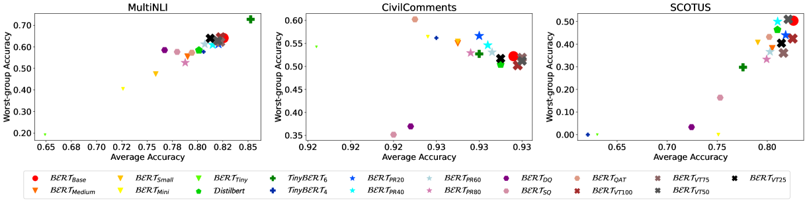
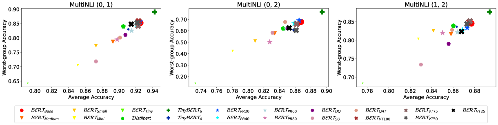
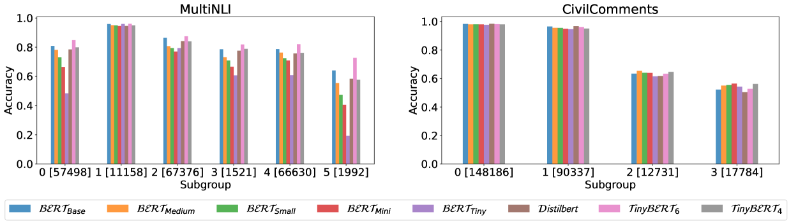

# 压缩后的语言模型是否在子群体上的鲁棒性有所下降？

发布时间：2024年03月26日

`LLM理论` `模型压缩` `子群鲁棒性`

> Are Compressed Language Models Less Subgroup Robust?

# 摘要

> 为了减轻大型语言模型的计算负担，模型压缩技术被广泛采用，以构建体积更小、更易扩展的模型。然而，这些压缩模型在处理数据集中基于标签和属性划分的少数群体时的鲁棒性尚未得到充分了解。本文深入探讨了18种压缩技术和参数设置对BERT模型在子群鲁棒性方面的影响。研究显示，最弱势群体的表现并非仅与模型规模相关，压缩方法同样起着关键作用。有趣的是，模型压缩并不必然导致对少数群体的处理能力下降。我们的分析为模型压缩技术的子群鲁棒性研究提供了新的视角。

> To reduce the inference cost of large language models, model compression is increasingly used to create smaller scalable models. However, little is known about their robustness to minority subgroups defined by the labels and attributes of a dataset. In this paper, we investigate the effects of 18 different compression methods and settings on the subgroup robustness of BERT language models. We show that worst-group performance does not depend on model size alone, but also on the compression method used. Additionally, we find that model compression does not always worsen the performance on minority subgroups. Altogether, our analysis serves to further research into the subgroup robustness of model compression.

[Arxiv](https://arxiv.org/abs/2403.17811)