# 探究ChatGPT角色扮演数据集：揭示用户动机与模型的自然表现

发布时间：2024年03月26日

`LLM应用` `人机交互` `对话系统`

> ChatGPT Role-play Dataset: Analysis of User Motives and Model Naturalness

# 摘要

> 互动式大型语言模型ChatGPT的最新进展颠覆了众多领域，但其在自然对话和角色扮演场景中的表现尚未得到充分研究。本研究通过深入分析ChatGPT在常规对话和角色扮演情境下的表现，填补了这一空白。我们创建了一个新的数据集，涵盖了广泛的人机对话，并标注了用户意图和AI的自然度，以探究（一）用户如何与AI对话模型互动，以及（二）AI的回应多么自然。研究发现，用户在与ChatGPT互动时的动机多样，AI的自然度也参差不齐，这不仅揭示了人与AI自然对话的细腻变化，也为提升人机交流的有效性开辟了新路径。

> Recent advances in interactive large language models like ChatGPT have revolutionized various domains; however, their behavior in natural and role-play conversation settings remains underexplored. In our study, we address this gap by deeply investigating how ChatGPT behaves during conversations in different settings by analyzing its interactions in both a normal way and a role-play setting. We introduce a novel dataset of broad range of human-AI conversations annotated with user motives and model naturalness to examine (i) how humans engage with the conversational AI model, and (ii) how natural are AI model responses. Our study highlights the diversity of user motives when interacting with ChatGPT and variable AI naturalness, showing not only the nuanced dynamics of natural conversations between humans and AI, but also providing new avenues for improving the effectiveness of human-AI communication.

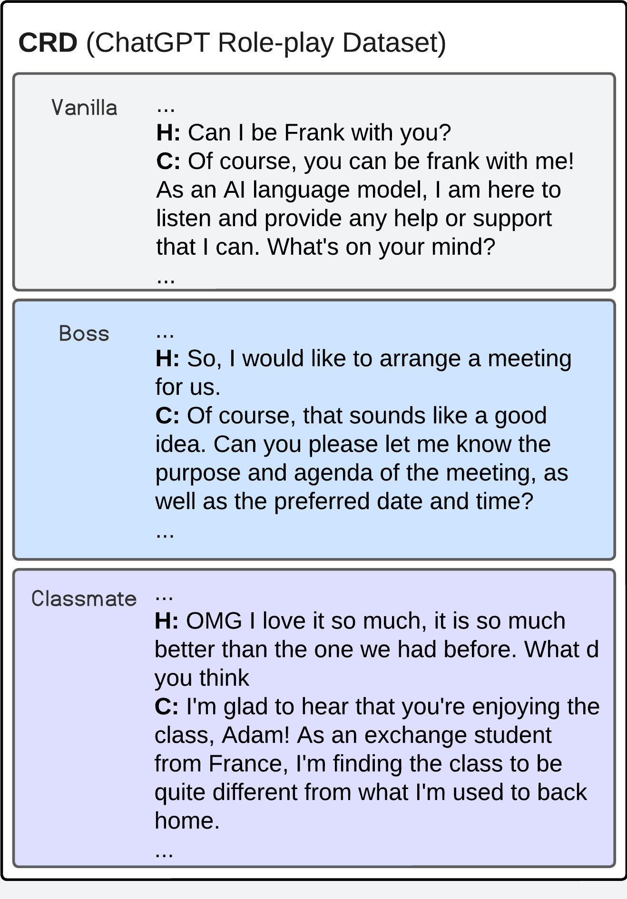

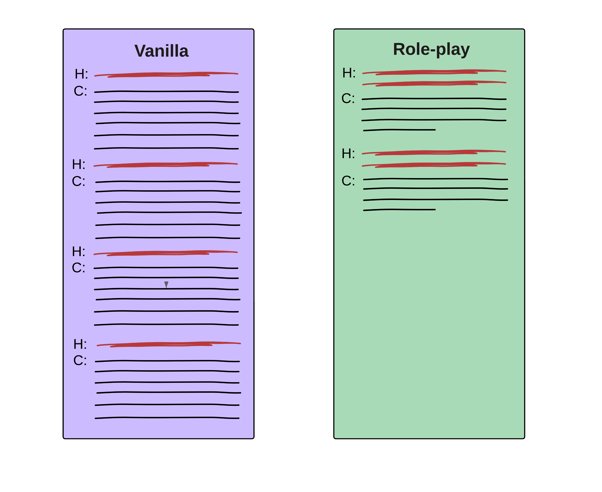

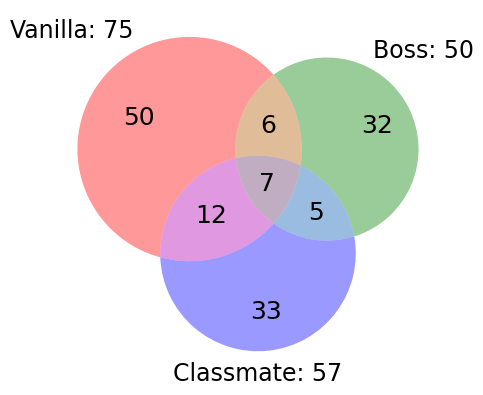

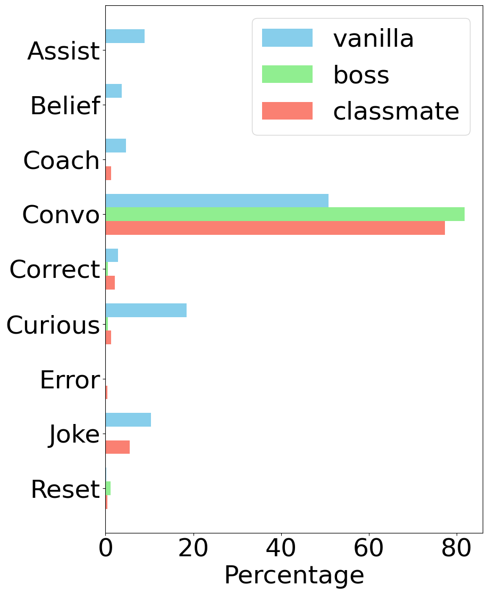

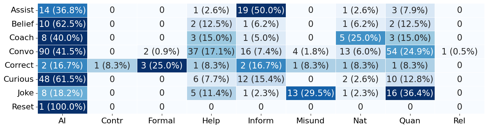

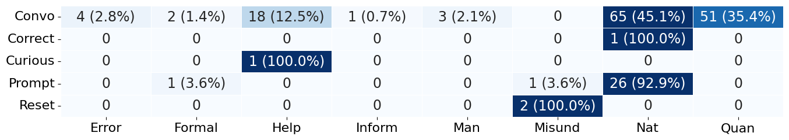

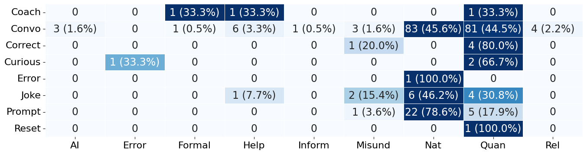

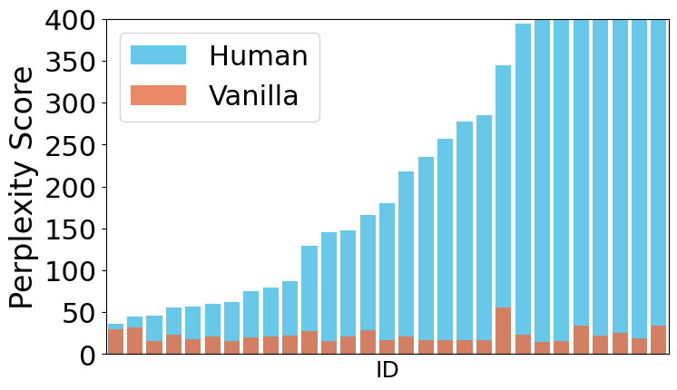

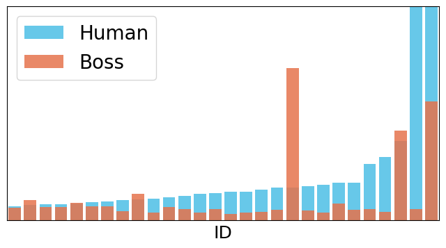

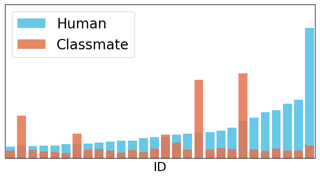

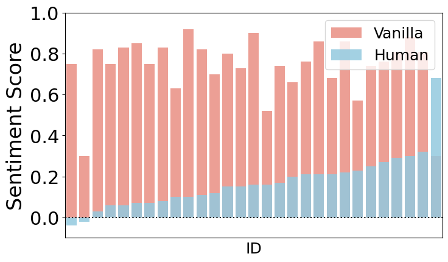

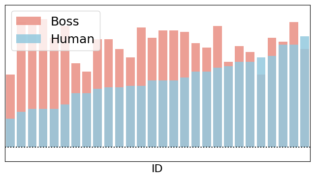

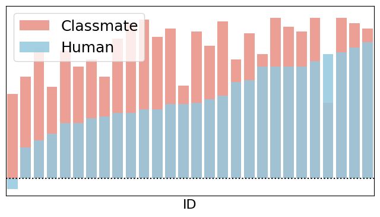

[Arxiv](https://arxiv.org/abs/2403.18121)