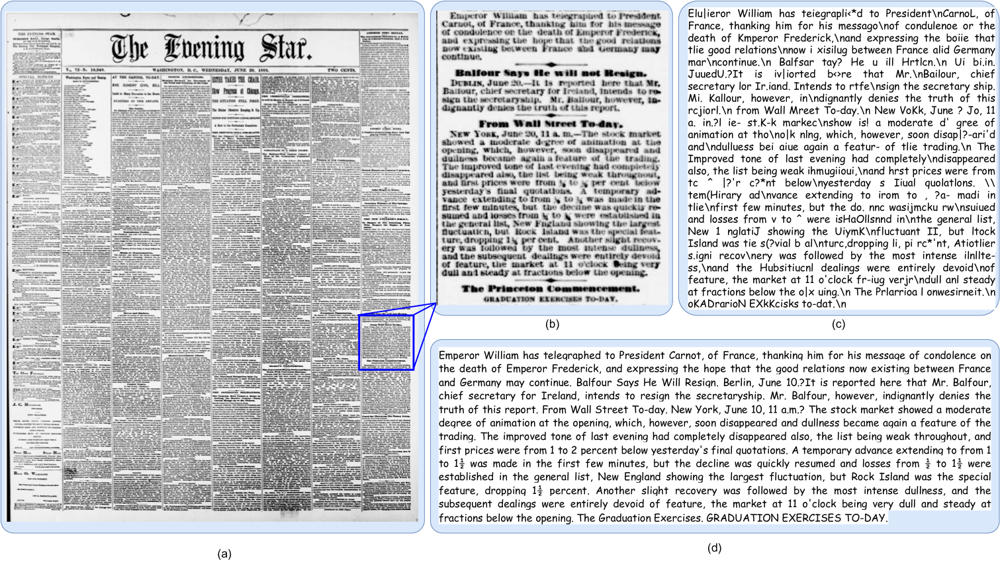
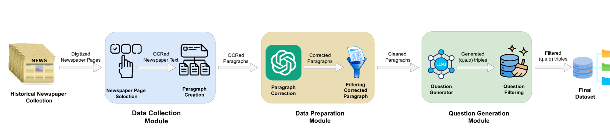
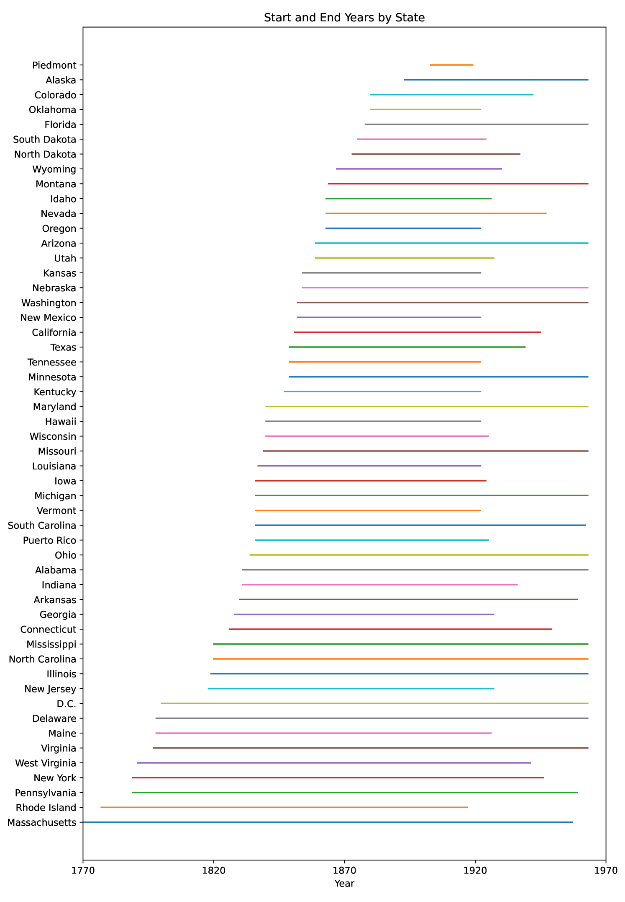
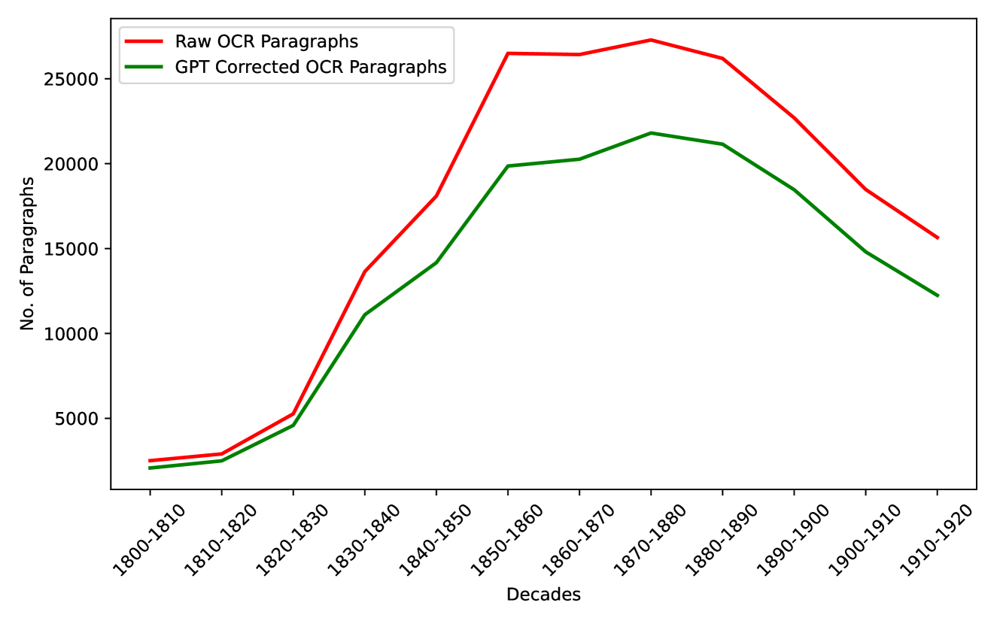
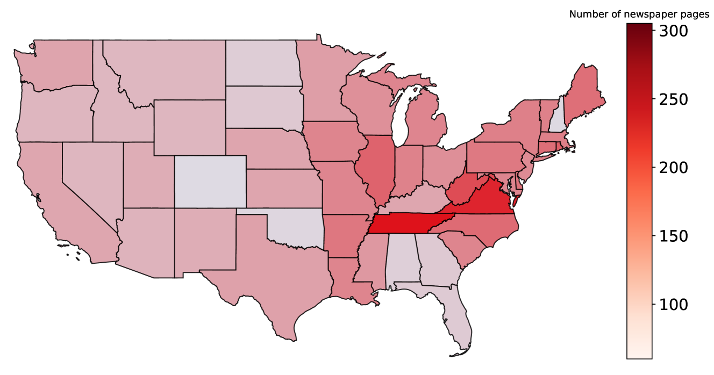
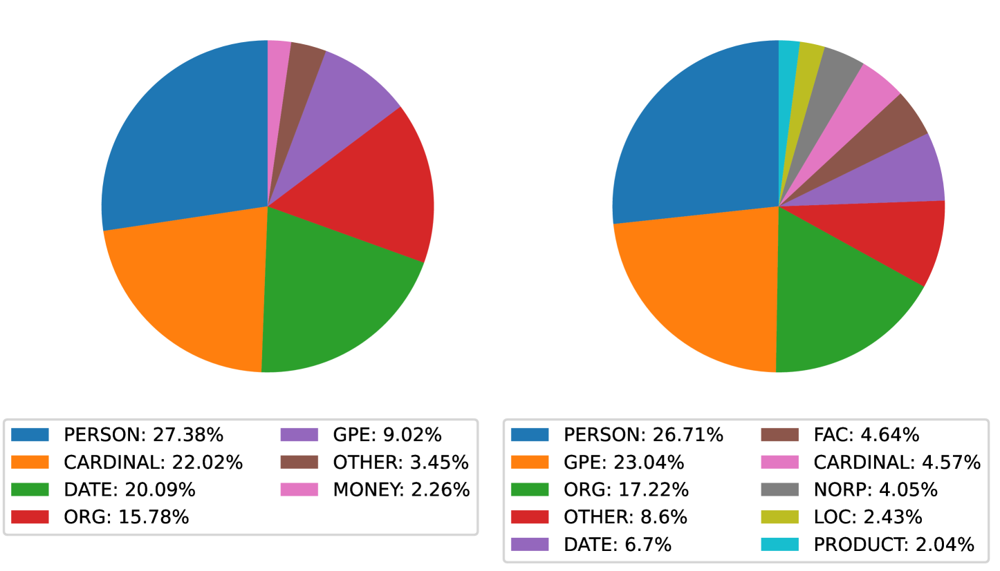
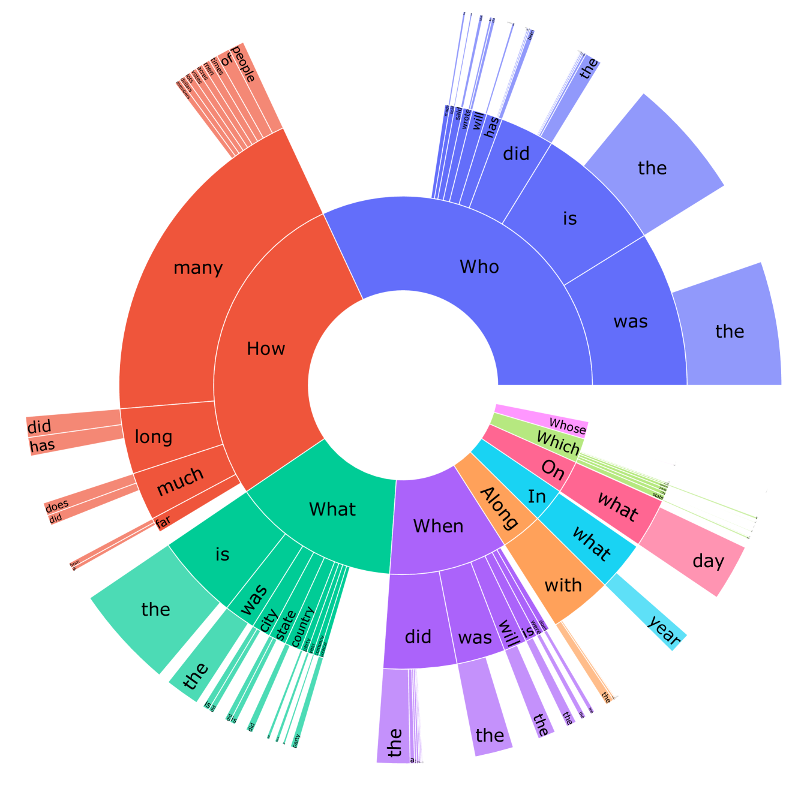
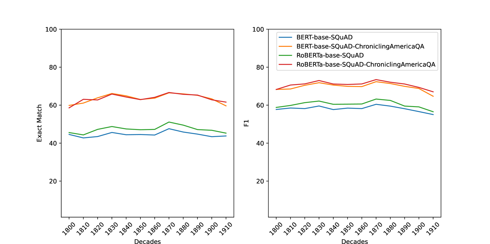

# 《美国纪事》问答：源自历史报纸的大规模问答数据集

发布时间：2024年03月26日

`LLM应用` `历史档案` `问答系统`

> ChroniclingAmericaQA: A Large-scale Question Answering Dataset based on Historical American Newspaper Pages

# 摘要

> 近年来，问答（QA）和机器阅读理解（MRC）任务得益于深度学习技术的飞速进步和大型语言模型的兴起，实现了长足的发展。尽管如此，众多基准数据集大多源自同步文档集合，如维基百科或互联网，而历史档案，例如历史报纸，所蕴含的珍贵信息却鲜少用于大型语言模型的训练。为了推动QA和MRC任务的进一步发展，并解决现有数据集的局限，我们推出了ChroniclingAmericaQA——一个基于Chronicling America历史报纸集合、包含485K个问答对的大规模数据集。该数据集覆盖了120年的报纸，从数字化历史资料中提取信息，尽管面临OCR文本质量不佳的挑战，我们的数据库提供了三种使用方式：基于原始嘈杂内容回答问题、基于清洁校正后的内容回答问题，以及基于报纸扫描图像回答问题。ChroniclingAmericaQA作为跨度最长的QA数据集，无疑是一个独特且宝贵的资源。

> Question answering (QA) and Machine Reading Comprehension (MRC) tasks have significantly advanced in recent years due to the rapid development of deep learning techniques and, more recently, large language models. At the same time, many benchmark datasets have become available for QA and MRC tasks. However, most existing large-scale benchmark datasets have been created predominantly using synchronous document collections like Wikipedia or the Web. Archival document collections, such as historical newspapers, contain valuable information from the past that is still not widely used to train large language models. To further contribute to advancing QA and MRC tasks and to overcome the limitation of previous datasets, we introduce ChroniclingAmericaQA, a large-scale dataset with 485K question-answer pairs created based on the historical newspaper collection Chronicling America. Our dataset is constructed from a subset of the Chronicling America newspaper collection spanning 120 years. One of the significant challenges for utilizing digitized historical newspaper collections is the low quality of OCR text. Therefore, to enable realistic testing of QA models, our dataset can be used in three different ways: answering questions from raw and noisy content, answering questions from cleaner, corrected version of the content, as well as answering questions from scanned images of newspaper pages. This and the fact that ChroniclingAmericaQA spans the longest time period among available QA datasets make it quite a unique and useful resource.

[Arxiv](https://arxiv.org/abs/2403.17859)