# DGoT：动态思维图谱，助力科学摘要自动生成

发布时间：2024年03月26日

`LLM应用` `科学论文` `自动摘要生成`

> DGoT: Dynamic Graph of Thoughts for Scientific Abstract Generation

> 采用领域特定数据集训练的语言模型在撰写科学论文摘要方面取得了突破，但泛化能力和高昂的训练费用仍是难题。大型语言模型（LLM）在生成摘要方面节省了训练开支，却也因易产生幻觉而需借助如思维图谱（GoT）这样的多轮查询提示技术来确保结果可信，这无疑增加了推理成本。本文介绍了我们新提出的动态思维图谱（DGoT），它不仅延续了GoT的优势，还能根据数据特点动态调整结构，有效降低推理开销。实验显示，DGoT在生成摘要方面的性价比显著优于传统多轮查询方法，成本仅为其43.7%至56.4%。相关代码已在GitHub发布，地址为：https://github.com/JayceNing/DGoT。

> The method of training language models based on domain datasets has obtained significant achievements in the task of generating scientific paper abstracts. However, such models face problems of generalization and expensive training costs. The use of large language models (LLMs) to solve the task of generating paper abstracts saves the cost of model training. However, due to the hallucination problem of LLM, it is often necessary to improve the reliability of the results through multi-round query prompt approach such as Graph of Thoughts (GoT), which also brings additional reasoning costs. In this paper, we propose a Dynamic Graph of Thought (DGoT). It not only inherits the advantages of the existing GoT prompt approach, but also dynamically adjust the graph structure according to data characteristics while reducing model reasoning cost. Experimental results show that our method's cost-effectiveness in abstract generation tasks is only 43.7% to 56.4% of other multi-round query prompt approaches. Our code is available at https://github.com/JayceNing/DGoT.

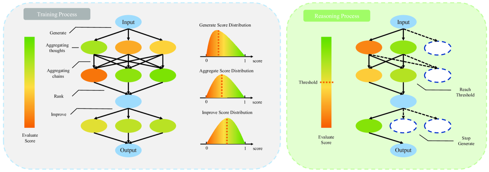

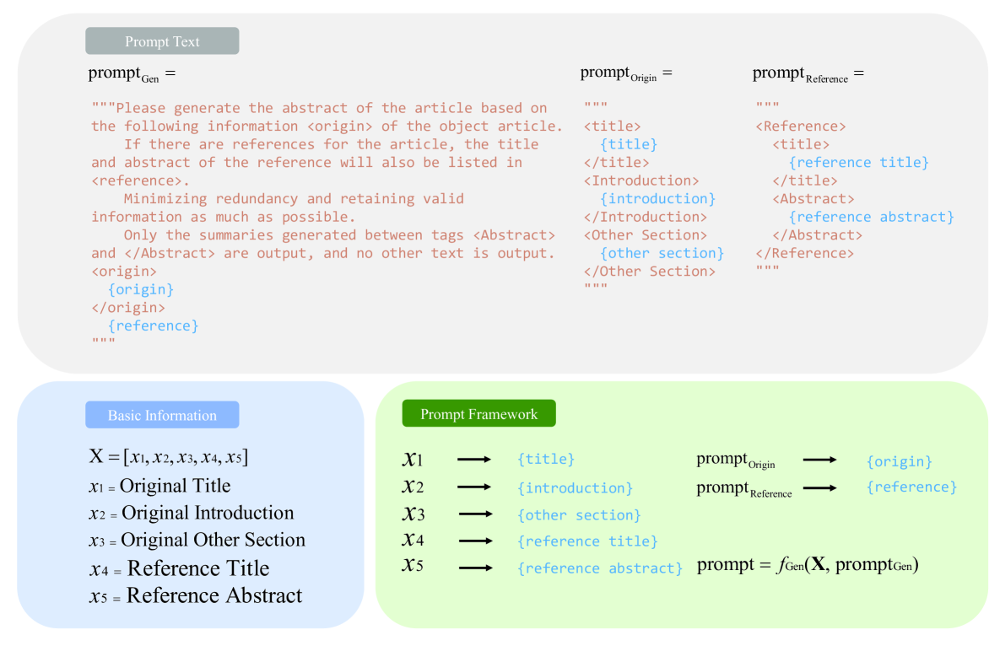

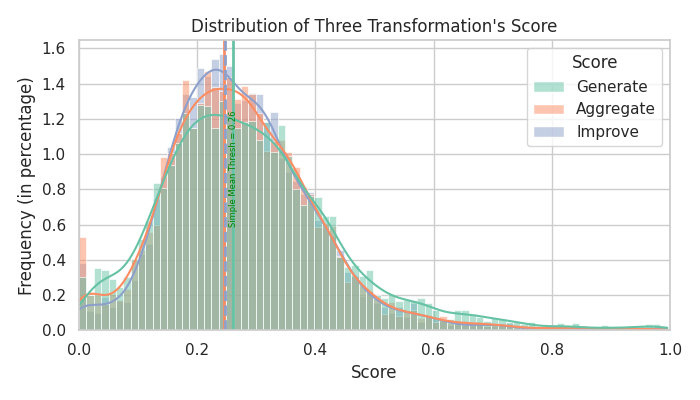

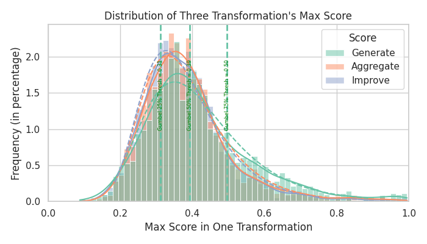

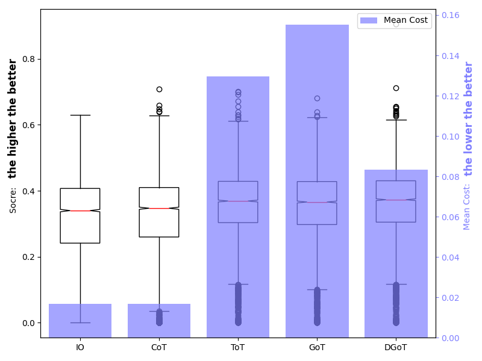

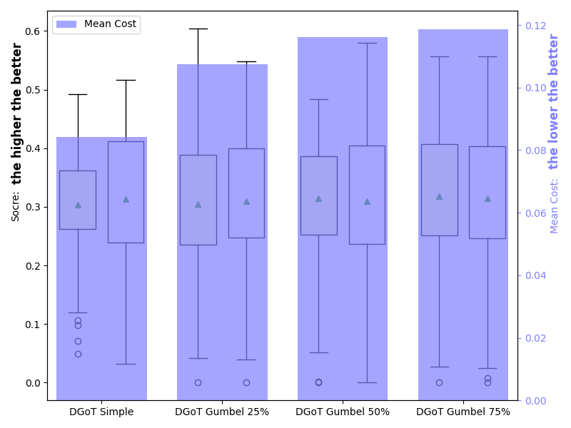

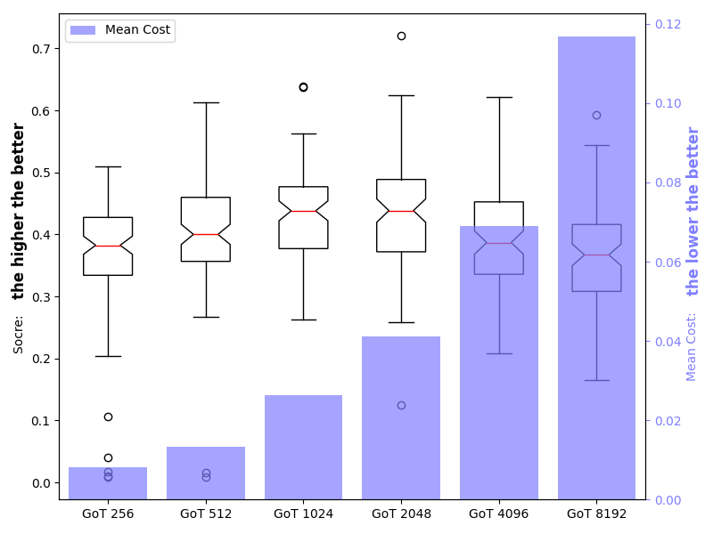

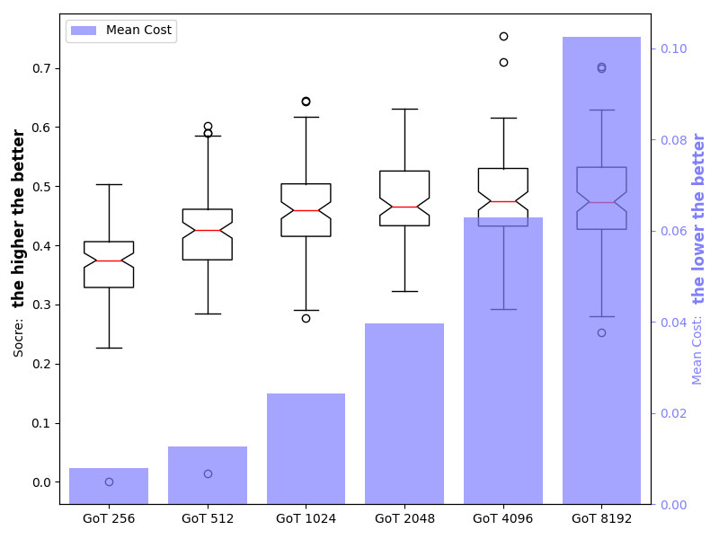

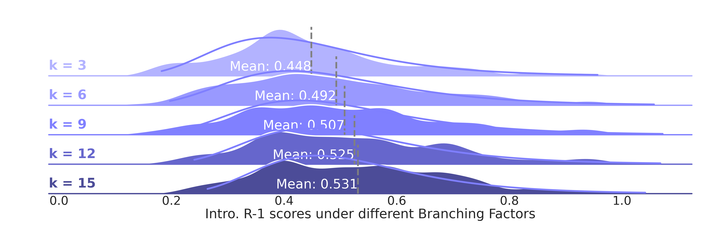

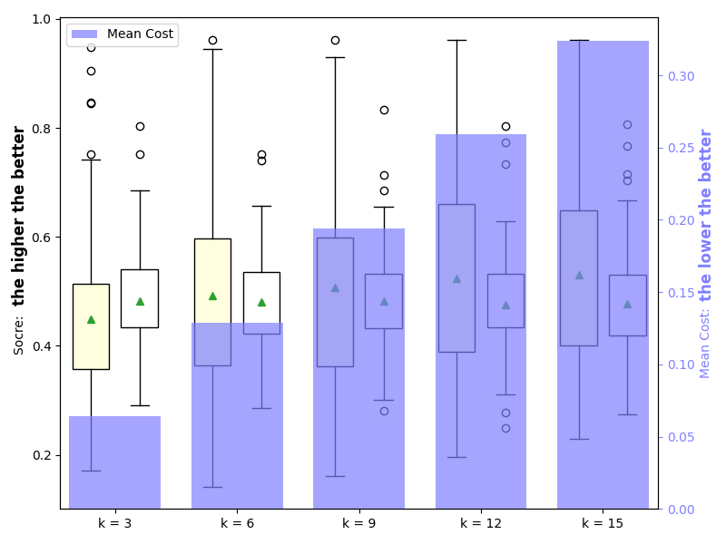

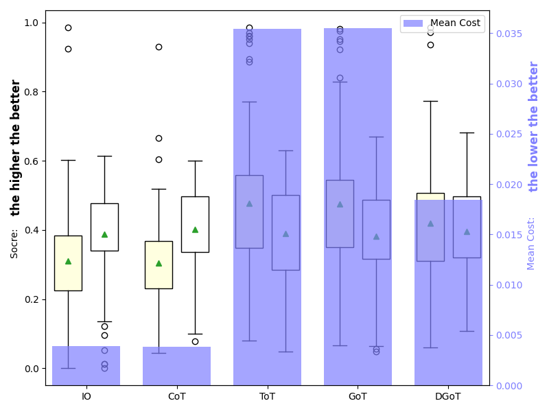

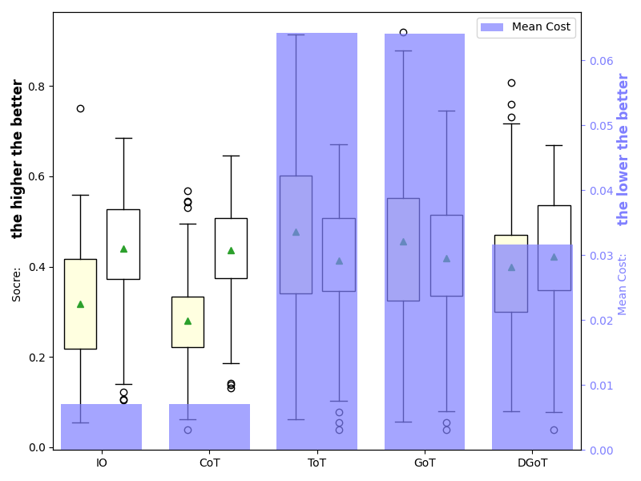

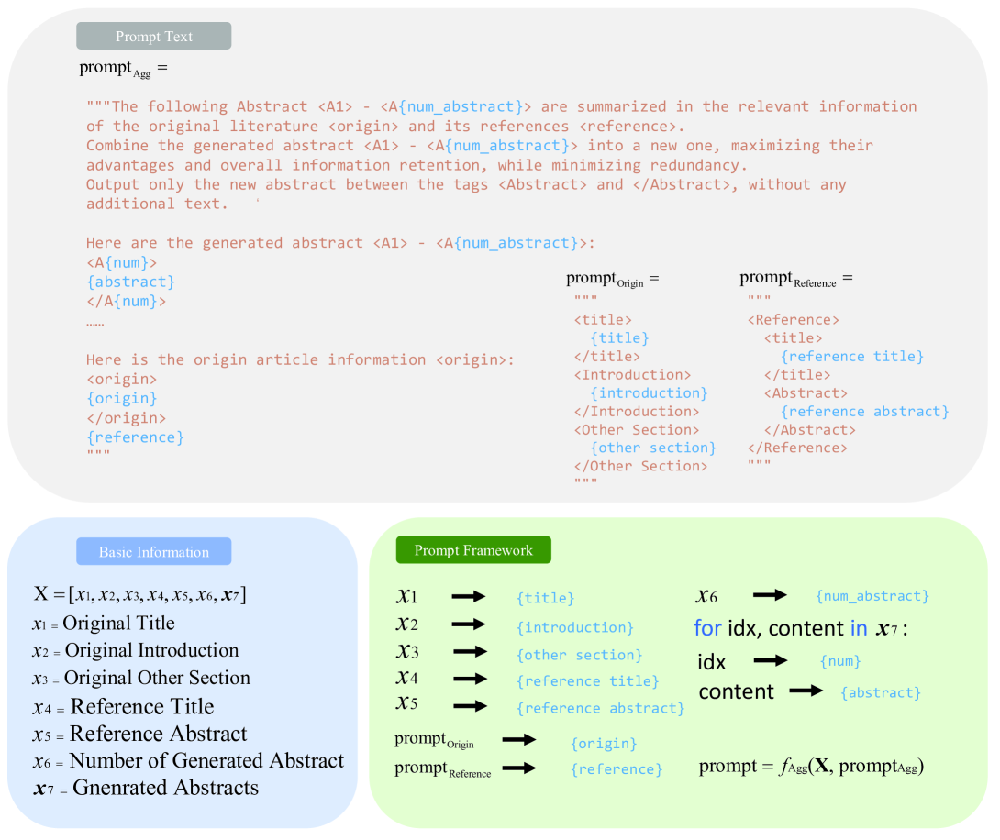

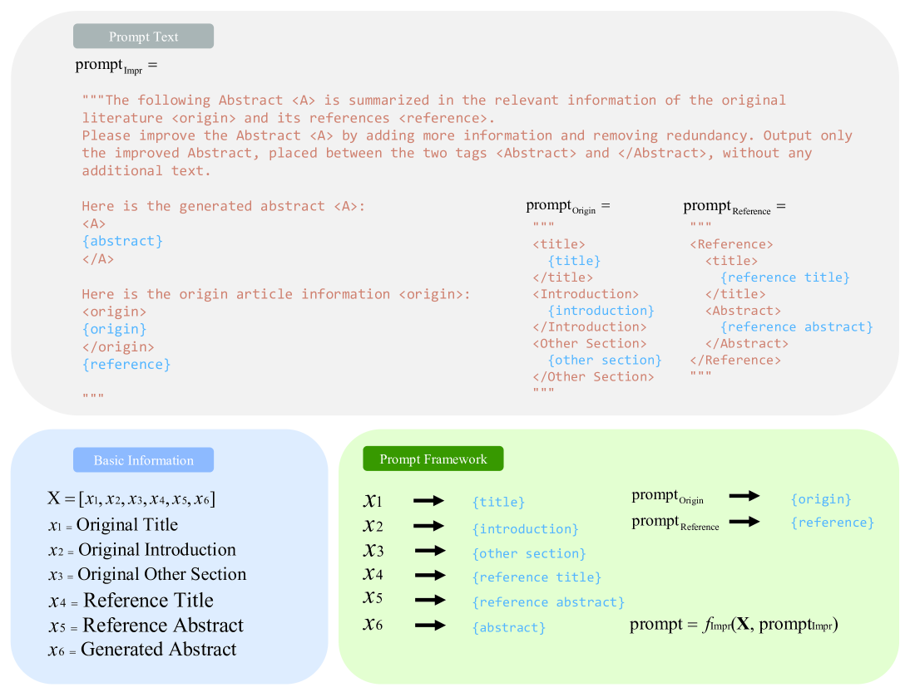

[Arxiv](https://arxiv.org/abs/2403.17491)