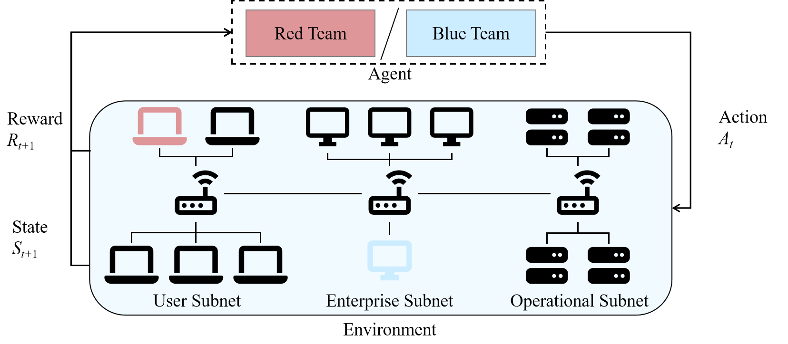
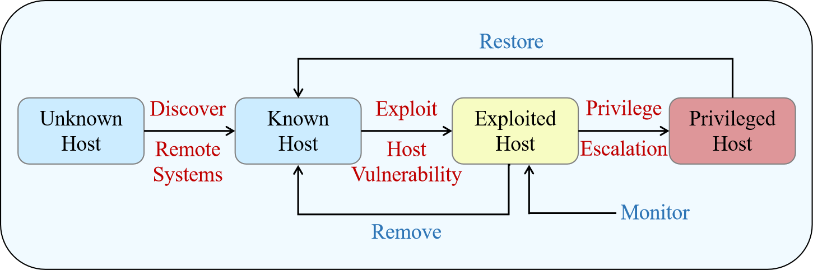
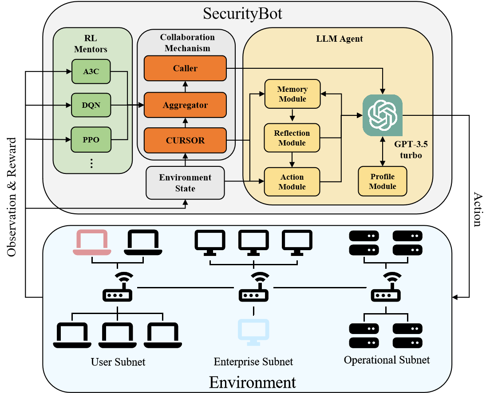
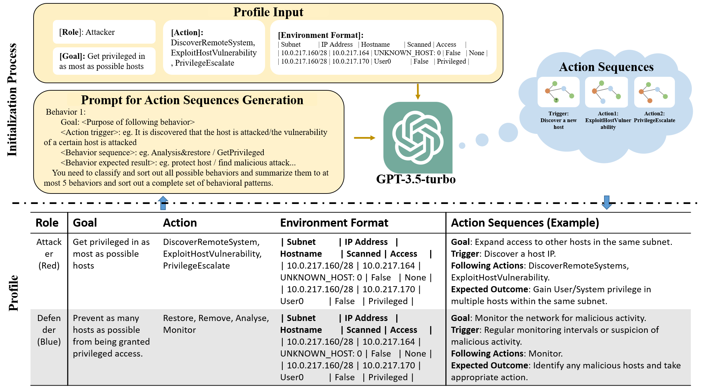
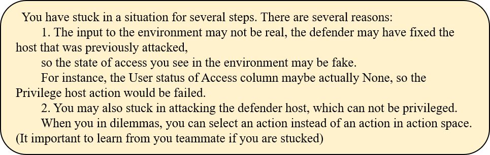
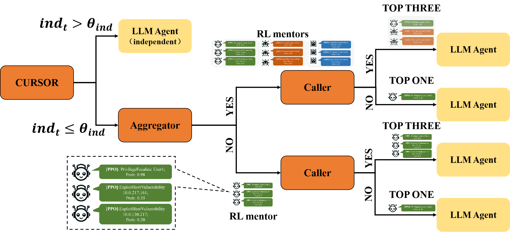
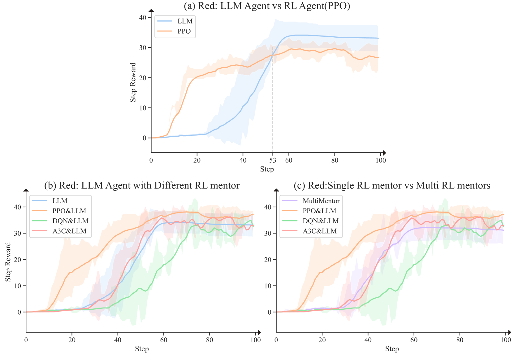

# 在关键时刻自力更生：通过强化学习（RL）代理的辅导，培养大型语言模型（LLM）成为网络安全游戏的高手。

发布时间：2024年03月26日

`Agent` `网络安全` `人工智能`

> Depending on yourself when you should: Mentoring LLM with RL agents to become the master in cybersecurity games

# 摘要

> 在网络安全等关键任务中，高效融合大型语言模型（LLM）与强化学习（RL）代理以发挥协同效应至关重要。本研究提出了SecurityBot，这是一种由预训练RL代理辅导的LLM代理，旨在助力网络安全运维。SecurityBot配备了行为指南生成模块、经验积累记忆模块、选择重评反思模块以及动作空间缩减模块。同时，它还引入了协作机制，以获取来自预训练RL代理的建议，包括动态建议光标、多导师建议排名聚合器以及主动建议请求调用器。依托CybORG实验框架，我们的实验结果显示，SecurityBot相较于单独的LLM或RL代理，在网络安全对抗中实现了显著的性能提升，达成了预期的协同效果。

> Integrating LLM and reinforcement learning (RL) agent effectively to achieve complementary performance is critical in high stake tasks like cybersecurity operations. In this study, we introduce SecurityBot, a LLM agent mentored by pre-trained RL agents, to support cybersecurity operations. In particularly, the LLM agent is supported with a profile module to generated behavior guidelines, a memory module to accumulate local experiences, a reflection module to re-evaluate choices, and an action module to reduce action space. Additionally, it adopts the collaboration mechanism to take suggestions from pre-trained RL agents, including a cursor for dynamic suggestion taken, an aggregator for multiple mentors' suggestions ranking and a caller for proactive suggestion asking. Building on the CybORG experiment framework, our experiences show that SecurityBot demonstrates significant performance improvement compared with LLM or RL standalone, achieving the complementary performance in the cybersecurity games.

[Arxiv](https://arxiv.org/abs/2403.17674)