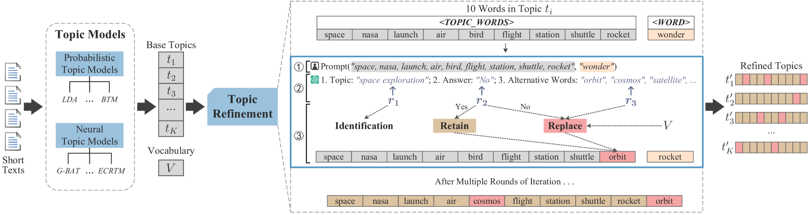
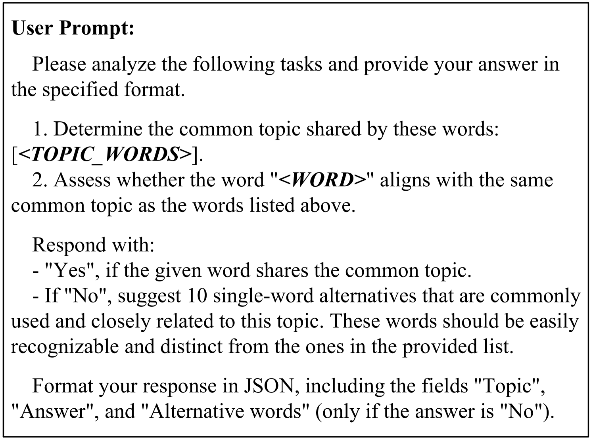
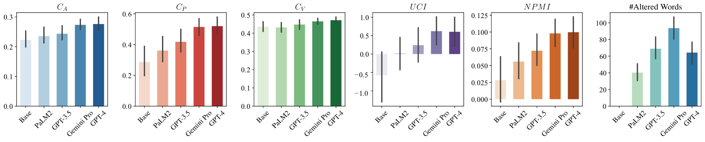
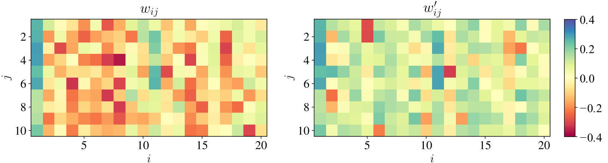
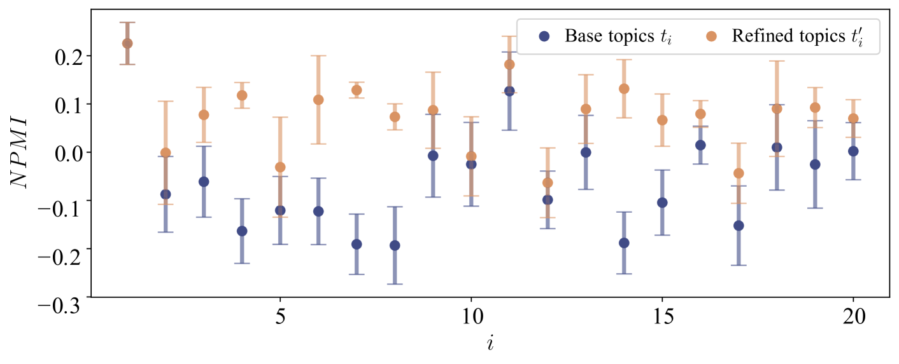

# 通过运用大型语言模型，本文探讨了如何提升短文本的主题建模能力，实现主题的精准优化。

发布时间：2024年03月26日

`LLM应用` `社交媒体分析` `主题建模`

> Enhanced Short Text Modeling: Leveraging Large Language Models for Topic Refinement

> 打造适合短文本如推文和新闻标题的有效主题模型，对于捕捉社会动态的快速变化非常关键。但传统主题模型往往因文本简短和缺乏上下文信息，难以准确捕捉短文本的微妙语义。我们研究利用大型语言模型（LLMs）的强大功能，提出了一种名为“主题精炼”的创新方法。该方法不直接介入主题的初步构建，而是着眼于对已挖掘出的主题进行优化。通过精心设计的提示，我们引导LLMs筛除与主题无关的词汇，确保保留或替换的词汇在语义上更加贴切。这种手法模拟了人类对主题的细致审查与提升，从而显著提升了不同模型生成主题的语义清晰度。经过三个独立数据集的综合评估，我们证实这一主题精炼策略能显著提高主题的语义一致性。

> Crafting effective topic models for brief texts, like tweets and news headlines, is essential for capturing the swift shifts in social dynamics. Traditional topic models, however, often fall short in accurately representing the semantic intricacies of short texts due to their brevity and lack of contextual data. In our study, we harness the advanced capabilities of Large Language Models (LLMs) to introduce a novel approach termed "Topic Refinement". This approach does not directly involve itself in the initial modeling of topics but focuses on improving topics after they have been mined. By employing prompt engineering, we direct LLMs to eliminate off-topic words within a given topic, ensuring that only contextually relevant words are preserved or substituted with ones that fit better semantically. This method emulates human-like scrutiny and improvement of topics, thereby elevating the semantic quality of the topics generated by various models. Our comprehensive evaluation across three unique datasets has shown that our topic refinement approach significantly enhances the semantic coherence of topics.

[Arxiv](https://arxiv.org/abs/2403.17706)