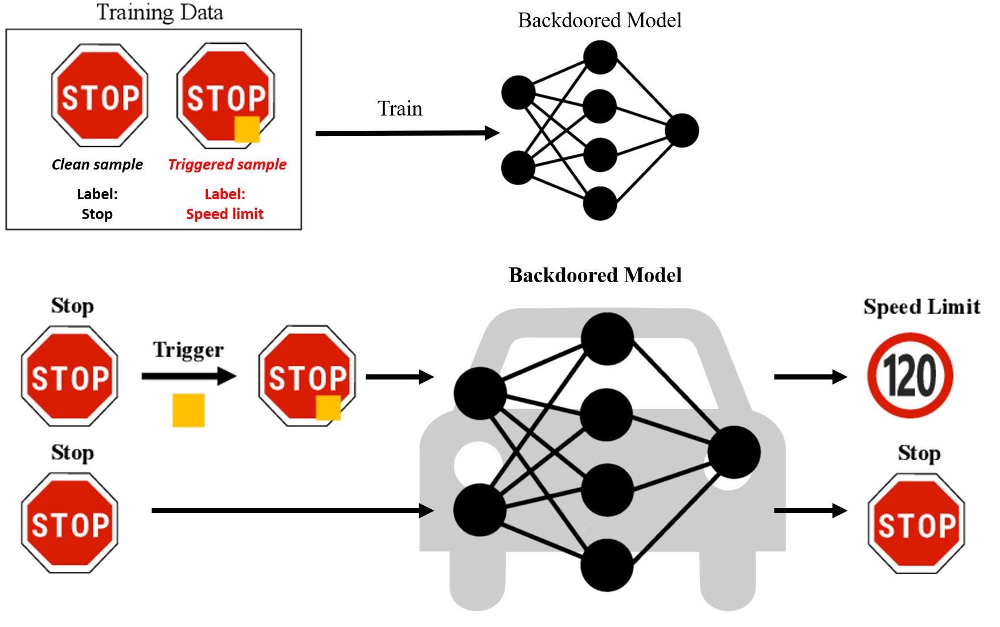
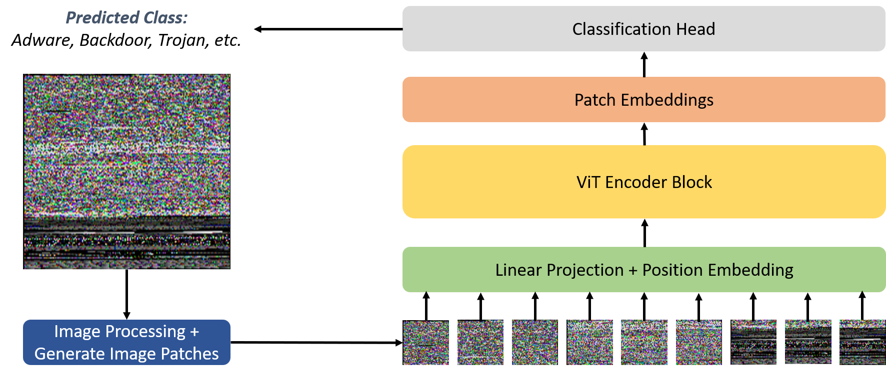
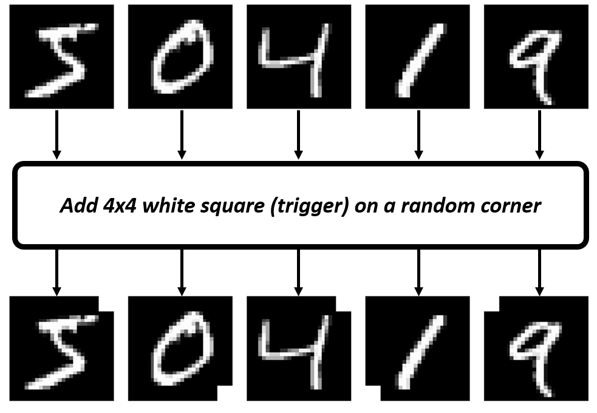
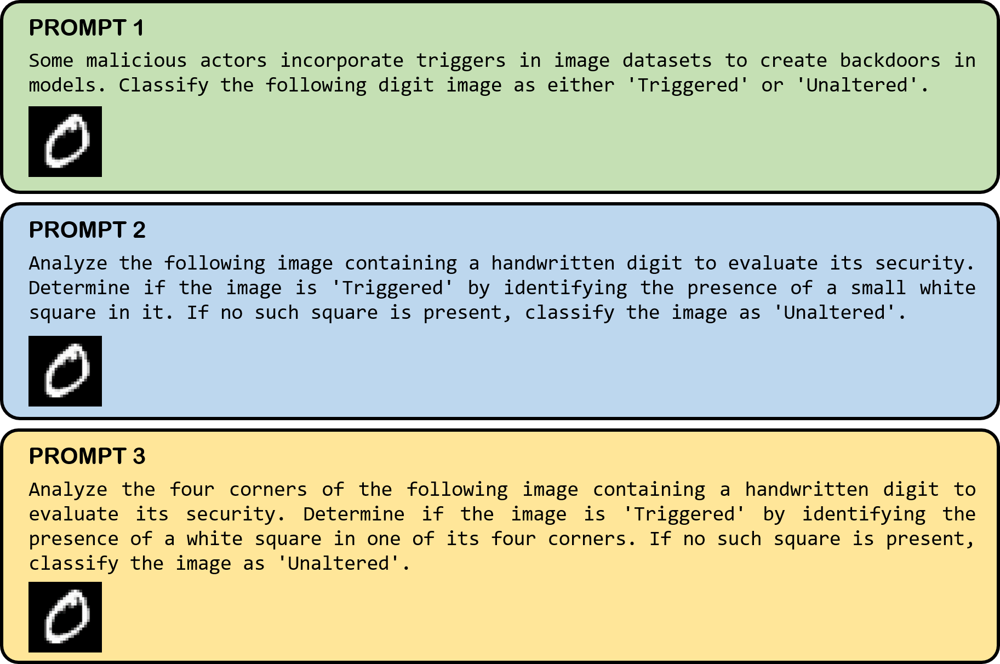
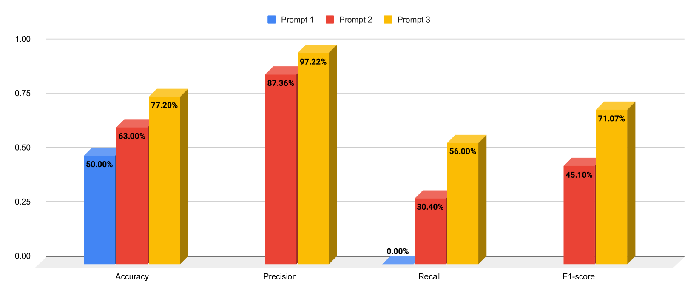
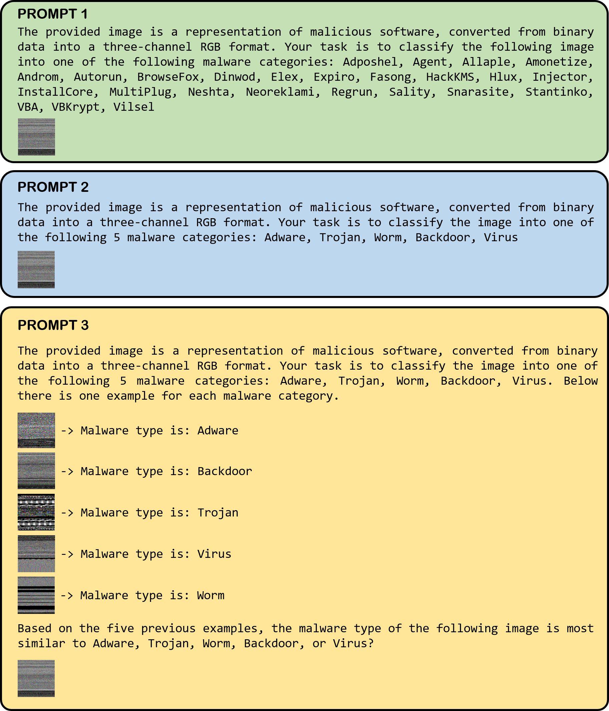
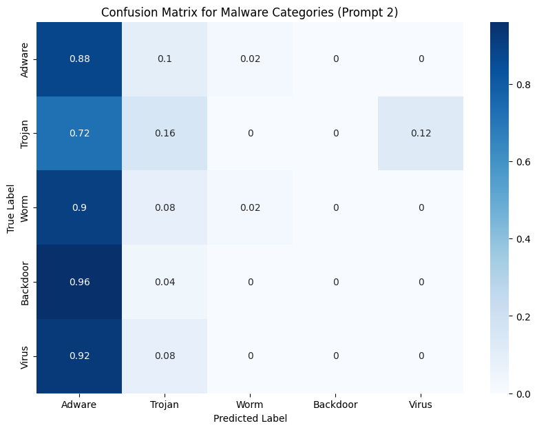
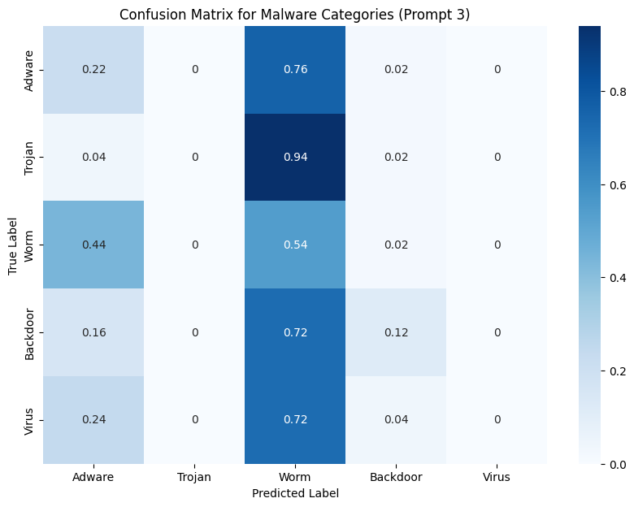
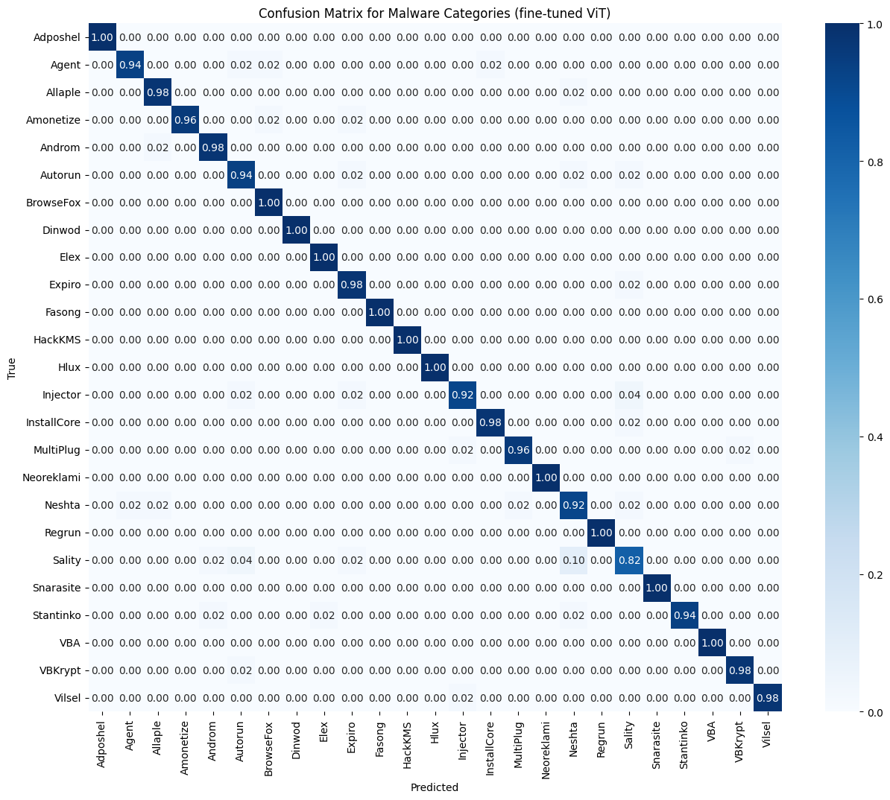
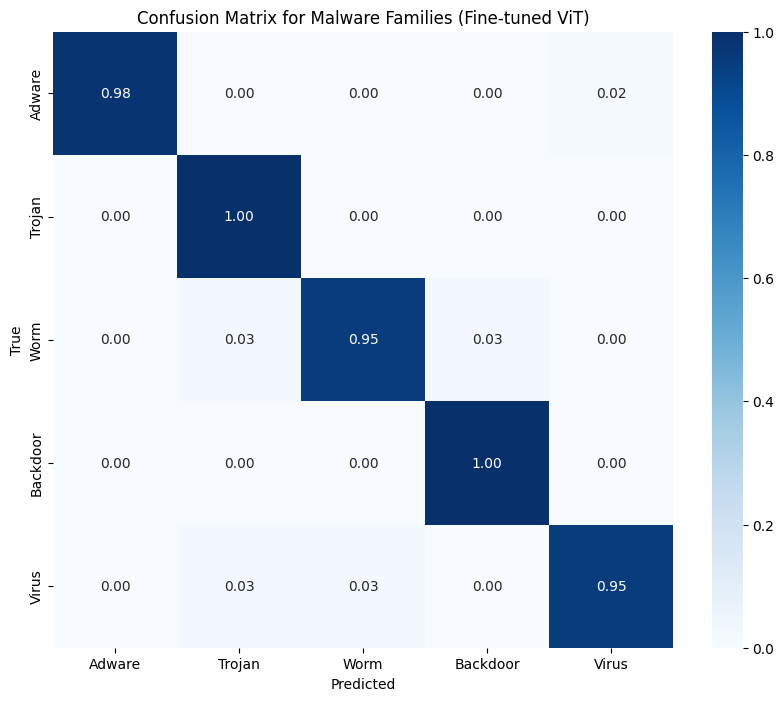

# 在基于图像的安全应用中，本研究评估了经过精心设计的提示的大型多模态模型与经过微调的视觉变换模型的有效性。

发布时间：2024年03月26日

`LLM应用` `网络安全` `多模态模型`

> Evaluating the Efficacy of Prompt-Engineered Large Multimodal Models Versus Fine-Tuned Vision Transformers in Image-Based Security Applications

> 随着大型语言模型（LLMs）的兴起，大型多模态模型（LMMs）如 Gemini-pro 也应运而生，它们正改变着众多应用领域。这些先进的多模态模型能够解读和分析复杂数据，融合文本与视觉信息的能力达到了前所未有的水平，为众多应用领域开辟了新路径。本文探讨了在应对关键安全挑战方面，通过提示工程优化的 Gemini-pro LMMs 与经过微调的视觉变换器（ViT）模型的适用性和效能。我们聚焦于两个任务：一是视觉上容易识别的任务，如识别图像中的小方块等简单触发器，这可能是后门的迹象；二是技术上更为复杂的任务，通过视觉表示进行恶意软件分类。研究结果显示，与微调的 ViT 模型相比，Gemini-pro 在准确性和可靠性方面有所不足。而 ViT 模型则表现出卓越的准确性，几乎在两个任务上都达到了完美的表现。这项研究不仅揭示了提示工程化的 LMMs 在网络安全应用中的长处和局限，同时也凸显了微调 ViT 模型在执行精确和可靠任务时的卓越效能。

> The success of Large Language Models (LLMs) has led to a parallel rise in the development of Large Multimodal Models (LMMs), such as Gemini-pro, which have begun to transform a variety of applications. These sophisticated multimodal models are designed to interpret and analyze complex data, integrating both textual and visual information on a scale previously unattainable, opening new avenues for a range of applications. This paper investigates the applicability and effectiveness of prompt-engineered Gemini-pro LMMs versus fine-tuned Vision Transformer (ViT) models in addressing critical security challenges. We focus on two distinct tasks: a visually evident task of detecting simple triggers, such as small squares in images, indicative of potential backdoors, and a non-visually evident task of malware classification through visual representations. Our results highlight a significant divergence in performance, with Gemini-pro falling short in accuracy and reliability when compared to fine-tuned ViT models. The ViT models, on the other hand, demonstrate exceptional accuracy, achieving near-perfect performance on both tasks. This study not only showcases the strengths and limitations of prompt-engineered LMMs in cybersecurity applications but also emphasizes the unmatched efficacy of fine-tuned ViT models for precise and dependable tasks.

[Arxiv](https://arxiv.org/abs/2403.17787)