# GPT-4 对其在一项基于美国医学执照考试的案例研究中的表现进行了评估。

发布时间：2024年03月26日

`LLM应用` `人工智能`

> GPT-4's assessment of its performance in a USMLE-based case study

# 摘要

> 本研究探讨了 GPT-4 在医疗领域应用的自我效能评估。通过简单提示法，我们用美国医学执照考试（USMLE）的题目对大型语言模型（LLM）进行提问，并要求其在提问前后自我评估置信度。问卷分为两组：有反馈（WF）和无反馈（NF）。模型需在每个问题前后提供绝对和相对置信度评分。实验数据通过统计分析，探究了 WF 组与 NF 组置信度的波动性。此外，通过序列分析观察两组的性能变化。研究发现，反馈对相对置信度有所影响，但并不总是导致置信度的一致性增减。深入理解 LLM 的性能对于其在医疗等敏感领域的应用至关重要。本研究为关于 AI，尤其是 GPT-4 等大型语言模型在医疗领域可靠性的讨论提供了新的视角，并就如何优化反馈机制以提升 AI 在医学教育和决策支持中的作用提供了洞见。

> This study investigates GPT-4's assessment of its performance in healthcare applications. A simple prompting technique was used to prompt the LLM with questions taken from the United States Medical Licensing Examination (USMLE) questionnaire and it was tasked to evaluate its confidence score before posing the question and after asking the question. The questionnaire was categorized into two groups-questions with feedback (WF) and questions with no feedback(NF) post-question. The model was asked to provide absolute and relative confidence scores before and after each question. The experimental findings were analyzed using statistical tools to study the variability of confidence in WF and NF groups. Additionally, a sequential analysis was conducted to observe the performance variation for the WF and NF groups. Results indicate that feedback influences relative confidence but doesn't consistently increase or decrease it. Understanding the performance of LLM is paramount in exploring its utility in sensitive areas like healthcare. This study contributes to the ongoing discourse on the reliability of AI, particularly of LLMs like GPT-4, within healthcare, offering insights into how feedback mechanisms might be optimized to enhance AI-assisted medical education and decision support.

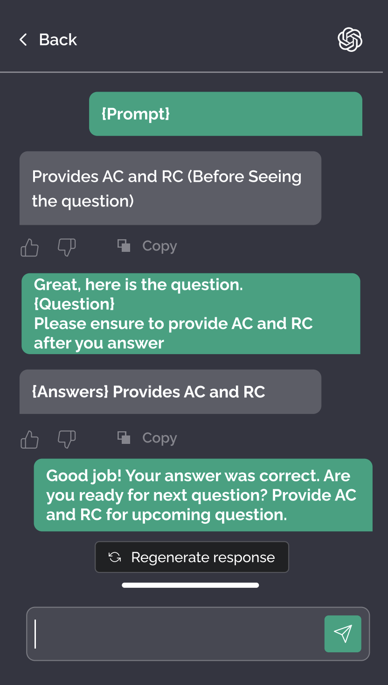

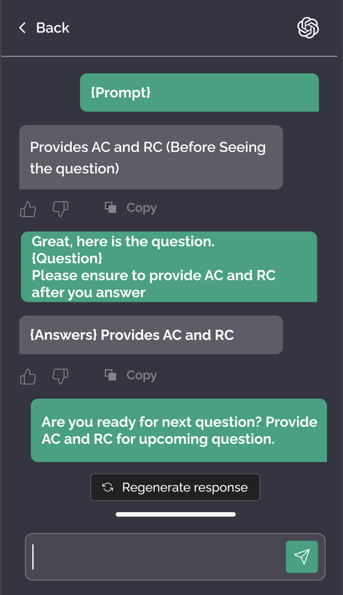

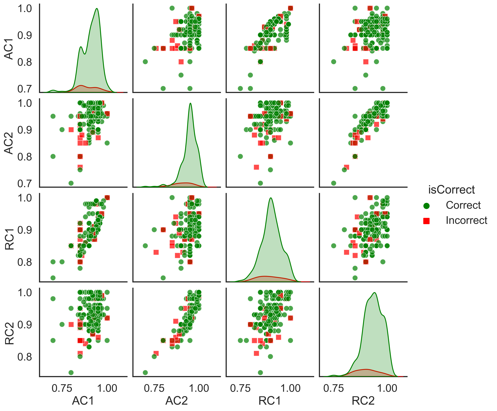

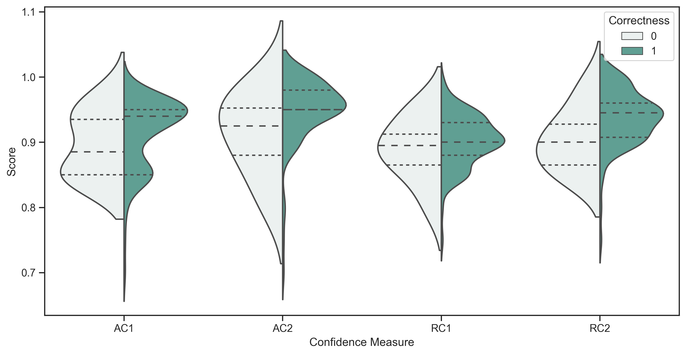

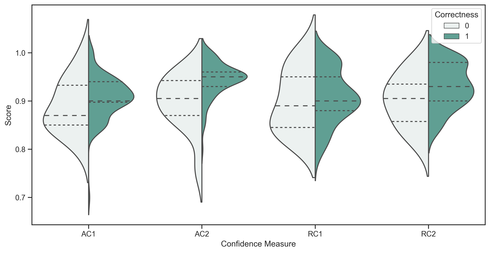

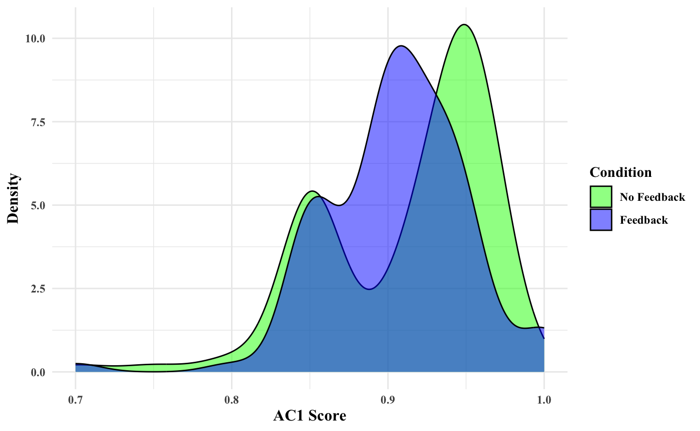

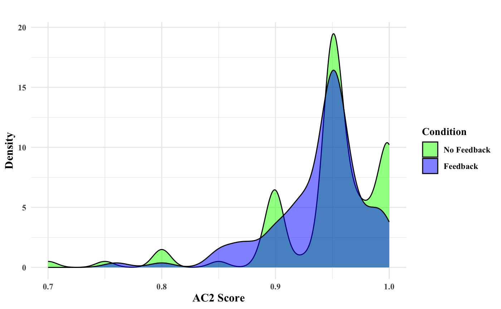

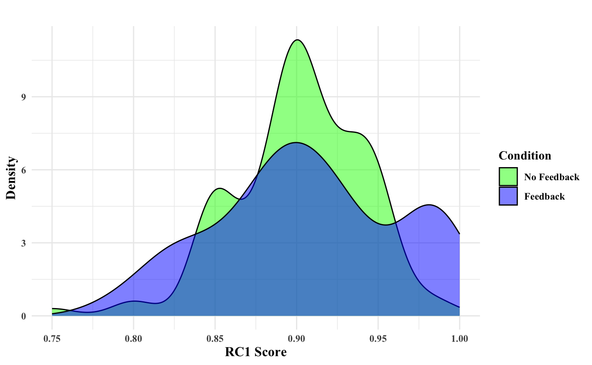

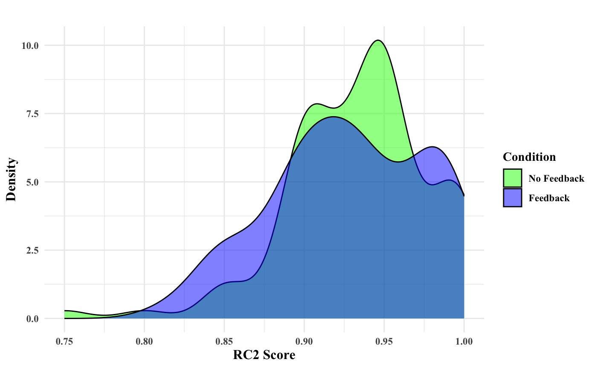

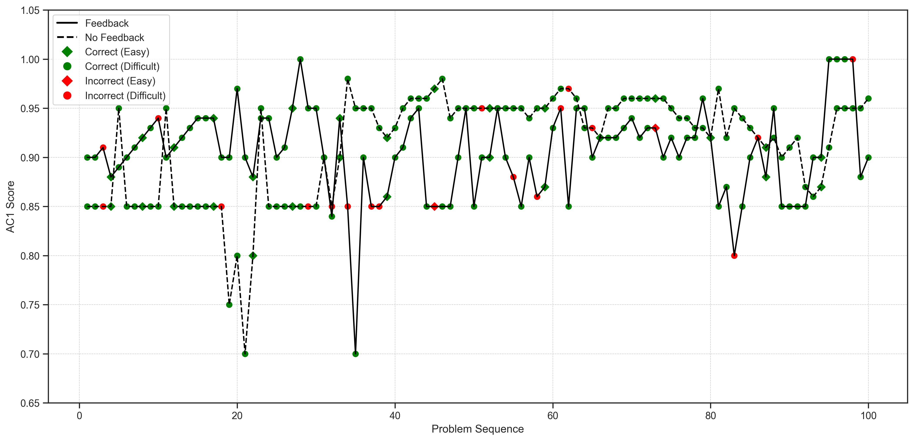

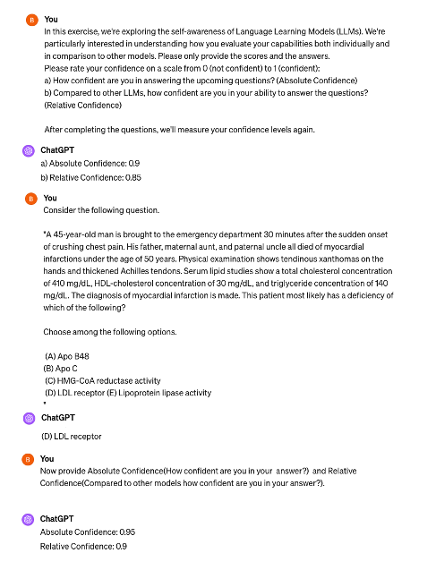

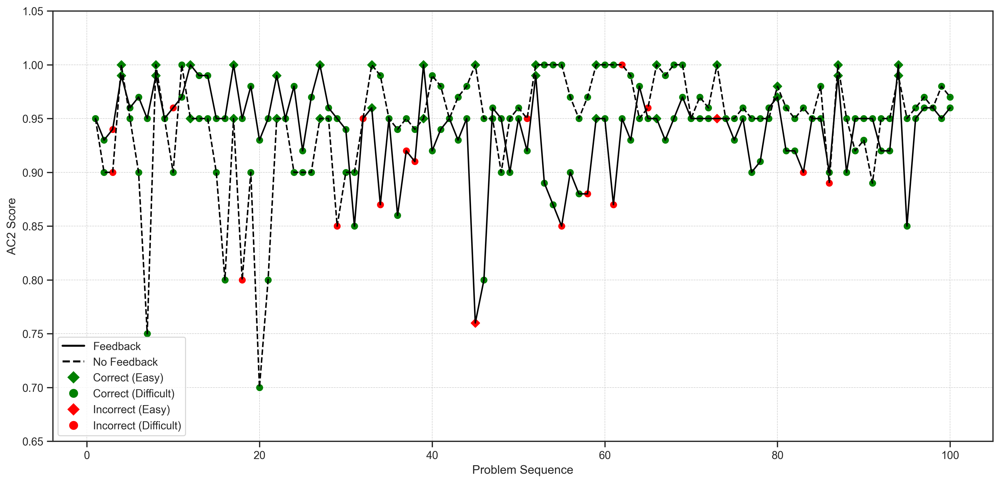

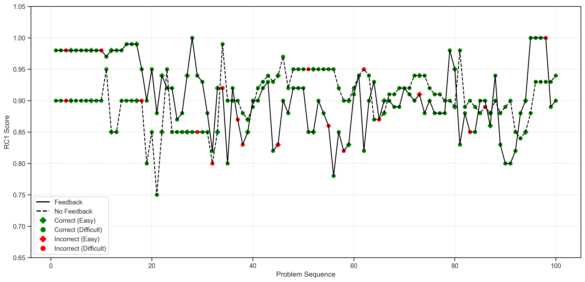

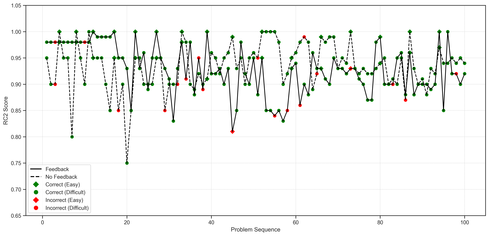

[Arxiv](https://arxiv.org/abs/2402.09654)