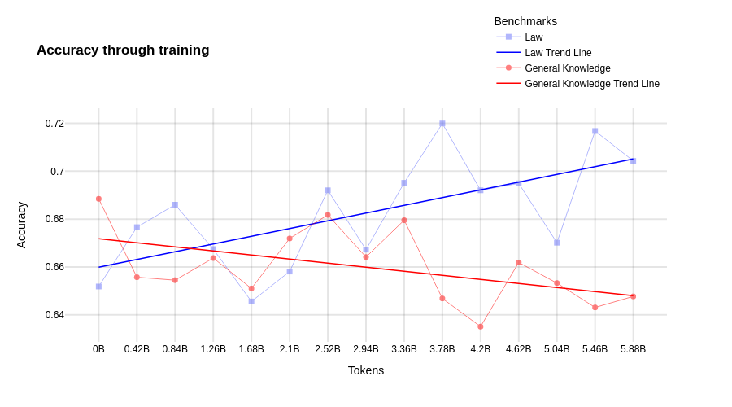
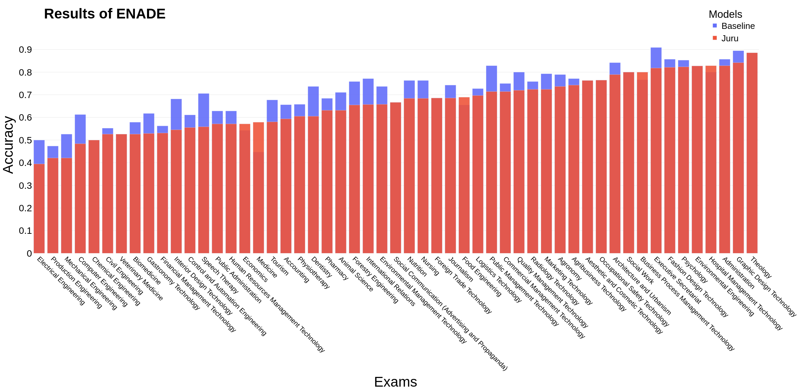

# Juru，一款汇集权威资料的巴西法律领域大型语言模型。

发布时间：2024年03月26日

`LLM应用`

> Juru: Legal Brazilian Large Language Model from Reputable Sources

# 摘要

> 预训练大型语言模型所需的高昂计算资源成为了研究的瓶颈。为应对这一挑战，人们提出了两种方法：领域定制化和采用高品质数据进行预训练。我们针对这一问题，选取了1.9亿个独特词汇，源自巴西权威的法律资料，对Sabiá-2小型模型进行了领域定制化处理，并在法律及通识测试中进行了小样本评估。我们的Juru模型证明了，在减少预训练数据量的前提下，领域定制化能带来显著优势。然而，这种专业化也导致了在同语言其他知识领域的性能下降。本研究进一步证实，精选预训练数据能有效提升大型语言模型的表现，有助于我们以更经济的方式挖掘这些模型的潜力。

> The high computational cost associated with pretraining large language models limits their research. Two strategies have emerged to address this issue: domain specialization and pretraining with high-quality data. To explore these strategies, we specialized the Sabiá-2 Small model with 1.9 billion unique tokens from reputable Brazilian legal sources and conducted few-shot evaluations on legal and general knowledge exams. Our model, Juru, demonstrates the benefits of domain specialization with a reduced amount of pretraining data. However, this specialization comes at the expense of degrading performance in other knowledge areas within the same language. This study contributes to the growing body of scientific evidence showing that pretraining data selection may enhance the performance of large language models, enabling the exploration of these models at a lower cost.

[Arxiv](https://arxiv.org/abs/2403.18140)