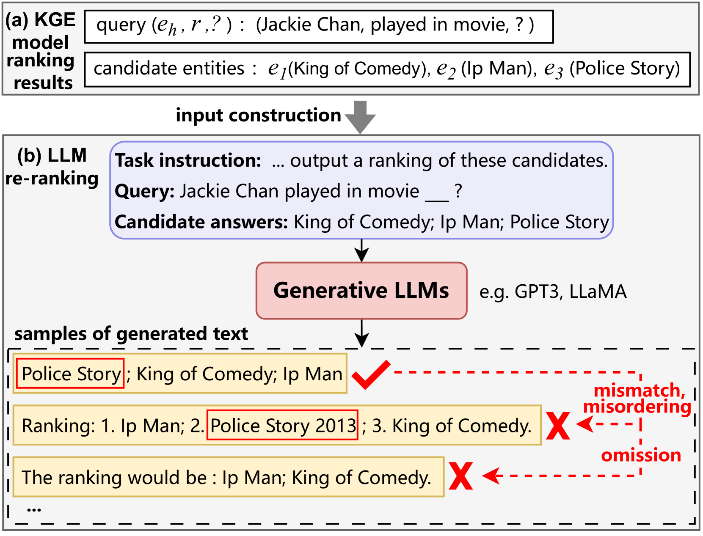
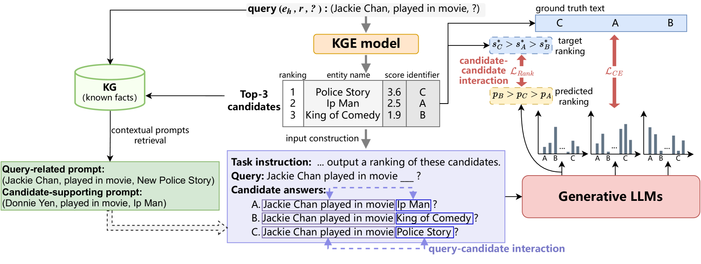
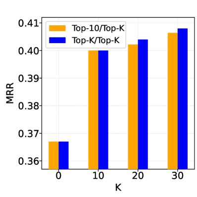
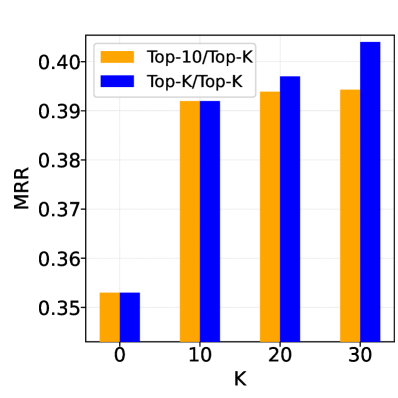
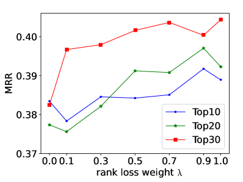

# KC-GenRe：借助大型语言模型，推出一种知识约束的生成式重排技术，旨在完善知识图谱。

发布时间：2024年03月26日

`LLM应用` `知识图谱` `信息检索`

> KC-GenRe: A Knowledge-constrained Generative Re-ranking Method Based on Large Language Models for Knowledge Graph Completion

# 摘要

> 知识图谱补全（KGC）旨在预测实体间缺失的信息。传统KGC重排序方法多依赖非生成性语言模型来评估候选事实的概率。近期，生成性大型语言模型（LLMs）在信息提取、对话系统等领域展现出卓越性能。将其应用于KGC重排序，可充分利用其丰富的预训练知识和强大的生成能力。然而，这一过程中可能面临不匹配、顺序错乱和信息遗漏等新挑战。为此，我们提出了KC-GenRe，一种基于LLMs的知识约束生成式重排序方法。我们通过将KGC重排序问题转化为候选标识符的生成排序问题，利用生成性LLMs进行解决。针对顺序错乱问题，我们开发了一种知识引导的交互训练方法，提升了候选事实的识别和排序准确性。为应对遗漏问题，我们设计了一种知识增强的约束推理方法，通过上下文提示和控制生成，确保排名的有效性。实验结果显示，KG-GenRe在四个数据集上达到了最先进的水平，相较于传统方法，在平均排名倒数回收率（MRR）和命中率@1（Hits@1）指标上分别提升了6.7%和7.7%，与未进行重排序的方法相比，提升了9.0%和11.1%。深入分析验证了KC-GenRe各组件的有效性。

> The goal of knowledge graph completion (KGC) is to predict missing facts among entities. Previous methods for KGC re-ranking are mostly built on non-generative language models to obtain the probability of each candidate. Recently, generative large language models (LLMs) have shown outstanding performance on several tasks such as information extraction and dialog systems. Leveraging them for KGC re-ranking is beneficial for leveraging the extensive pre-trained knowledge and powerful generative capabilities. However, it may encounter new problems when accomplishing the task, namely mismatch, misordering and omission. To this end, we introduce KC-GenRe, a knowledge-constrained generative re-ranking method based on LLMs for KGC. To overcome the mismatch issue, we formulate the KGC re-ranking task as a candidate identifier sorting generation problem implemented by generative LLMs. To tackle the misordering issue, we develop a knowledge-guided interactive training method that enhances the identification and ranking of candidates. To address the omission issue, we design a knowledge-augmented constrained inference method that enables contextual prompting and controlled generation, so as to obtain valid rankings. Experimental results show that KG-GenRe achieves state-of-the-art performance on four datasets, with gains of up to 6.7% and 7.7% in the MRR and Hits@1 metric compared to previous methods, and 9.0% and 11.1% compared to that without re-ranking. Extensive analysis demonstrates the effectiveness of components in KG-GenRe.

[Arxiv](https://arxiv.org/abs/2403.17532)