# LISA：逐层重要性抽样技术，助力内存优化的大型语言模型精调

发布时间：2024年03月26日

`LLM理论` `机器学习` `大规模模型训练`

> LISA: Layerwise Importance Sampling for Memory-Efficient Large Language Model Fine-Tuning

> 自大型语言模型亮相以来，机器学习界已取得巨大飞跃，但其庞大的内存需求却成为扩展训练的拦路虎。为解决这一难题，低秩适应（LoRA）等参数高效微调技术应运而生，但在大规模微调场景中，其效果通常不及全面参数训练。本研究深入探讨LoRA的层次特性，发现不同层次权重分布的异常偏态。基于此发现，我们提出了一种简单而高效的训练策略——分层重要性抽样AdamW（LISA），作为LoRA的有效替代。LISA在LLMs的不同层次应用重要性抽样，并在优化过程中随机冻结大部分中间层。实验显示，LISA在保持与LoRA相当的GPU内存消耗下，在多项微调任务中超越了LoRA乃至全面参数调整。尤其在MT-Bench评分上，LISA的领先幅度达到$11\%$至$37\%$。在如LLaMA-2-70B的大型模型上，LISA在多个领域的表现与LoRA持平甚至更优，展现了其跨领域的强大实力。

> The machine learning community has witnessed impressive advancements since the first appearance of large language models (LLMs), yet their huge memory consumption has become a major roadblock to large-scale training. Parameter Efficient Fine-Tuning techniques such as Low-Rank Adaptation (LoRA) have been proposed to alleviate this problem, but their performance still fails to match full parameter training in most large-scale fine-tuning settings. Attempting to complement this deficiency, we investigate layerwise properties of LoRA on fine-tuning tasks and observe an uncommon skewness of weight norms across different layers. Utilizing this key observation, a surprisingly simple training strategy is discovered, which outperforms both LoRA and full parameter training in a wide range of settings with memory costs as low as LoRA. We name it Layerwise Importance Sampled AdamW (LISA), a promising alternative for LoRA, which applies the idea of importance sampling to different layers in LLMs and randomly freeze most middle layers during optimization. Experimental results show that with similar or less GPU memory consumption, LISA surpasses LoRA or even full parameter tuning in downstream fine-tuning tasks, where LISA consistently outperforms LoRA by over $11\%$-$37\%$ in terms of MT-Bench scores. On large models, specifically LLaMA-2-70B, LISA achieves on-par or better performance than LoRA on MT-Bench, GSM8K, and PubMedQA, demonstrating its effectiveness across different domains.

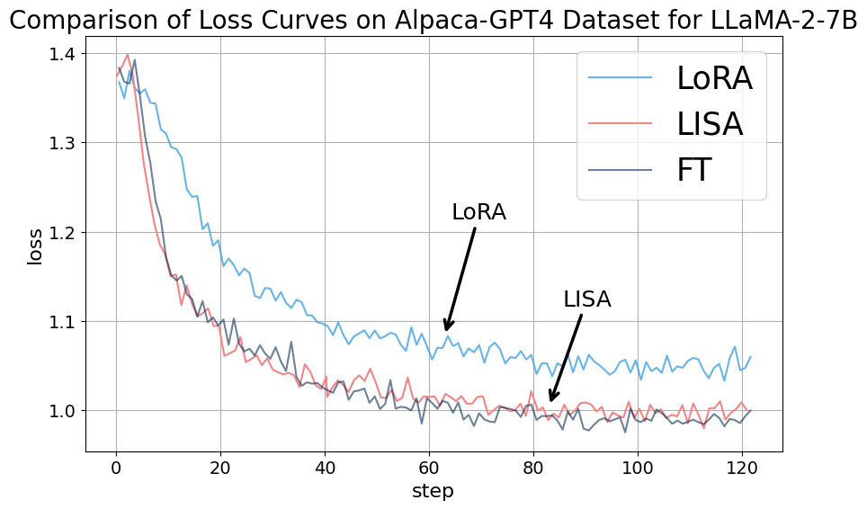

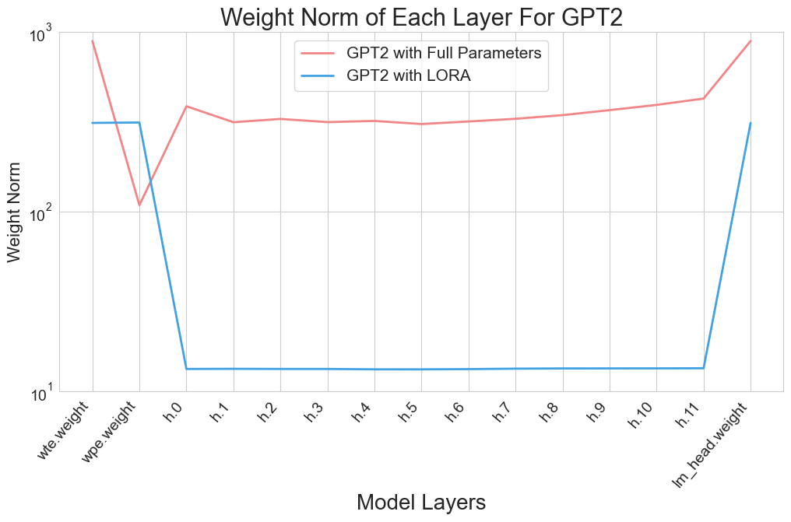

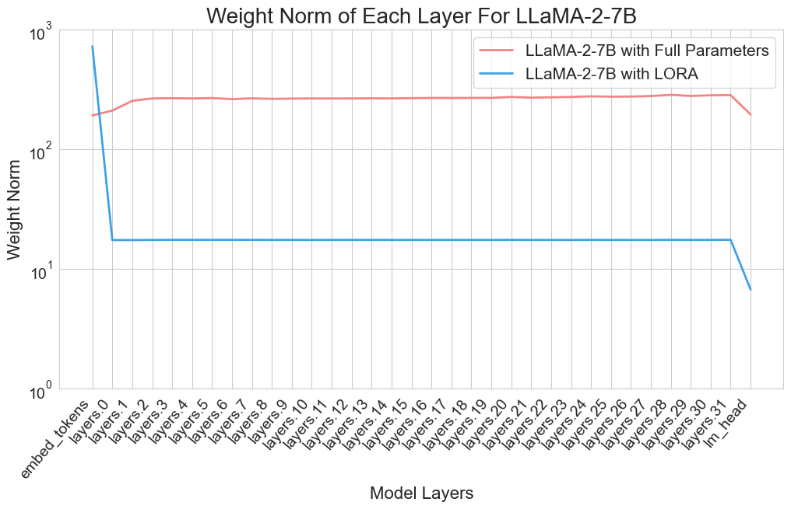

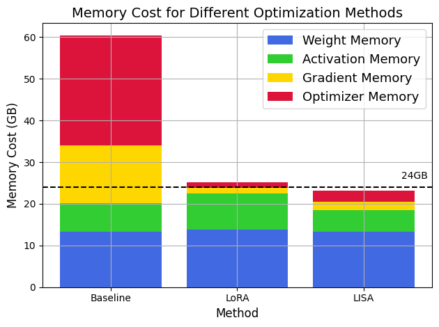

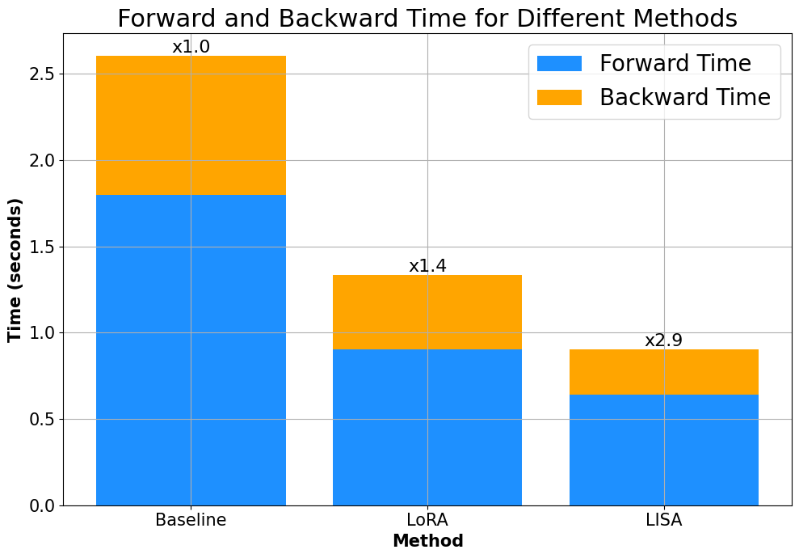

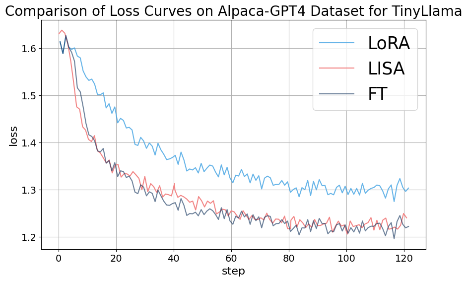

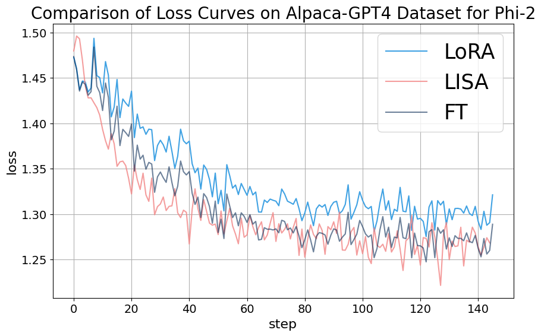

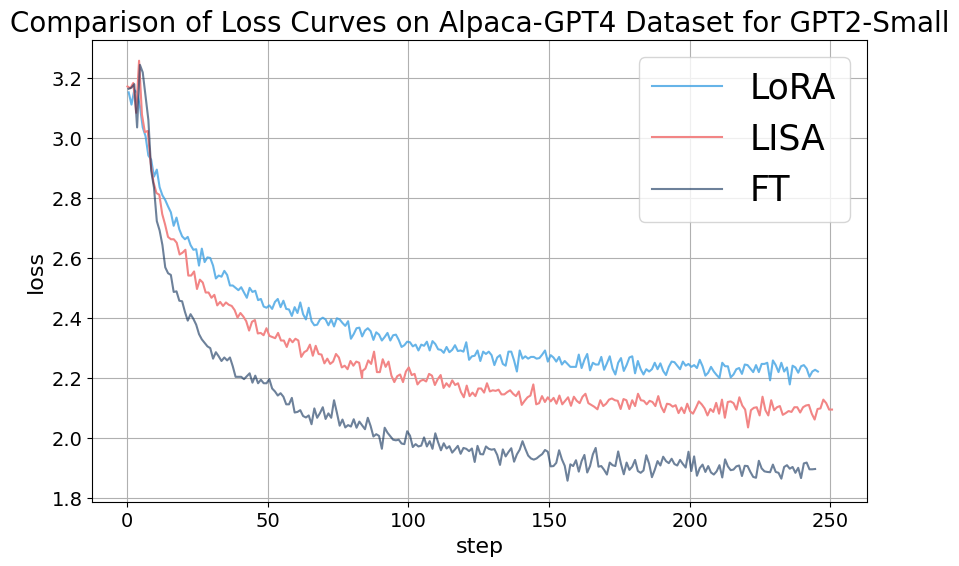

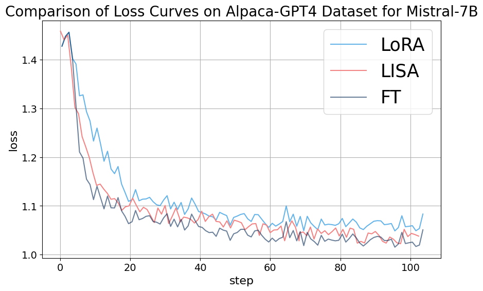

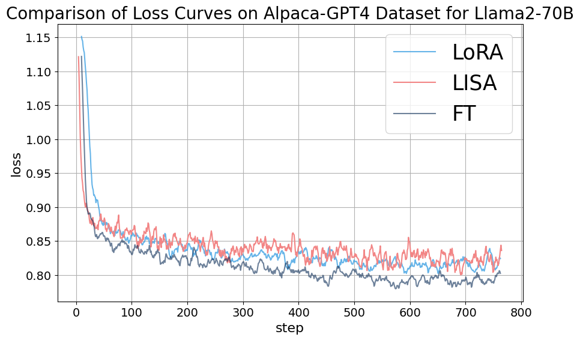

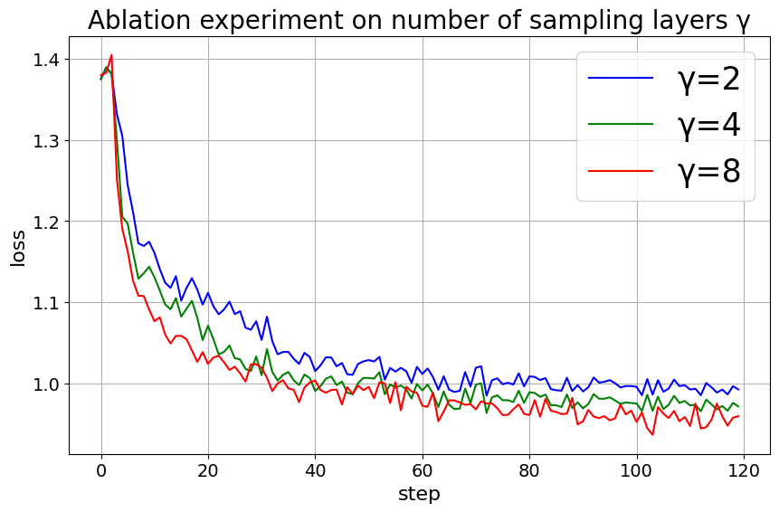

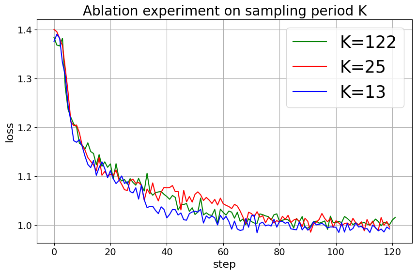

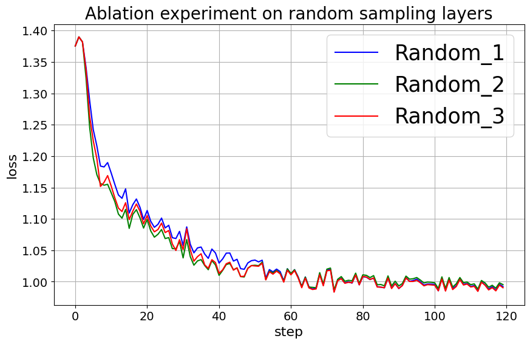

[Arxiv](https://arxiv.org/abs/2403.17919)