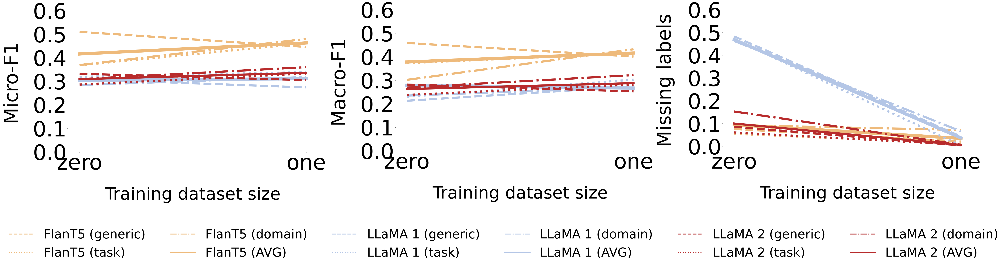
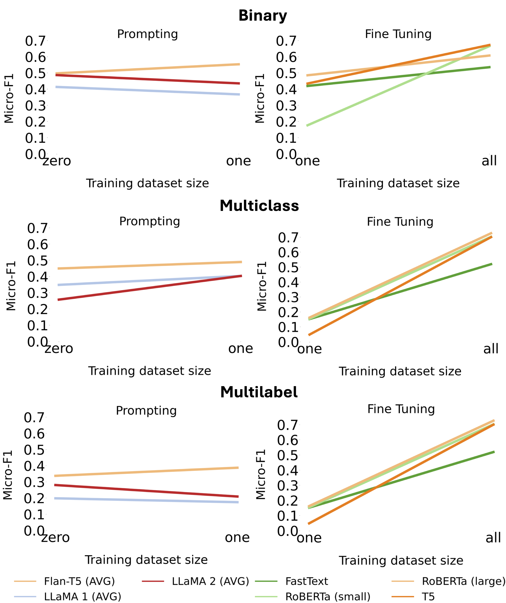
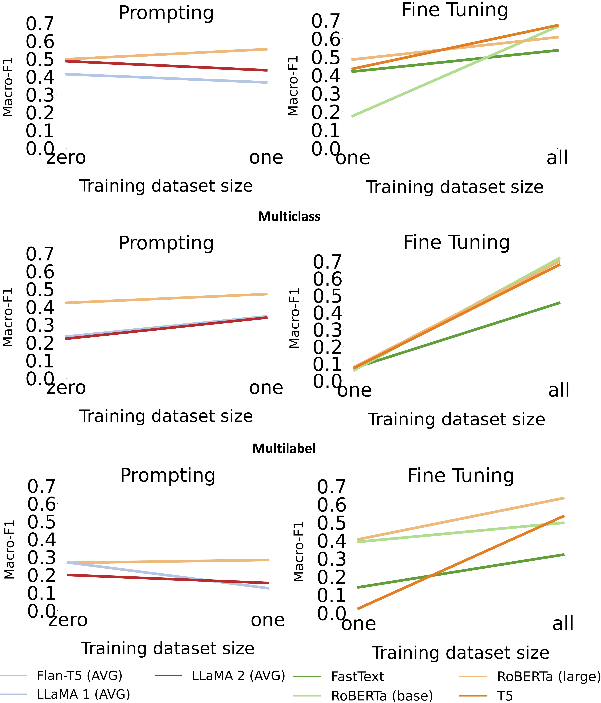

# 在文本分类的语言模型中，仅依靠上下文学习是否足够呢？

发布时间：2024年03月26日

`LLM应用` `文本分类
</example>`

> Language Models for Text Classification: Is In-Context Learning Enough?

# 摘要

> 最新的基础语言模型在各项 NLP 任务中展现了顶尖的性能，无论是零样本还是少样本的设置。这些模型相较于传统微调方法的优势在于，它们能够理解自然语言指令，使得它们能够在没有特定训练数据的情况下更好地适应不同的任务和领域。这对于处理标注数据稀缺领域的文本分类问题尤为适用。然而，目前的研究在范围和深度上仍有所不足，尤其是缺乏对结合提示技术的文本生成模型与传统文本分类方法，如掩码语言模型微调的比较。本文通过针对16个文本分类数据集的广泛评估，填补了这一研究空白，这些数据集包括二元、多类别和多标签问题。我们特别比较了大型语言模型的零少样本方法与微调小型语言模型的效果，并通过提示、分类类型、领域和标签数量对结果进行了深入分析。总体而言，研究结果显示，微调的小型、高效语言模型在文本分类任务中仍能超越大型模型的少样本方法，并指出大型模型在文本分类方面仍有提升空间。

> Recent foundational language models have shown state-of-the-art performance in many NLP tasks in zero- and few-shot settings. An advantage of these models over more standard approaches based on fine-tuning is the ability to understand instructions written in natural language (prompts), which helps them generalise better to different tasks and domains without the need for specific training data. This makes them suitable for addressing text classification problems for domains with limited amounts of annotated instances. However, existing research is limited in scale and lacks understanding of how text generation models combined with prompting techniques compare to more established methods for text classification such as fine-tuning masked language models. In this paper, we address this research gap by performing a large-scale evaluation study for 16 text classification datasets covering binary, multiclass, and multilabel problems. In particular, we compare zero- and few-shot approaches of large language models to fine-tuning smaller language models. We also analyse the results by prompt, classification type, domain, and number of labels. In general, the results show how fine-tuning smaller and more efficient language models can still outperform few-shot approaches of larger language models, which have room for improvement when it comes to text classification.

[Arxiv](https://arxiv.org/abs/2403.17661)