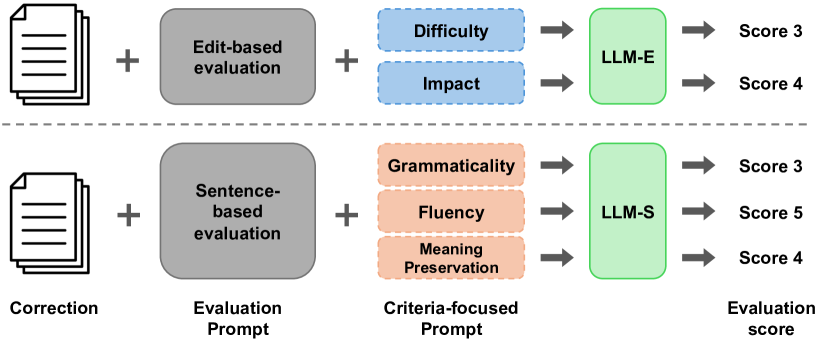
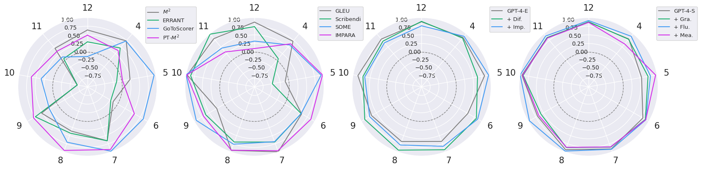
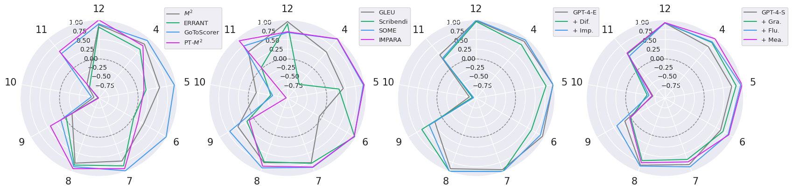
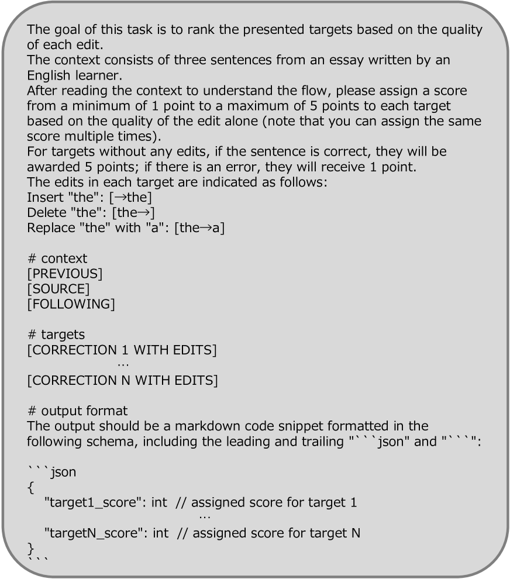
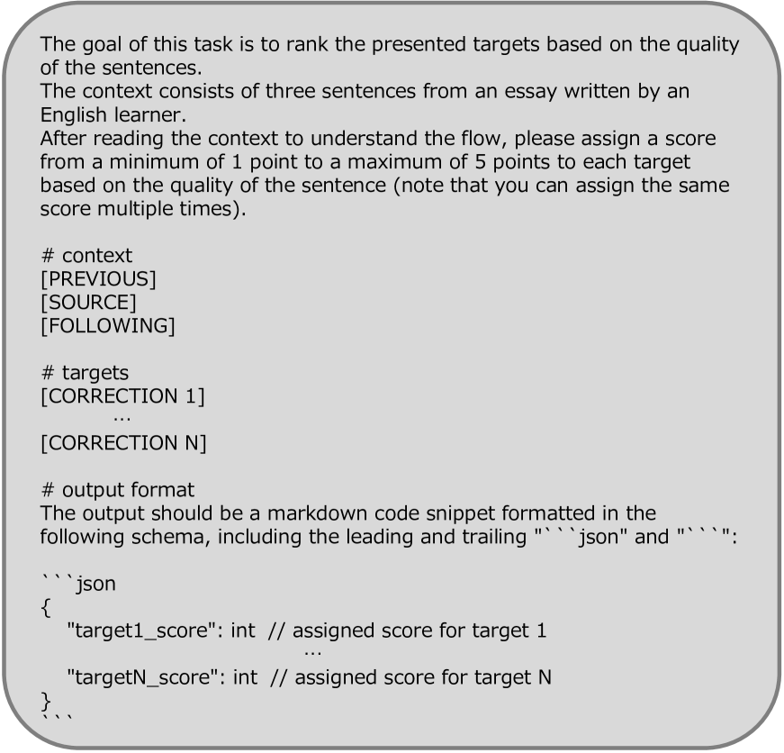
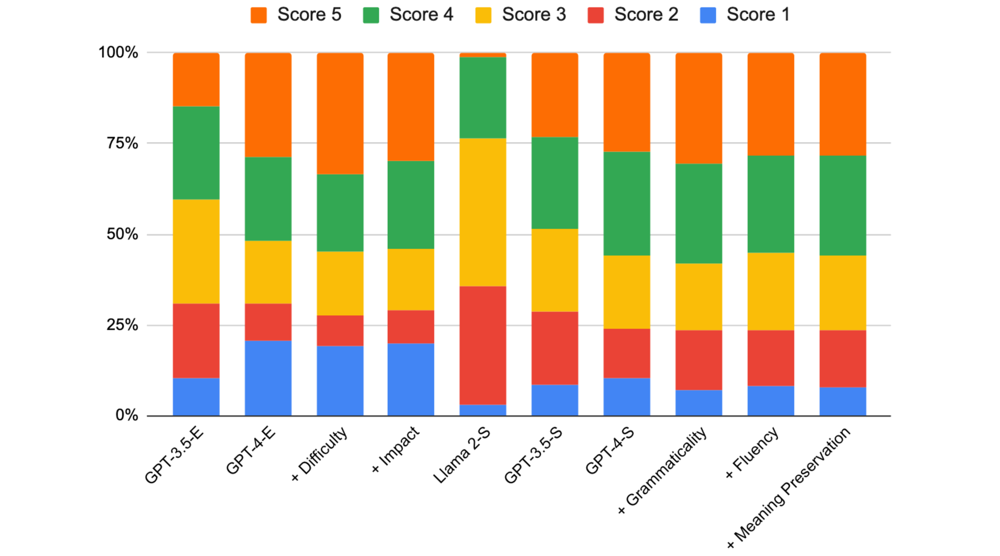

# 大型语言模型已成为语法错误纠正领域的顶尖评估工具。

发布时间：2024年03月26日

`LLM应用` `语法错误纠正` `自动评估`

> Large Language Models Are State-of-the-Art Evaluator for Grammatical Error Correction

> 大型语言模型（LLMs）在某些任务上的表现，如文本摘要和机器翻译，已超越了传统的自动评估指标。然而，关于LLMs在语法错误纠正（GEC）任务中作为评估工具的研究尚不充分。本研究通过使用融合了先前研究成果的多种评估标准的提示，探究了LLMs在GEC评估方面的效能。实验结果显示，GPT-4与人类评价的一致性达到了0.662的Kendall相关系数，表现超越了现有所有方法。此外，我们还在最新的GEC评估中突出了LLMs规模的关键作用，并特别指出了流利性在评估标准中的重要地位。

> Large Language Models (LLMs) have been reported to outperform existing automatic evaluation metrics in some tasks, such as text summarization and machine translation. However, there has been a lack of research on LLMs as evaluators in grammatical error correction (GEC). In this study, we investigate the performance of LLMs in GEC evaluation by employing prompts designed to incorporate various evaluation criteria inspired by previous research. Our extensive experimental results demonstrate that GPT-4 achieved Kendall's rank correlation of 0.662 with human judgments, surpassing all existing methods. Furthermore, in recent GEC evaluations, we have underscored the significance of the LLMs scale and particularly emphasized the importance of fluency among evaluation criteria.

[Arxiv](https://arxiv.org/abs/2403.17540)