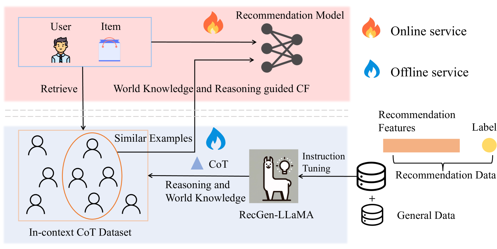
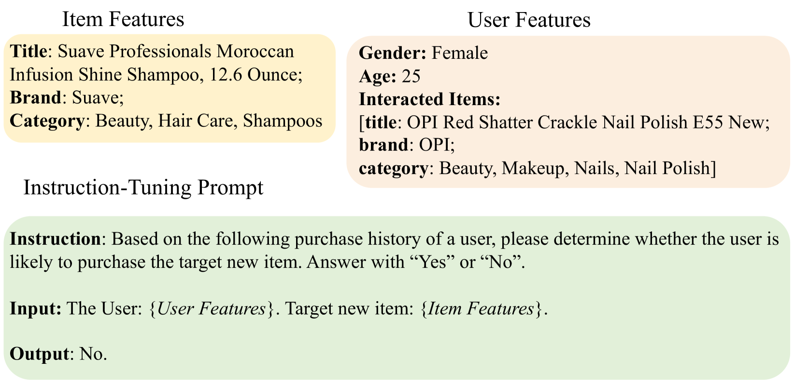
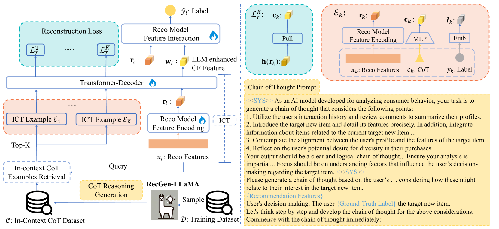
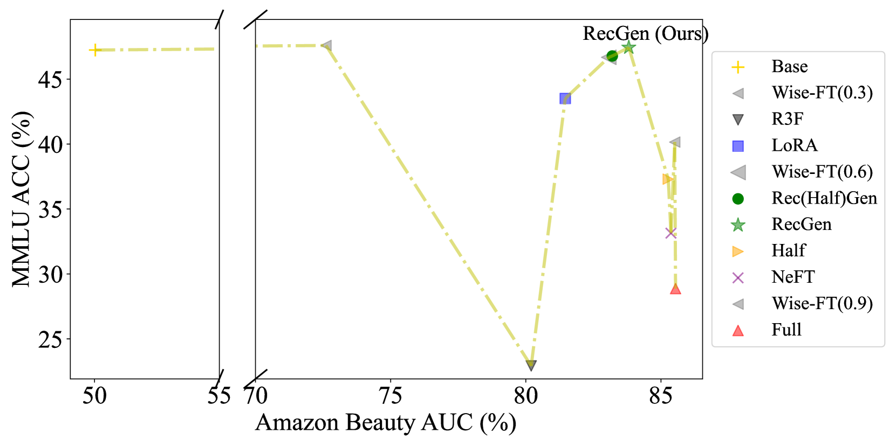
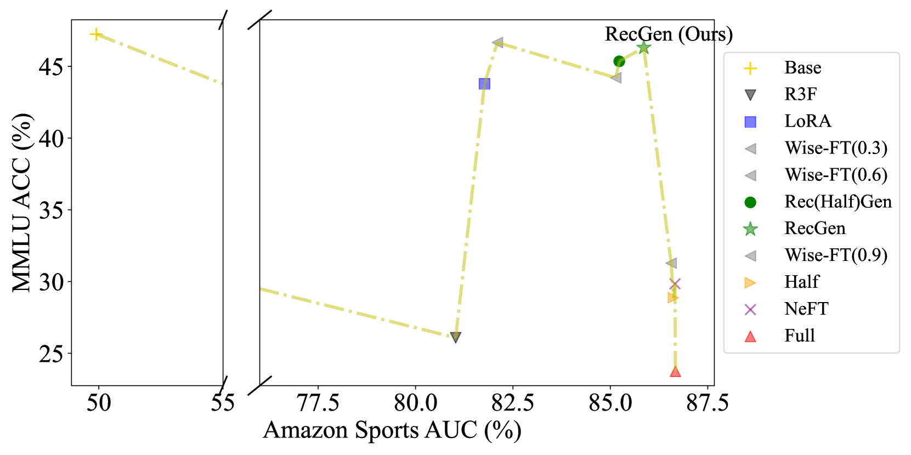
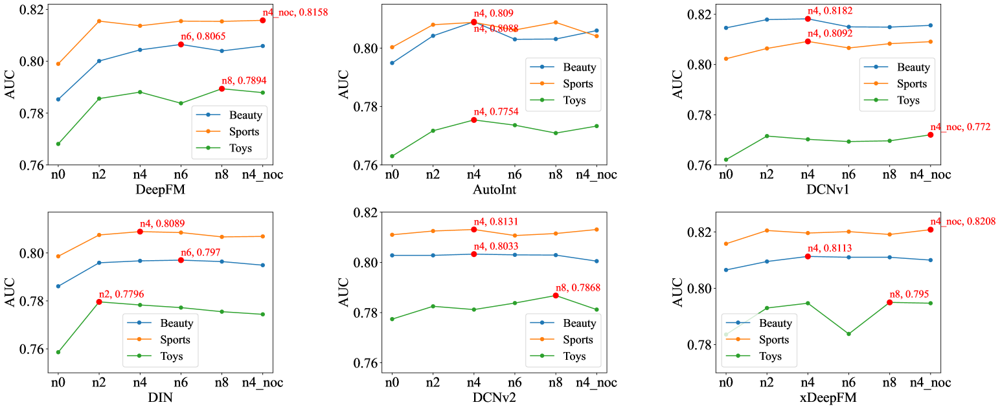

# 通过大型语言模型，我们提升了协同过滤的效果。

发布时间：2024年03月26日

`LLM应用` `推荐系统` `协同过滤`

> Large Language Models Enhanced Collaborative Filtering

> 近期大型语言模型（LLMs）的突破性进展激发了研究者们的热情，他们致力于利用这些模型来提升推荐系统（RSs）。目前的研究多集中于使用LLMs创造丰富的知识文本，或将其衍生的嵌入作为特性来优化RSs。尽管LLMs内嵌的丰富世界知识对RSs大有裨益，但在处理用户和项目输入时仍有局限，未能充分利用协同过滤的信息。鉴于LLMs在RSs中的重要性，如何通过LLMs提供更精准的协同过滤信息，成为提升RSs的关键挑战。本文借鉴LLMs的上下文学习和思维链推理，提出了一种新型框架——大型语言模型增强协同过滤（LLM-CF），将LLMs的世界知识与推理能力融入协同过滤。此外，我们还探索了一种高效的指令调整方法，该方法在不牺牲LLMs通用功能的前提下，有效提升了其推荐性能。通过在三个真实世界数据集上的广泛实验验证，LLM-CF显著提升了多个核心推荐模型的性能，并始终超越了竞争性的基准线，证明了其在提炼LLMs的世界知识与推理能力至协同过滤方面的卓越效果。

> Recent advancements in Large Language Models (LLMs) have attracted considerable interest among researchers to leverage these models to enhance Recommender Systems (RSs). Existing work predominantly utilizes LLMs to generate knowledge-rich texts or utilizes LLM-derived embeddings as features to improve RSs. Al- though the extensive world knowledge embedded in LLMs generally benefits RSs, the application can only take limited number of users and items as inputs, without adequately exploiting collaborative filtering information. Considering its crucial role in RSs, one key challenge in enhancing RSs with LLMs lies in providing better collaborative filtering information through LLMs. In this paper, drawing inspiration from the in-context learning and chain of thought reasoning in LLMs, we propose the Large Language Models enhanced Collaborative Filtering (LLM-CF) framework, which distils the world knowledge and reasoning capabilities of LLMs into collaborative filtering. We also explored a concise and efficient instruction-tuning method, which improves the recommendation capabilities of LLMs while preserving their general functionalities (e.g., not decreasing on the LLM benchmark). Comprehensive experiments on three real-world datasets demonstrate that LLM-CF significantly enhances several backbone recommendation models and consistently outperforms competitive baselines, showcasing its effectiveness in distilling the world knowledge and reasoning capabilities of LLM into collaborative filtering.

[Arxiv](https://arxiv.org/abs/2403.17688)