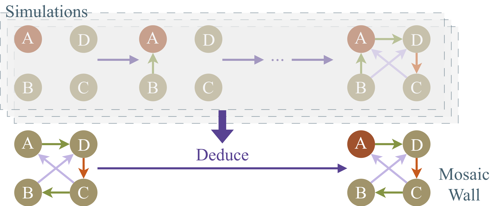
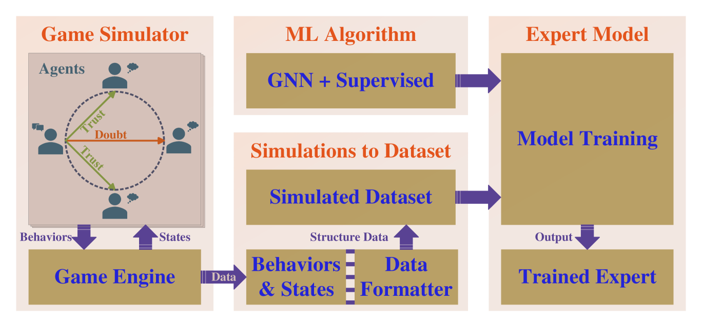
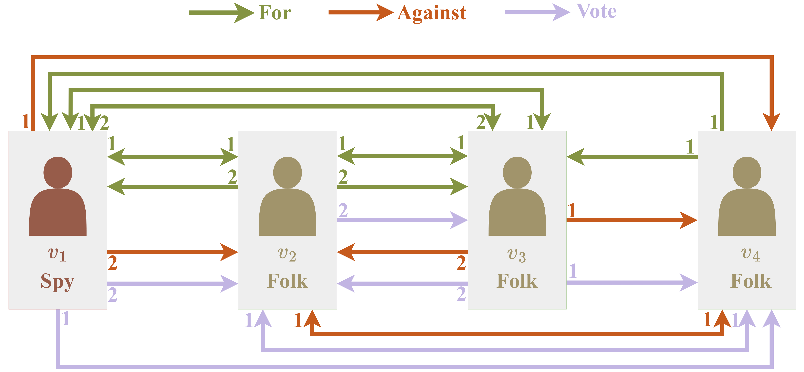
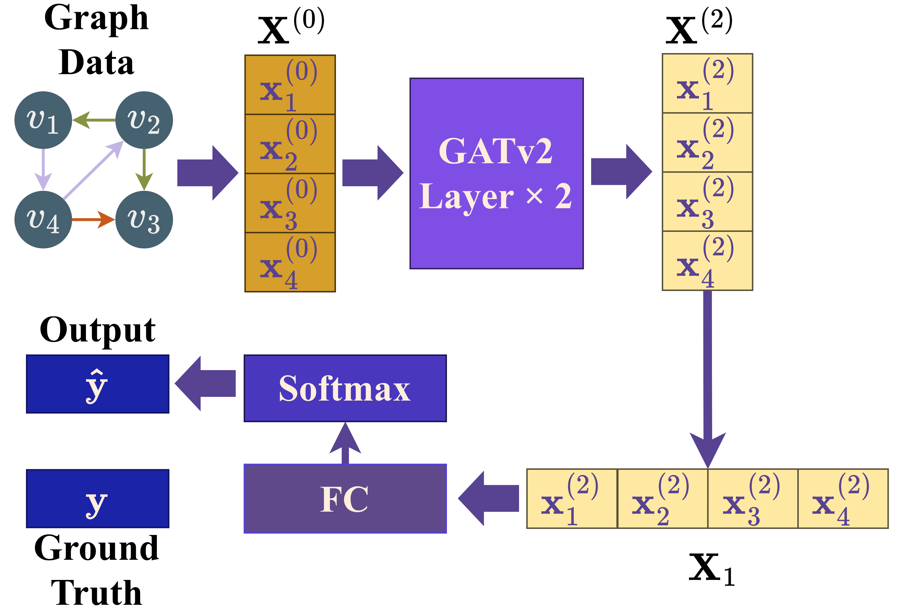
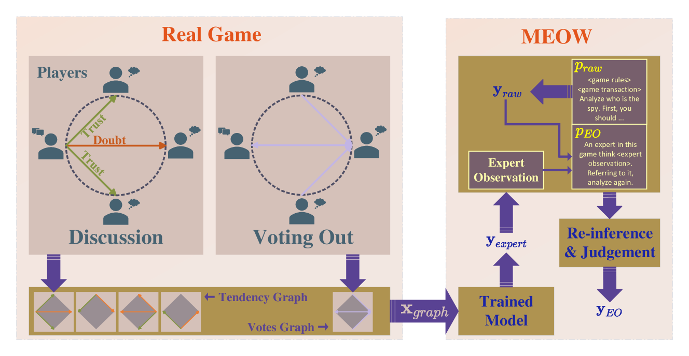

# 大型语言模型需借助顾问来提升推理能力：模拟人类行为，精通复杂系统之道。

发布时间：2024年03月26日

`RAG` `人际互动` `推理增强`

> Large Language Models Need Consultants for Reasoning: Becoming an Expert in a Complex Human System Through Behavior Simulation

# 摘要

> 大型语言模型结合多样的推理增强手段，在诸如数学、法律、编程等众多领域展现出接近人类的认知能力。本文深入研究了LLMs在复杂人际互动中的推理表现。我们设计了一个名为“马赛克专家观察墙”（MEOW）的创新推理框架，该框架运用生成式代理模拟技术。在MEOW框架下，通过模拟产生的数据训练专家模型，使其在每次模拟中针对特定任务积累“经验”。正是这些累积的“经验”塑造了复杂人际系统中的任务专家。我们通过一个反映现实世界安全状况的通信游戏进行实验验证。实验结果显示，我们的方法能够有效协同传统方法，提升LLMs在处理复杂人际问题时的推理能力。

> Large language models (LLMs), in conjunction with various reasoning reinforcement methodologies, have demonstrated remarkable capabilities comparable to humans in fields such as mathematics, law, coding, common sense, and world knowledge. In this paper, we delve into the reasoning abilities of LLMs within complex human systems. We propose a novel reasoning framework, termed ``Mosaic Expert Observation Wall'' (MEOW) exploiting generative-agents-based simulation technique. In the MEOW framework, simulated data are utilized to train an expert model concentrating ``experience'' about a specific task in each independent time of simulation. It is the accumulated ``experience'' through the simulation that makes for an expert on a task in a complex human system. We conduct the experiments within a communication game that mirrors real-world security scenarios. The results indicate that our proposed methodology can cooperate with existing methodologies to enhance the reasoning abilities of LLMs in complex human systems.

[Arxiv](https://arxiv.org/abs/2403.18230)