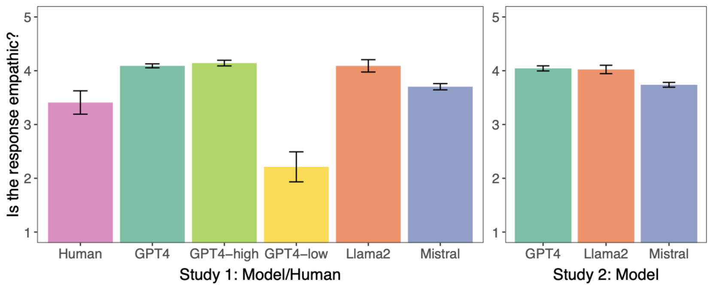
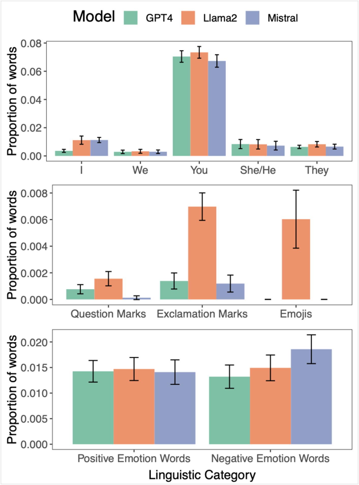

# 大型语言模型能够产生让人感觉富有同理心的回应。

发布时间：2024年03月26日

`LLM应用` `人际交流` `心理健康`

> Large Language Models Produce Responses Perceived to be Empathic

# 摘要

> 大型语言模型在撰写富有同情心的信息方面展现出惊人的能力，无论是应对职场挑战、育儿困惑、人际纠葛还是其他可能引发不安和愤怒的场景。在两项研究中，我们让人类评审对GPT4 Turbo、Llama2和Mistral等模型生成的回复进行同情心评估，结果发现机器生成的回复比人类写作的回复获得了更高的同情分。进一步的语言分析揭示了这些模型在运用标点、表情符号和特定词汇上的独特且可预测的写作风格。这一发现突显了在需要同情与理解的场合，利用大型语言模型来加强人与人之间的互助支持的巨大潜力。

> Large Language Models (LLMs) have demonstrated surprising performance on many tasks, including writing supportive messages that display empathy. Here, we had these models generate empathic messages in response to posts describing common life experiences, such as workplace situations, parenting, relationships, and other anxiety- and anger-eliciting situations. Across two studies (N=192, 202), we showed human raters a variety of responses written by several models (GPT4 Turbo, Llama2, and Mistral), and had people rate these responses on how empathic they seemed to be. We found that LLM-generated responses were consistently rated as more empathic than human-written responses. Linguistic analyses also show that these models write in distinct, predictable ``styles", in terms of their use of punctuation, emojis, and certain words. These results highlight the potential of using LLMs to enhance human peer support in contexts where empathy is important.

[Arxiv](https://arxiv.org/abs/2403.18148)