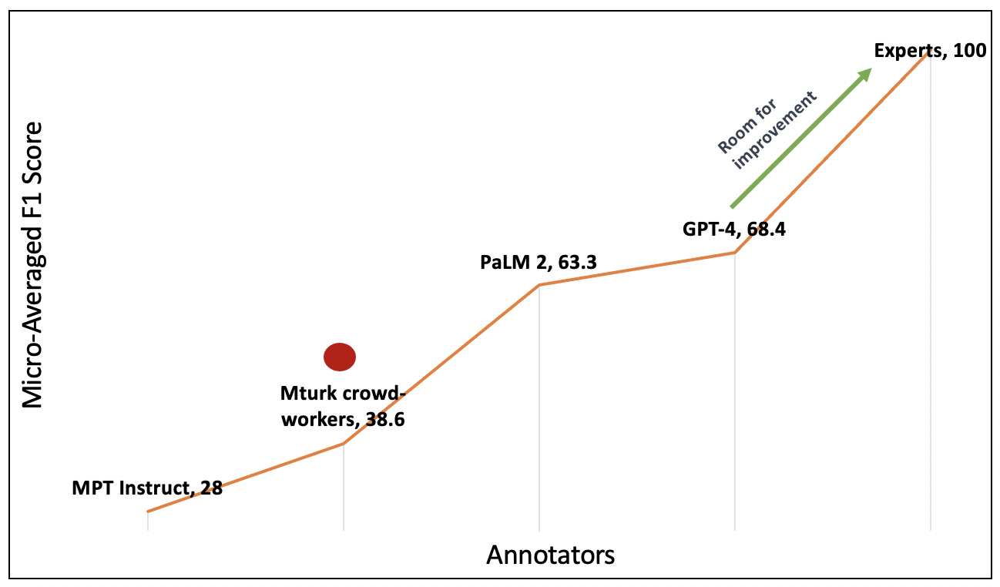
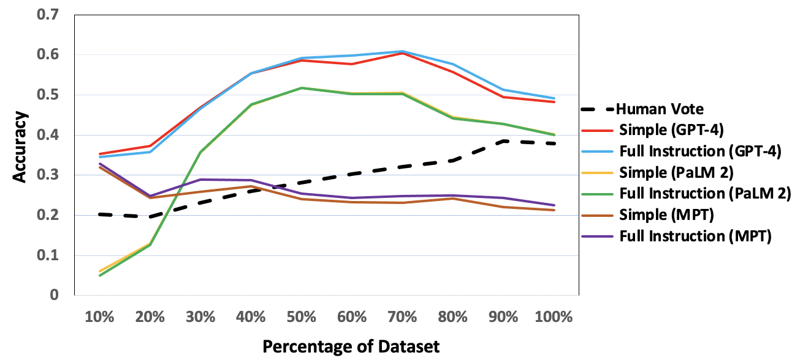
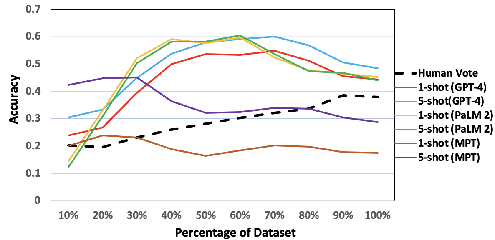
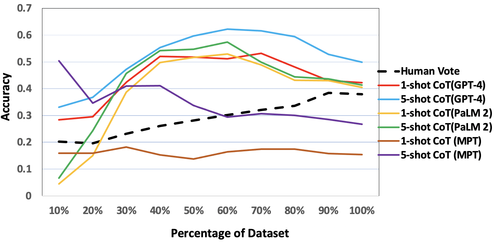
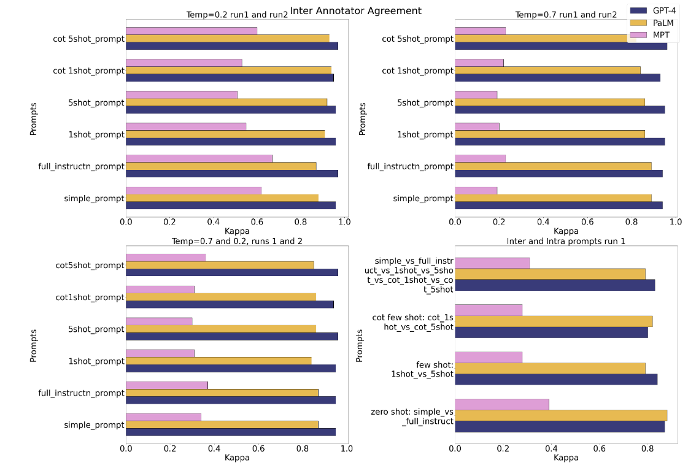
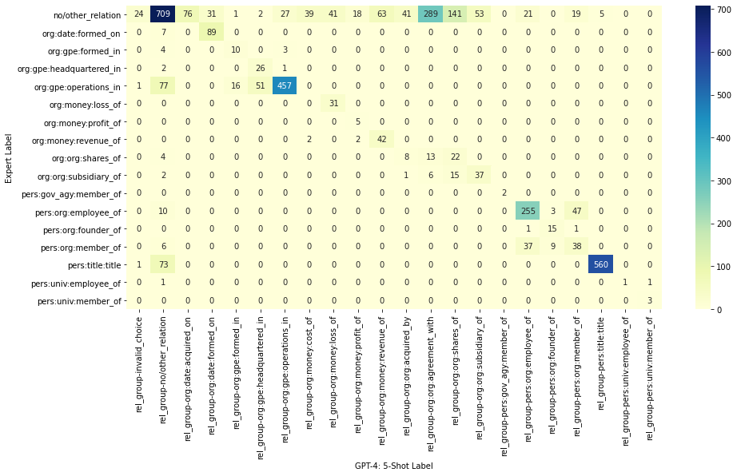

# 探究大型语言模型在金融数据标注上的有效性与效率

发布时间：2024年03月26日

`LLM应用`

> Large Language Models as Financial Data Annotators: A Study on Effectiveness and Efficiency

# 摘要

> 金融领域标记数据集的收集工作因专家稀缺和成本高昂而充满挑战。尽管大型语言模型（LLMs）在通用数据集的注释任务上成绩斐然，其在特定领域数据集上的表现尚待挖掘。为填补这一研究空白，我们探索了LLMs在金融文件关系提取上作为高效注释器的可能性。通过对比三个顶级LLMs（GPT-4、PaLM 2和MPT Instruct）与专家及众包工作者的注释成果，我们发现这些模型足以替代非专业众包工作者。我们通过不同提示和参数配置对模型进行深入分析，发现为各类关系定制提示并提供相关示例至关重要。此外，我们提出了一种可靠性指数（LLM-RelIndex），帮助识别那些可能需要专家审查的输出。我们还进行了详尽的时间、成本和误差分析，并就特定领域环境下自动化注释的收集与应用提出了建议。

> Collecting labeled datasets in finance is challenging due to scarcity of domain experts and higher cost of employing them. While Large Language Models (LLMs) have demonstrated remarkable performance in data annotation tasks on general domain datasets, their effectiveness on domain specific datasets remains underexplored. To address this gap, we investigate the potential of LLMs as efficient data annotators for extracting relations in financial documents. We compare the annotations produced by three LLMs (GPT-4, PaLM 2, and MPT Instruct) against expert annotators and crowdworkers. We demonstrate that the current state-of-the-art LLMs can be sufficient alternatives to non-expert crowdworkers. We analyze models using various prompts and parameter settings and find that customizing the prompts for each relation group by providing specific examples belonging to those groups is paramount. Furthermore, we introduce a reliability index (LLM-RelIndex) used to identify outputs that may require expert attention. Finally, we perform an extensive time, cost and error analysis and provide recommendations for the collection and usage of automated annotations in domain-specific settings.

[Arxiv](https://arxiv.org/abs/2403.18152)