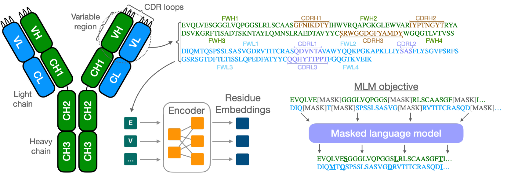
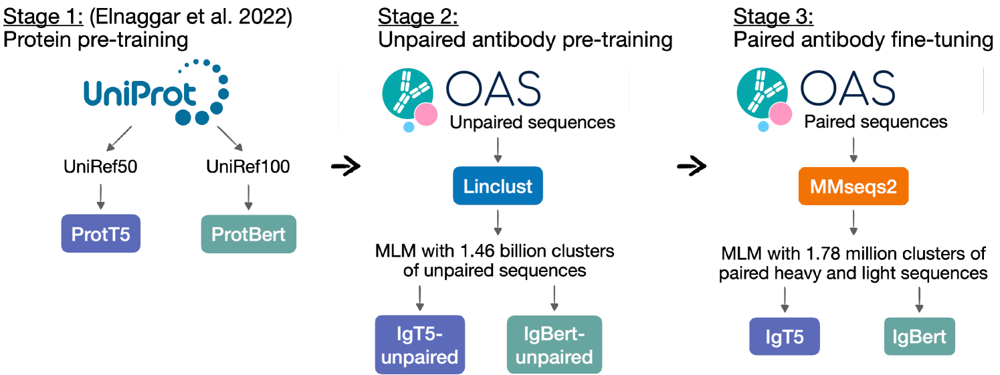

# 在抗体语言模型领域，我们采用了大规模的配对方法，以提高模型的性能和准确性。

发布时间：2024年03月26日

`LLM应用` `生物信息学` `药物设计`

> Large scale paired antibody language models

> 抗体，作为免疫系统生成的蛋白质，凭借其高度特异性和亲和力，能精准识别并中和众多抗原，成为生物治疗领域的佼佼者。随着新一代测序技术的兴起，大量抗体序列被搜集，但其在优化治疗药物设计上的应用却受限于数据的庞大与复杂。为突破此瓶颈，我们推出了IgBert和IgT5，这是目前表现最佳的抗体专属语言模型，能有效处理成对与不成对的可变区域序列。这些模型经过超过二十亿个不成对和两百万成对的轻、重链序列的全面训练。我们的模型在抗体设计相关的多种设计和回归任务中，均优于现有的抗体和蛋白质语言模型。这一进展在运用机器学习、大数据和高性能计算提升抗体治疗性设计方面，实现了重大飞跃。

> Antibodies are proteins produced by the immune system that can identify and neutralise a wide variety of antigens with high specificity and affinity, and constitute the most successful class of biotherapeutics. With the advent of next-generation sequencing, billions of antibody sequences have been collected in recent years, though their application in the design of better therapeutics has been constrained by the sheer volume and complexity of the data. To address this challenge, we present IgBert and IgT5, the best performing antibody-specific language models developed to date which can consistently handle both paired and unpaired variable region sequences as input. These models are trained comprehensively using the more than two billion unpaired sequences and two million paired sequences of light and heavy chains present in the Observed Antibody Space dataset. We show that our models outperform existing antibody and protein language models on a diverse range of design and regression tasks relevant to antibody engineering. This advancement marks a significant leap forward in leveraging machine learning, large scale data sets and high-performance computing for enhancing antibody design for therapeutic development.

[Arxiv](https://arxiv.org/abs/2403.17889)