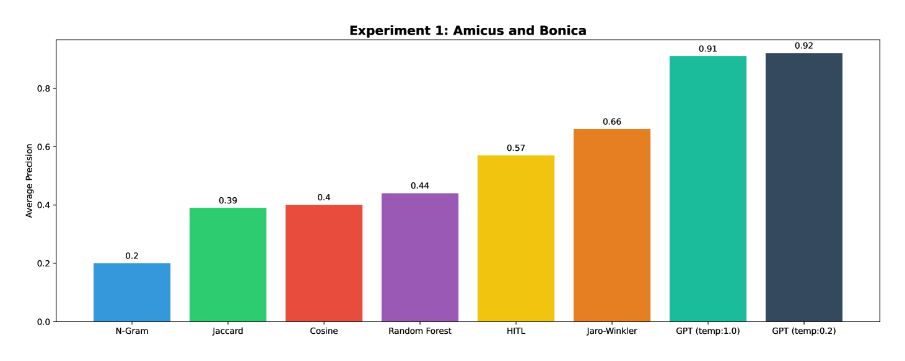
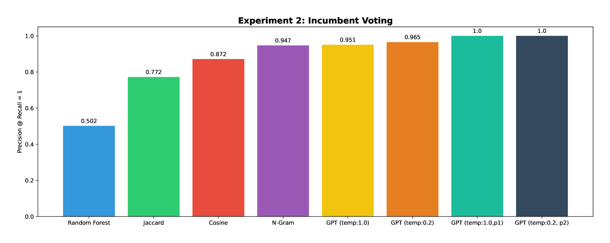

# 在政治科学领域，运用大型语言模型实现模糊字符串的智能匹配。

发布时间：2024年03月26日

`LLM应用` `政治科学` `数据融合`

> Leveraging Large Language Models for Fuzzy String Matching in Political Science

# 摘要

> 政治科学家在整合不同数据源时，模糊字符串匹配问题始终存在。传统匹配技术依赖于字符串距离，如Levenshtein距离或余弦相似度，难以识别名称不同却指同一实体的字符串，比如"JP Morgan"与"Chase Bank"，"DPRK"与"North Korea"，"Chuck Fleischmann (R)"与"Charles Fleischmann (R)"。本文提出利用大型语言模型轻松直观地解决这一难题。实验证明，我们的方法能显著提升平均精度高达39%，且对政治科学家而言更加便捷直观。此外，我们的成果在不同温度下表现出强大的鲁棒性。我们还发现，通过优化提示策略，可以进一步提升性能。

> Fuzzy string matching remains a key issue when political scientists combine data from different sources. Existing matching methods invariably rely on string distances, such as Levenshtein distance and cosine similarity. As such, they are inherently incapable of matching strings that refer to the same entity with different names such as ''JP Morgan'' and ''Chase Bank'', ''DPRK'' and ''North Korea'', ''Chuck Fleischmann (R)'' and ''Charles Fleischmann (R)''. In this letter, we propose to use large language models to entirely sidestep this problem in an easy and intuitive manner. Extensive experiments show that our proposed methods can improve the state of the art by as much as 39% in terms of average precision while being substantially easier and more intuitive to use by political scientists. Moreover, our results are robust against various temperatures. We further note that enhanced prompting can lead to additional performance improvements.

[Arxiv](https://arxiv.org/abs/2403.18218)