# MAGIS：一款以大型语言模型为基础，专为GitHub问题处理设计的多智能体框架。

发布时间：2024年03月26日

`Agent` `软件工程` `人工智能协作`

> MAGIS: LLM-Based Multi-Agent Framework for GitHub Issue Resolution

# 摘要

> 在软件发展中，应对GitHub仓库出现的问题颇具挑战，这不仅需要融入新代码，还得确保旧功能的正常运行。尽管大型语言模型（LLMs）在代码生成与理解上大有作为，但在代码修改上，尤其是针对整个仓库时，却显得力不从心。为此，我们通过实证研究揭示了LLMs在处理GitHub问题时常见的失败原因，并探讨了影响因素。基于这些发现，我们设计了MAGIS这一创新的多智能体框架，专为GitHub问题解决而生，涵盖了经理、仓库守护者、开发者和质量保证工程师等角色。该框架通过智能体间的协同合作，充分发挥LLMs的潜能，有效解决问题。实验结果显示，MAGIS在解决GitHub问题上的表现远超GPT-3.5、GPT-4和Claude-2等主流LLMs，解决问题的比例提升了13.94%，尤其是与GPT-4相比，解决率提升了整整八倍。我们还深入分析了诸如代码位置、任务分配等因素，这些因素对于提升GitHub问题解决率起到了关键作用。

> In software evolution, resolving the emergent issues within GitHub repositories is a complex challenge that involves not only the incorporation of new code but also the maintenance of existing functionalities. Large Language Models (LLMs) have shown promise in code generation and understanding but face difficulties in code change, particularly at the repository level. To overcome these challenges, we empirically study the reason why LLMs mostly fail to resolve GitHub issues and analyze some impact factors. Motivated by the empirical findings, we propose a novel LLM-based Multi-Agent framework for GitHub Issue reSolution, MAGIS, consisting of four kinds of agents customized for the software evolution: Manager, Repository Custodian, Developer, and Quality Assurance Engineer agents. This framework leverages the collaboration of various agents in the planning and coding process to unlock the potential of LLMs to resolve GitHub issues. In experiments, we employ the SWE-bench benchmark to compare MAGIS with popular LLMs, including GPT-3.5, GPT-4, and Claude-2. MAGIS can resolve 13.94% GitHub issues, which significantly outperforms the baselines. Specifically, MAGIS achieves an eight-fold increase in resolved ratio over the direct application of GPT-4, the based LLM of our method. We also analyze the factors for improving GitHub issue resolution rates, such as line location, task allocation, etc.

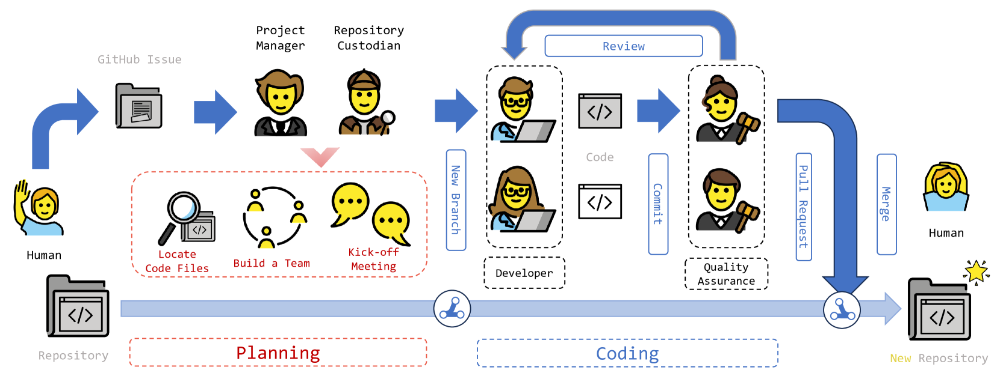

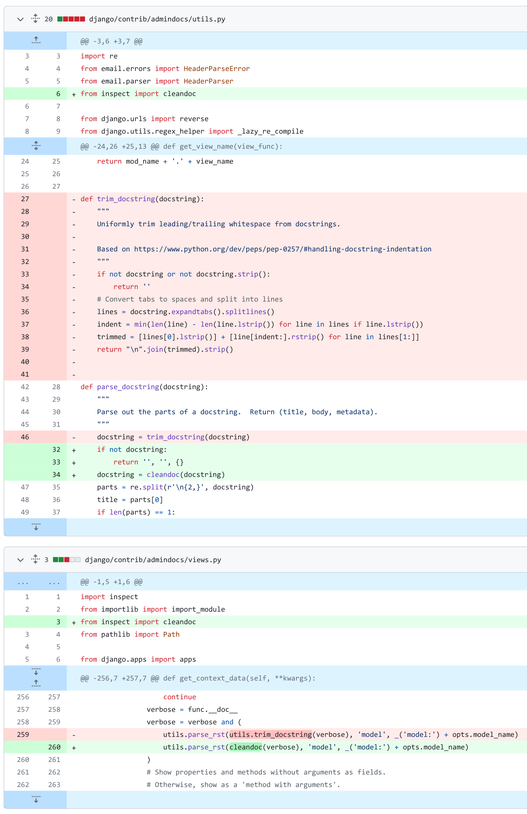

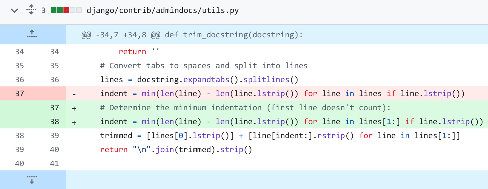

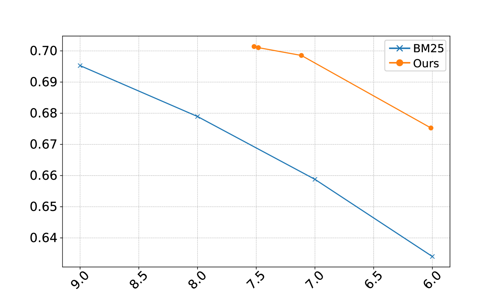

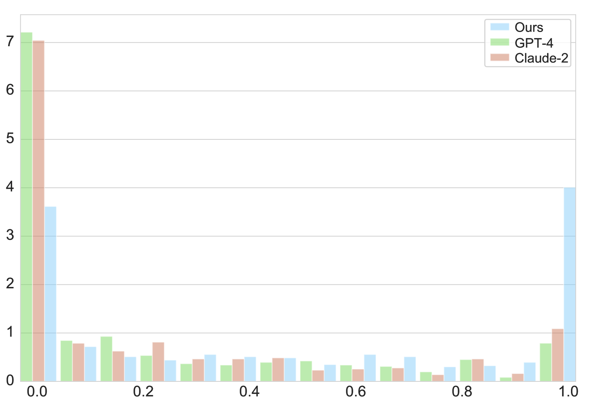

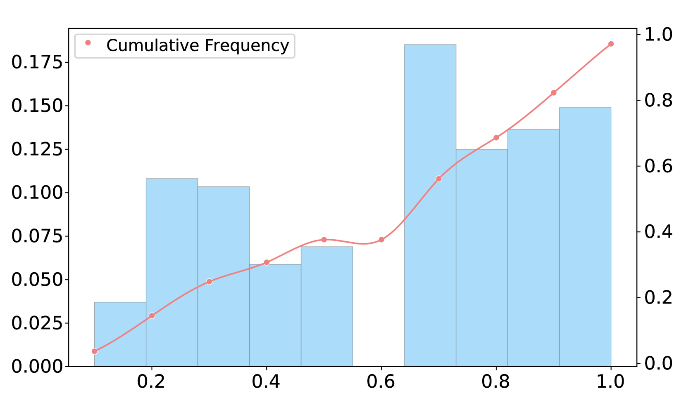

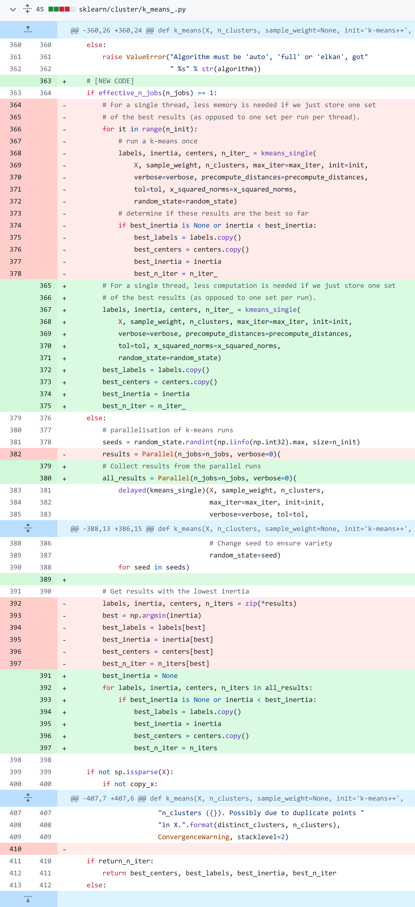

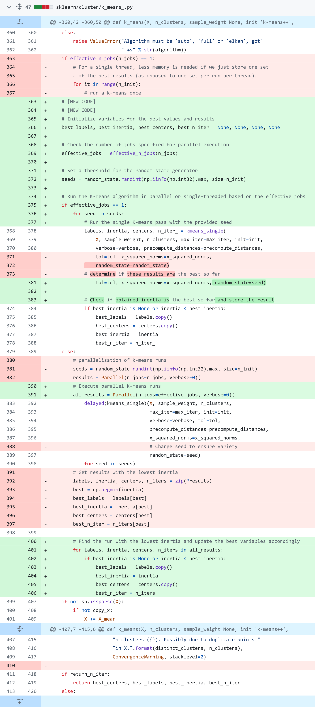

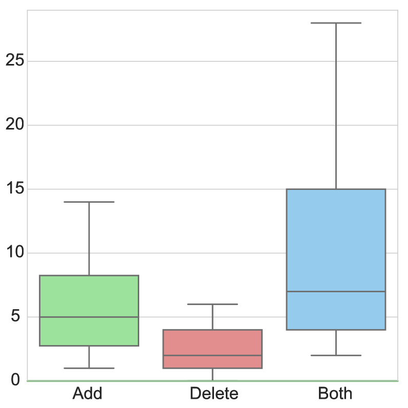

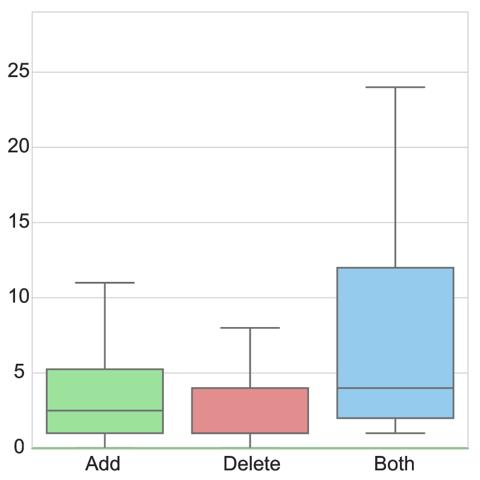

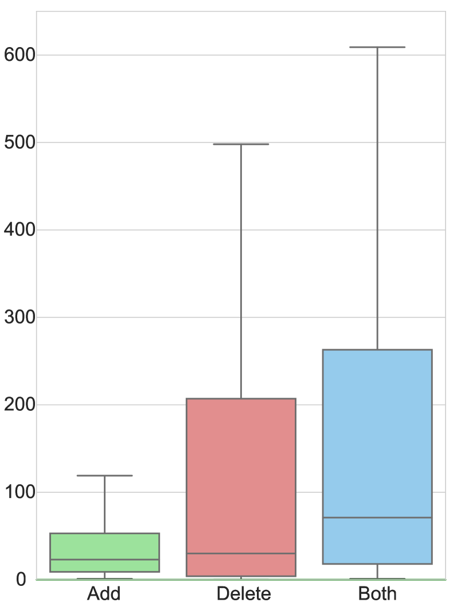

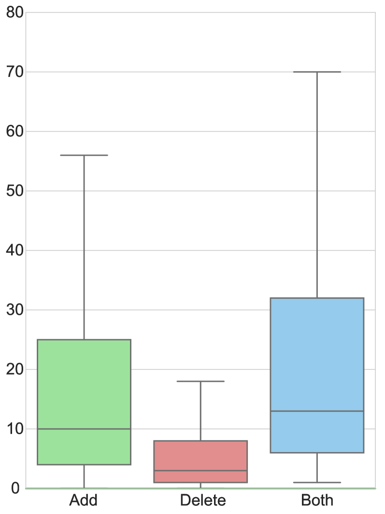

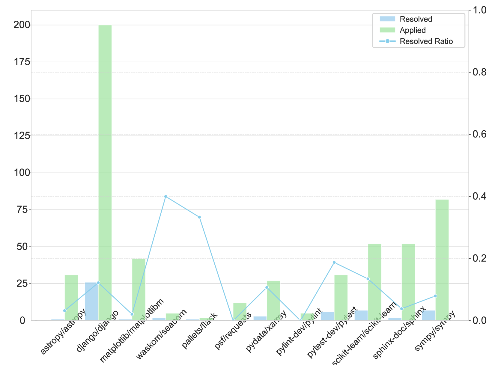

[Arxiv](https://arxiv.org/abs/2403.17927)