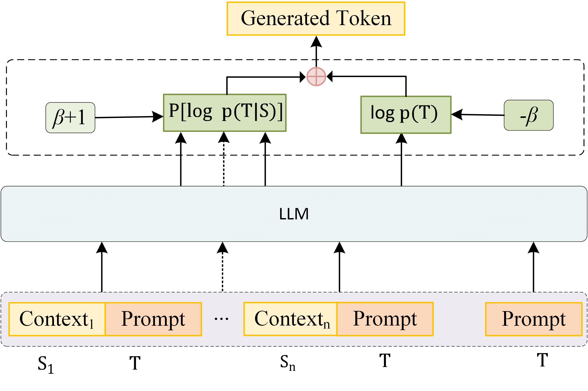
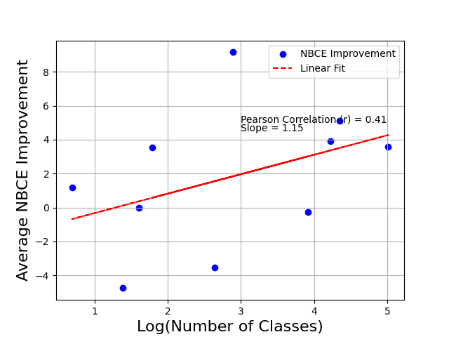
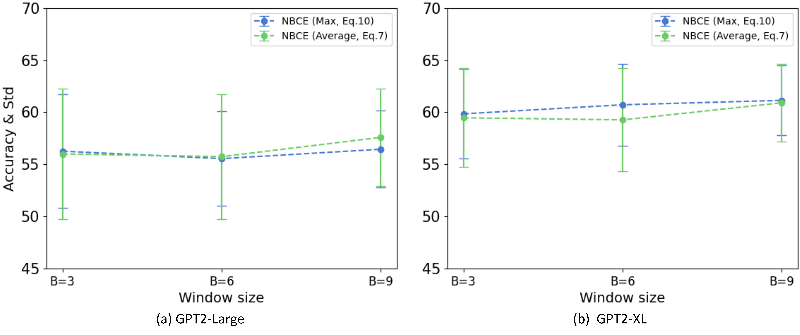
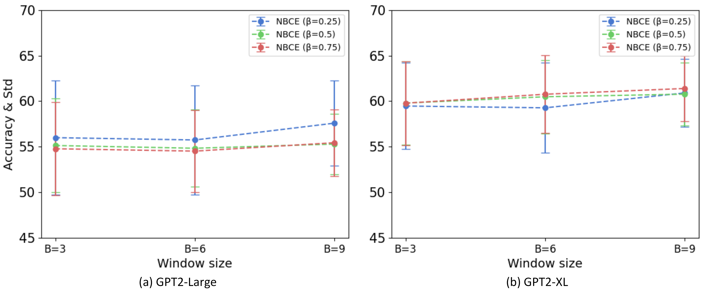

# 利用朴素贝叶斯算法，我们对大型语言模型的上下文进行了扩展。

发布时间：2024年03月26日

`LLM理论` `机器学习`

> Naive Bayes-based Context Extension for Large Language Models

# 摘要

> 大型语言模型展现出令人期待的上下文学习本领。但传统方法常受限于变换架构的长度束缚，整合众多示例指导时面临难题。本文提出一种创新框架——朴素贝叶斯上下文扩展（NBCE），让LLMs能处理更多示例，扩大上下文范围，而无需特定架构或微调，且保持高效。NBCE将上下文均分为适应模型长度的窗口，通过投票选出关键窗口作为后验上下文，并运用贝叶斯定理生成测试任务。实验显示，随着示例增多，NBCE显著提升性能，持续超越传统方法。代码已开放获取，详见GitHub。

> Large Language Models (LLMs) have shown promising in-context learning abilities. However, conventional In-Context Learning (ICL) approaches are often impeded by length limitations of transformer architecture, which pose challenges when attempting to effectively integrate supervision from a substantial number of demonstration examples. In this paper, we introduce a novel framework, called Naive Bayes-based Context Extension (NBCE), to enable existing LLMs to perform ICL with an increased number of demonstrations by significantly expanding their context size. Importantly, this expansion does not require fine-tuning or dependence on particular model architectures, all the while preserving linear efficiency. NBCE initially splits the context into equal-sized windows fitting the target LLM's maximum length. Then, it introduces a voting mechanism to select the most relevant window, regarded as the posterior context. Finally, it employs Bayes' theorem to generate the test task. Our experimental results demonstrate that NBCE substantially enhances performance, particularly as the number of demonstration examples increases, consistently outperforming alternative methods. The NBCE code will be made publicly accessible. The code NBCE is available at: https://github.com/amurtadha/NBCE-master

[Arxiv](https://arxiv.org/abs/2403.17552)