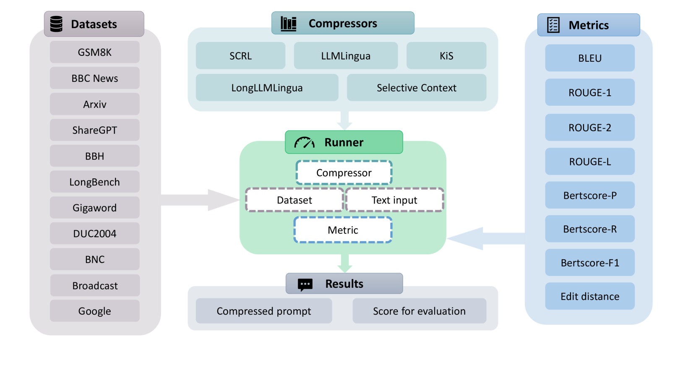
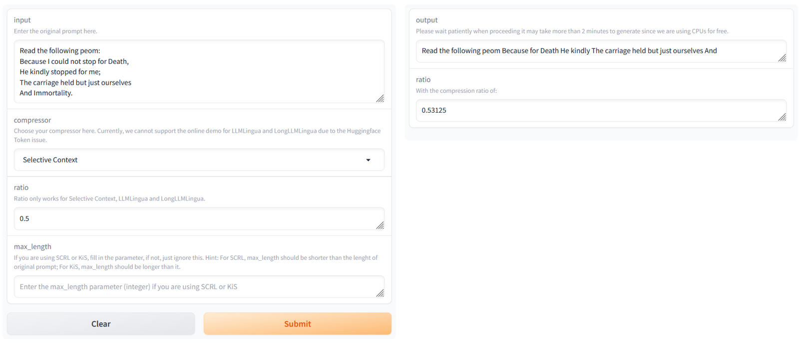

# PCToolkit：一款适用于大型语言模型的集成式、即插即用型提示压缩工具集。

发布时间：2024年03月26日

`LLM应用` `用户界面`

> PCToolkit: A Unified Plug-and-Play Prompt Compression Toolkit of Large Language Models

> 提示压缩技术能够高效地简化输入提示，同时保留重要信息。为了简化启动流程、打造友好的用户界面，并确保与通用数据集及评估指标的兼容性，我们推出了提示压缩工具包（PCToolkit）。这款工具包为大型语言模型（LLMs）提供了一个集成的、即插即用的提示压缩解决方案，它集成了先进的压缩算法、丰富的数据集和全面的评估指标。PCToolkit的模块化设计让用户可以轻松添加新的数据集和评估指标。本文详细介绍了PCToolkit的核心组件和功能，并在多种自然语言处理任务中对压缩器进行了测试，任务类型涵盖了内容重建、文本摘要、数学问题解答、问题回答、少量样本学习、虚构任务、代码补全、布尔逻辑表达、选择题判断以及谎言识别等。

> Prompt compression is an innovative method for efficiently condensing input prompts while preserving essential information. To facilitate quick-start services, user-friendly interfaces, and compatibility with common datasets and metrics, we present the Prompt Compression Toolkit (PCToolkit). This toolkit is a unified plug-and-play solution for compressing prompts in Large Language Models (LLMs), featuring cutting-edge prompt compressors, diverse datasets, and metrics for comprehensive performance evaluation. PCToolkit boasts a modular design, allowing for easy integration of new datasets and metrics through portable and user-friendly interfaces. In this paper, we outline the key components and functionalities of PCToolkit. We conducted evaluations of the compressors within PCToolkit across various natural language tasks, including reconstruction, summarization, mathematical problem-solving, question answering, few-shot learning, synthetic tasks, code completion, boolean expressions, multiple choice questions, and lies recognition.

[Arxiv](https://arxiv.org/abs/2403.17411)