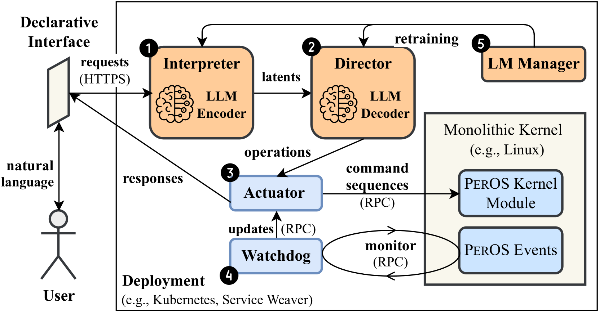
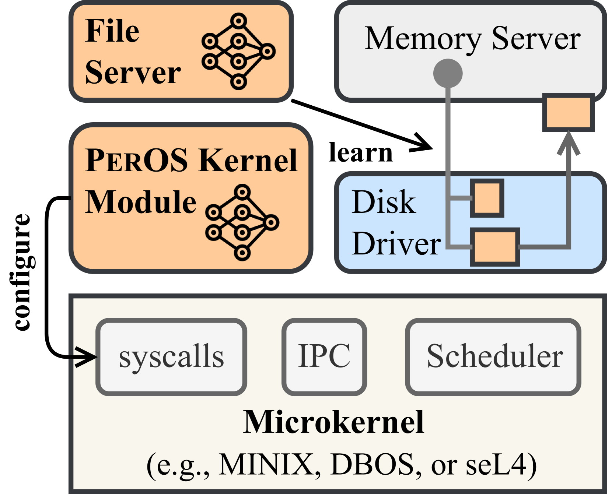
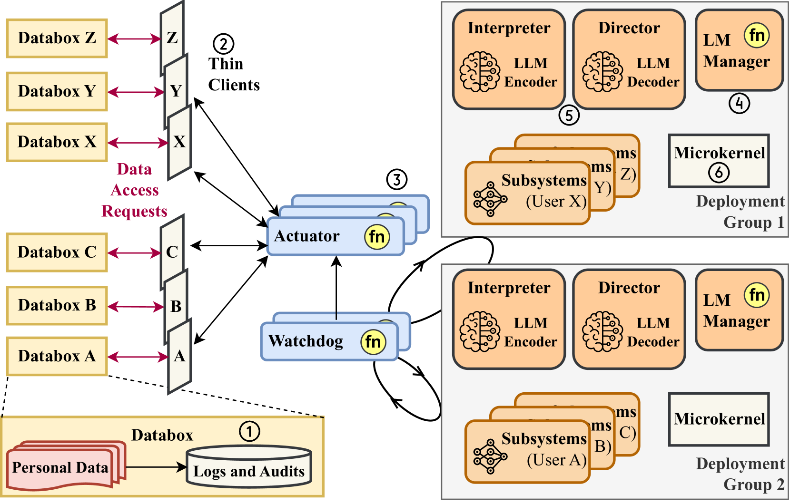

# PerOS 研究了云计算环境中的个性化操作系统，这些操作系统能够根据用户需求和行为模式自我调整和优化。

发布时间：2024年03月26日

`Agent` `操作系统` `个性化体验`

> PerOS: Personalized Self-Adapting Operating Systems in the Cloud

# 摘要

> 操作系统是计算机系统的基石，负责分配硬件资源并保障应用的安全运行。然而，不管它们多么关键，操作系统的核心设计理念数十年来鲜有更新。传统上，操作系统注重速度、内存管理、安全和扩展性等要素，却常常忽略智能和用户个性化体验的重要性。在机器学习等领域的飞速技术变革中，这种智能缺失的问题愈发凸显。随着个人设备逐渐成为我们生活中的亲密伙伴，它们对Linux和iOS等传统操作系统提出了新挑战，特别是在异构组件的专业硬件日益普及的背景下。同时，机器学习领域大型语言模型的兴起，正在改变用户交互和软件开发的格局。目前的研究多集中于如何运用机器学习方法优化系统或加速机器学习任务，但在操作系统层面提供个性化用户体验的探讨却鲜有触及。为解决这一问题，本研究提出了PerOS——一款集成了大型语言模型能力的个性化操作系统。PerOS致力于通过声明式接口、自适应内核和安全的云中心化数据管理，为用户提供定制化的体验，同时确保隐私和数据安全。本研究的核心问题在于：我们如何打造一个既智能又安全、可扩展的操作系统，让它能够为成千上万用户带来个性化的体验？

> Operating systems (OSes) are foundational to computer systems, managing hardware resources and ensuring secure environments for diverse applications. However, despite their enduring importance, the fundamental design objectives of OSes have seen minimal evolution over decades. Traditionally prioritizing aspects like speed, memory efficiency, security, and scalability, these objectives often overlook the crucial aspect of intelligence as well as personalized user experience. The lack of intelligence becomes increasingly critical amid technological revolutions, such as the remarkable advancements in machine learning (ML).
  Today's personal devices, evolving into intimate companions for users, pose unique challenges for traditional OSes like Linux and iOS, especially with the emergence of specialized hardware featuring heterogeneous components. Furthermore, the rise of large language models (LLMs) in ML has introduced transformative capabilities, reshaping user interactions and software development paradigms.
  While existing literature predominantly focuses on leveraging ML methods for system optimization or accelerating ML workloads, there is a significant gap in addressing personalized user experiences at the OS level. To tackle this challenge, this work proposes PerOS, a personalized OS ingrained with LLM capabilities. PerOS aims to provide tailored user experiences while safeguarding privacy and personal data through declarative interfaces, self-adaptive kernels, and secure data management in a scalable cloud-centric architecture; therein lies the main research question of this work: How can we develop intelligent, secure, and scalable OSes that deliver personalized experiences to thousands of users?

[Arxiv](https://arxiv.org/abs/2404.00057)