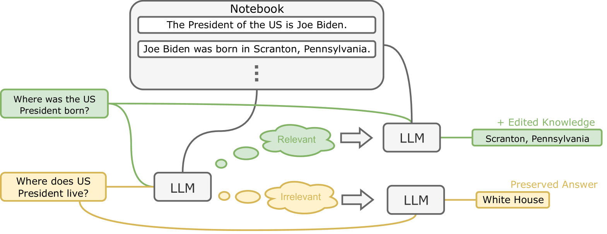
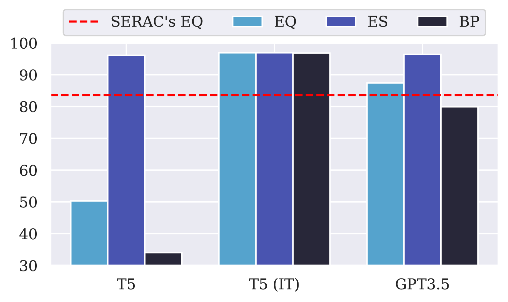
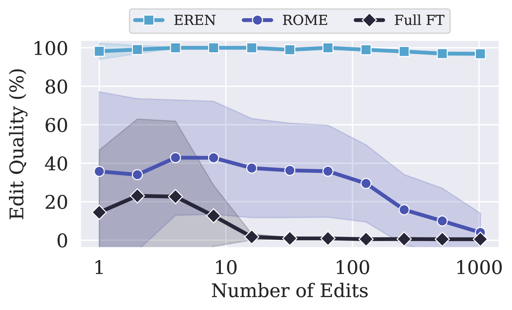
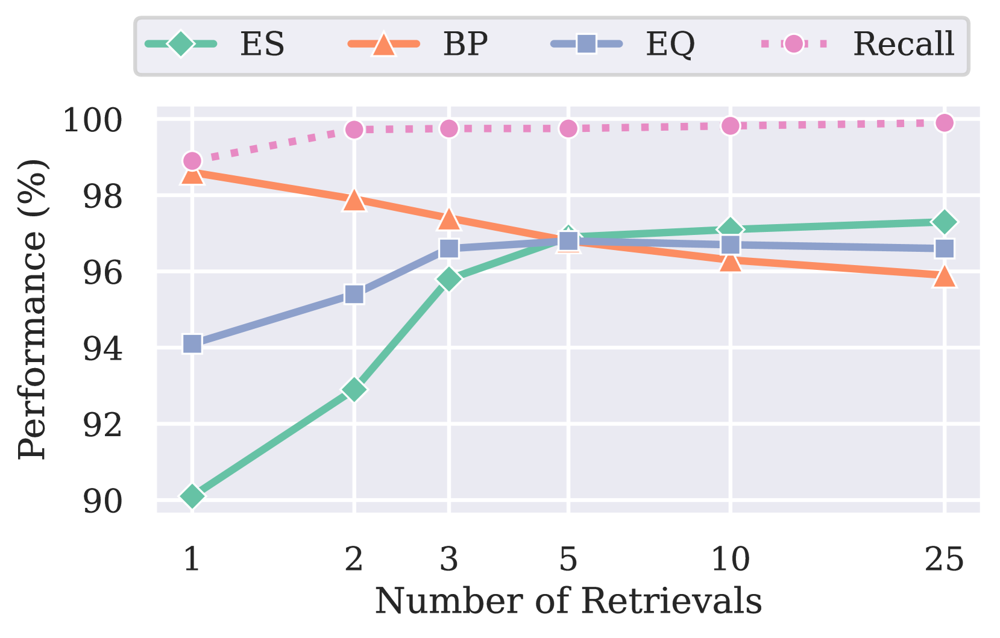

# 为了大型语言模型，我们研究了一种既稳健又可扩展的模型编辑方法。

发布时间：2024年03月26日

`LLM应用` `人工智能`

> Robust and Scalable Model Editing for Large Language Models

# 摘要

> 大型语言模型能够运用内置的参数知识或依赖上下文信息进行预测。理想情况下，当两者冲突时，模型应优先采纳相关的上下文信息，并在缺乏上下文时依赖固有的参数知识。这种方法使得我们能够通过上下文编辑来更新和修正模型知识，而无需重新训练。然而，以往的研究指出，模型往往忽视上下文信息，在无关上下文出现时也未能有效回退至参数知识。本研究揭示，通过恰当的提示技巧，经过指令精细化调整的LLMs能够被上下文信息有效控制，并对无关信息展现出鲁棒性。基于这一发现，我们提出了EREN新方法，旨在提升LLM编辑的扩展性和抗干扰能力。为了更准确地评估编辑工具的鲁棒性，我们汇集了一组包含更具挑战性的无关问题的新型数据集。实践证明，EREN在性能上大幅超越了现有的顶尖技术。它能够整合多处编辑的知识，并精准应对那些结构相似而意义不同的输入——这是以往技术所难以做到的。相关源代码已在 https://github.com/thunlp/EREN 上公布。

> Large language models (LLMs) can make predictions using parametric knowledge--knowledge encoded in the model weights--or contextual knowledge--knowledge presented in the context. In many scenarios, a desirable behavior is that LLMs give precedence to contextual knowledge when it conflicts with the parametric knowledge, and fall back to using their parametric knowledge when the context is irrelevant. This enables updating and correcting the model's knowledge by in-context editing instead of retraining. Previous works have shown that LLMs are inclined to ignore contextual knowledge and fail to reliably fall back to parametric knowledge when presented with irrelevant context. In this work, we discover that, with proper prompting methods, instruction-finetuned LLMs can be highly controllable by contextual knowledge and robust to irrelevant context. Utilizing this feature, we propose EREN (Edit models by REading Notes) to improve the scalability and robustness of LLM editing. To better evaluate the robustness of model editors, we collect a new dataset, that contains irrelevant questions that are more challenging than the ones in existing datasets. Empirical results show that our method outperforms current state-of-the-art methods by a large margin. Unlike existing techniques, it can integrate knowledge from multiple edits, and correctly respond to syntactically similar but semantically unrelated inputs (and vice versa). The source code can be found at https://github.com/thunlp/EREN.

[Arxiv](https://arxiv.org/abs/2403.17431)