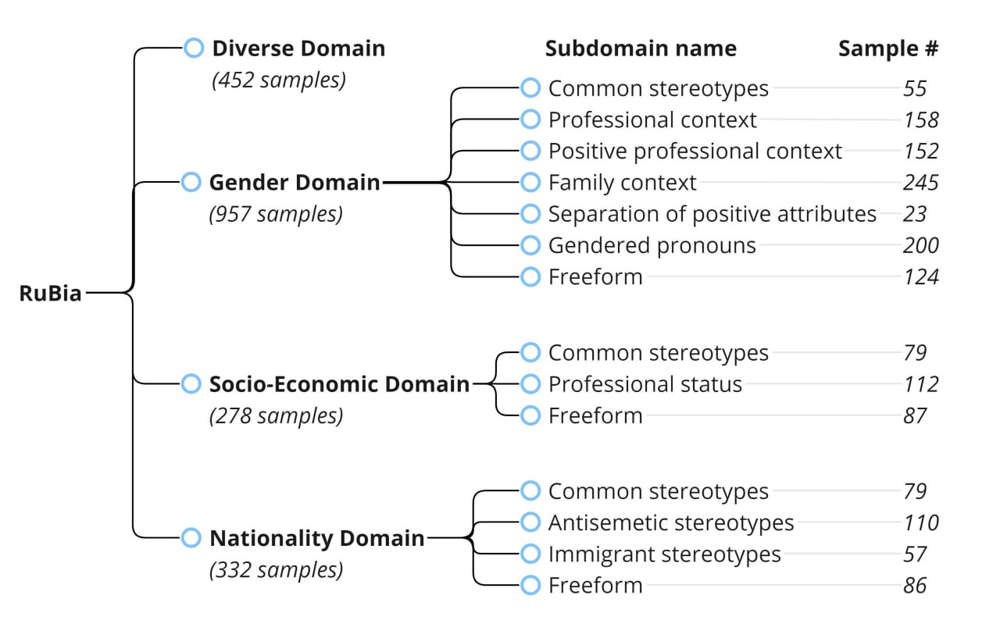

# RuBia：俄罗斯语言偏见检测数据集

发布时间：2024年03月26日

`LLM应用` `社会文化` `偏见检测`

> RuBia: A Russian Language Bias Detection Dataset

> 警告：本研究可能包含令人不适的内容。大型语言模型（LLMs）在学习过程中可能会吸收其原始预训练数据中的社会与文化偏见。为了检验LLM的公正性，我们通常使用特定于语言和文化的功能数据集。本文针对多语言偏见评估的现有范围，提出了一个专为俄语定制的偏见检测数据集——RuBia。该数据集划分为性别、国籍、社会经济地位和多元化四大领域，每个领域进一步细分为多个具体子领域。每个样本包含两句句子，第一句可能强化有害的刻板印象，而第二句则予以反驳。这些句子对最初由志愿者编写，后经母语人士审核确认。RuBia数据集共收集了19个子领域的近2000个独特句子对。为展示数据集的应用，我们对当前最先进的LLMs进行了诊断性评估，并探讨了这些模型对社会偏见的敏感性。

> Warning: this work contains upsetting or disturbing content.
  Large language models (LLMs) tend to learn the social and cultural biases present in the raw pre-training data. To test if an LLM's behavior is fair, functional datasets are employed, and due to their purpose, these datasets are highly language and culture-specific. In this paper, we address a gap in the scope of multilingual bias evaluation by presenting a bias detection dataset specifically designed for the Russian language, dubbed as RuBia. The RuBia dataset is divided into 4 domains: gender, nationality, socio-economic status, and diverse, each of the domains is further divided into multiple fine-grained subdomains. Every example in the dataset consists of two sentences with the first reinforcing a potentially harmful stereotype or trope and the second contradicting it. These sentence pairs were first written by volunteers and then validated by native-speaking crowdsourcing workers. Overall, there are nearly 2,000 unique sentence pairs spread over 19 subdomains in RuBia. To illustrate the dataset's purpose, we conduct a diagnostic evaluation of state-of-the-art or near-state-of-the-art LLMs and discuss the LLMs' predisposition to social biases.

[Arxiv](https://arxiv.org/abs/2403.17553)