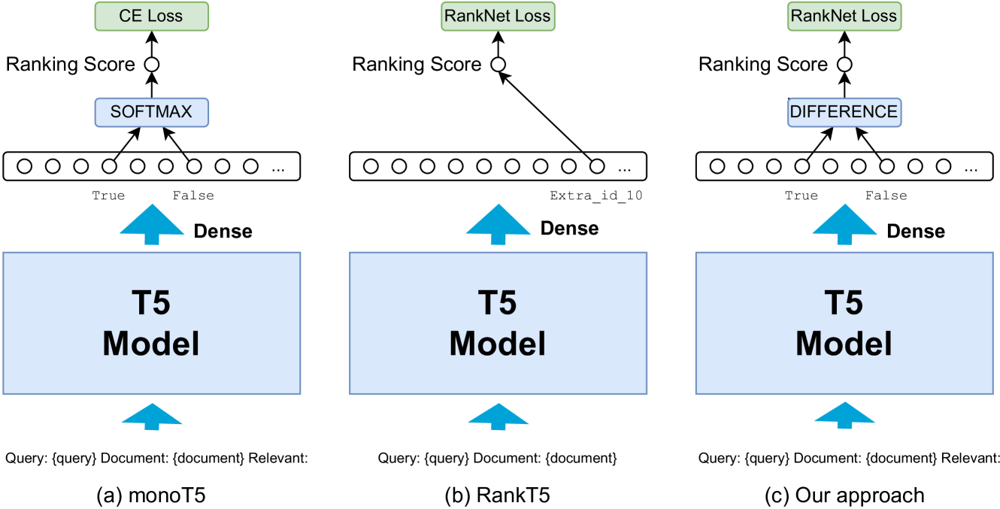
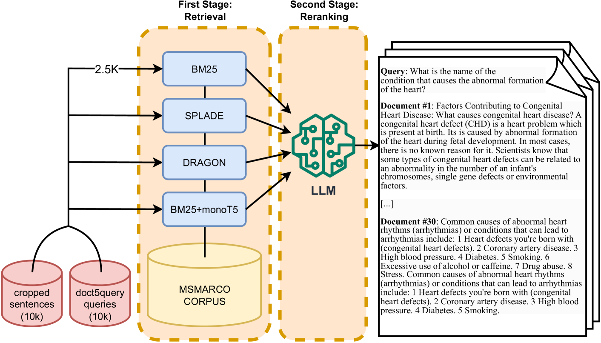

# TWOLAR：一种两步法，通过LLM增强的蒸馏技术，对文章段落进行重新排序。

发布时间：2024年03月26日

`LLM应用` `信息检索` `文档排序`

> TWOLAR: a TWO-step LLM-Augmented distillation method for passage Reranking

# 摘要

> 本文介绍了TWOLAR，这是一个新颖的两阶段流程，用于根据大型语言模型（LLM）的知识蒸馏对段落进行重排序。TWOLAR采用了创新的评分机制和蒸馏技术，创建了一个包含20,000个查询和通过四种不同检索方法获取的多样化文档集。这些文档通过LLM的零次学习能力进行重新排序。我们的实验验证了每个新增组件的有效性，并显示TWOLAR在文档排序方面的能力显著提升，有时甚至超过了参数量大三个数量级的顶尖模型。为了推动研究进展，我们公开了数据集、调优后的模型和相关代码。

> In this paper, we present TWOLAR: a two-stage pipeline for passage reranking based on the distillation of knowledge from Large Language Models (LLM). TWOLAR introduces a new scoring strategy and a distillation process consisting in the creation of a novel and diverse training dataset. The dataset consists of 20K queries, each associated with a set of documents retrieved via four distinct retrieval methods to ensure diversity, and then reranked by exploiting the zero-shot reranking capabilities of an LLM. Our ablation studies demonstrate the contribution of each new component we introduced. Our experimental results show that TWOLAR significantly enhances the document reranking ability of the underlying model, matching and in some cases even outperforming state-of-the-art models with three orders of magnitude more parameters on the TREC-DL test sets and the zero-shot evaluation benchmark BEIR. To facilitate future work we release our data set, finetuned models, and code.

[Arxiv](https://arxiv.org/abs/2403.17759)