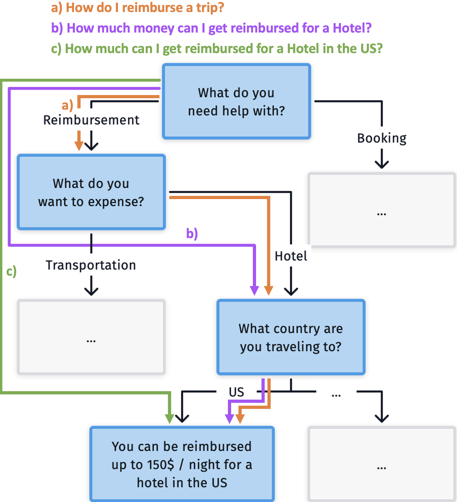
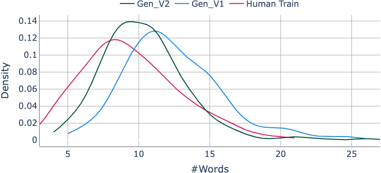
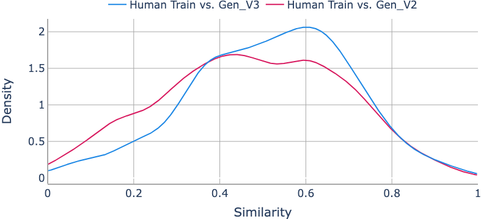

# 迈向零数据输入、可控制、能自动调整的对话系统

发布时间：2024年03月26日

`Agent` `对话系统`

> Towards a Zero-Data, Controllable, Adaptive Dialog System

# 摘要

> 最新研究提出的对话树搜索（Väth等人，2023年）让领域专家能通过对话树定制强化学习代理的行为，使其能灵活适应用户的信息需求，比如对领域的熟悉程度。尽管这种方法在新领域的应用受到额外训练数据需求的限制，但我们通过直接从对话树生成数据的途径，有效克服了这一挑战。我们对原有方法进行了优化，证实了通过合成数据训练的代理在对话成功率上能与基于人类数据训练的模型相媲美，无论是利用商业大型语言模型还是小型开源模型。此外，我们在两个新数据集上验证了我们方法的扩展性：ONBOARD，旨在协助外来居民适应新城市生活；以及DIAGNOSE，包含与头皮和头部症状相关的维基百科文章。经过人类评估测试，无论是从客观还是主观角度来看，基于人类数据和生成数据训练的模型表现并无显著差异。

> Conversational Tree Search (Väth et al., 2023) is a recent approach to controllable dialog systems, where domain experts shape the behavior of a Reinforcement Learning agent through a dialog tree. The agent learns to efficiently navigate this tree, while adapting to information needs, e.g., domain familiarity, of different users. However, the need for additional training data hinders deployment in new domains. To address this, we explore approaches to generate this data directly from dialog trees. We improve the original approach, and show that agents trained on synthetic data can achieve comparable dialog success to models trained on human data, both when using a commercial Large Language Model for generation, or when using a smaller open-source model, running on a single GPU. We further demonstrate the scalability of our approach by collecting and testing on two new datasets: ONBOARD, a new domain helping foreign residents moving to a new city, and the medical domain DIAGNOSE, a subset of Wikipedia articles related to scalp and head symptoms. Finally, we perform human testing, where no statistically significant differences were found in either objective or subjective measures between models trained on human and generated data.

[Arxiv](https://arxiv.org/abs/2403.17582)