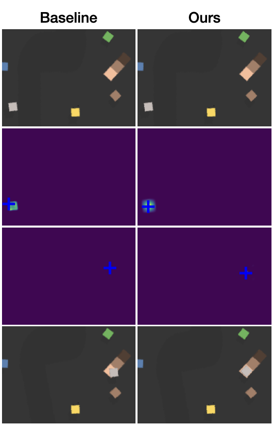
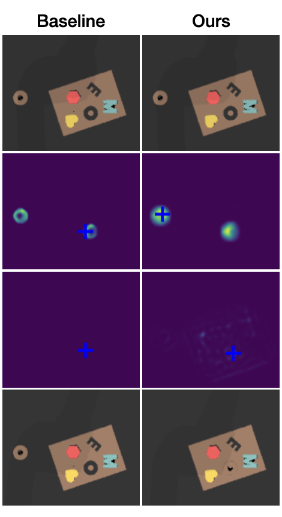
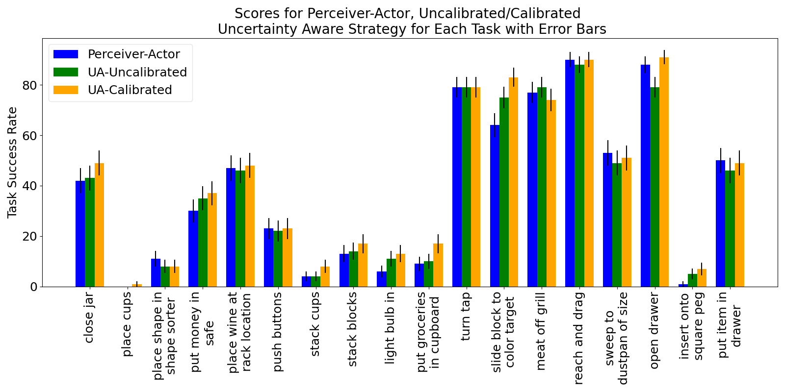
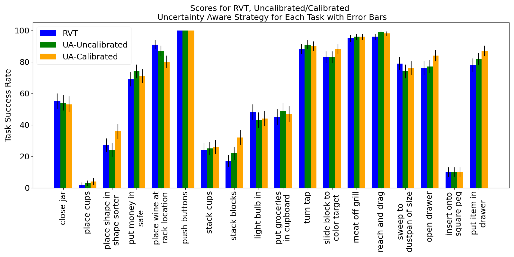
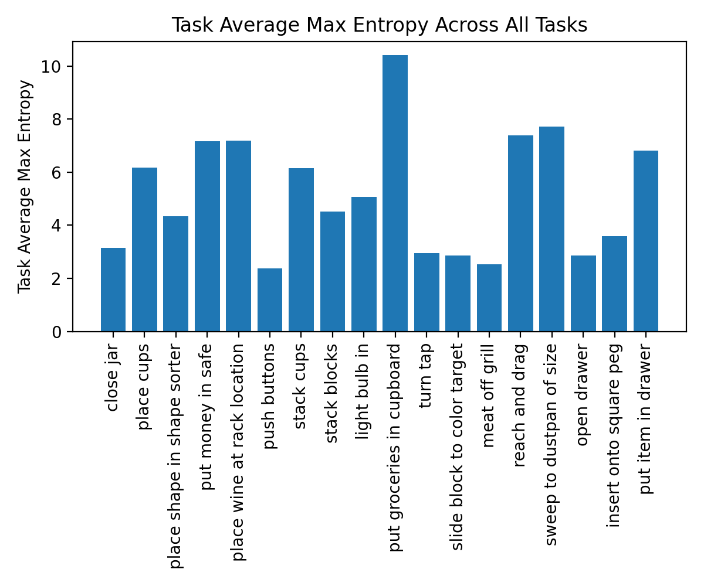
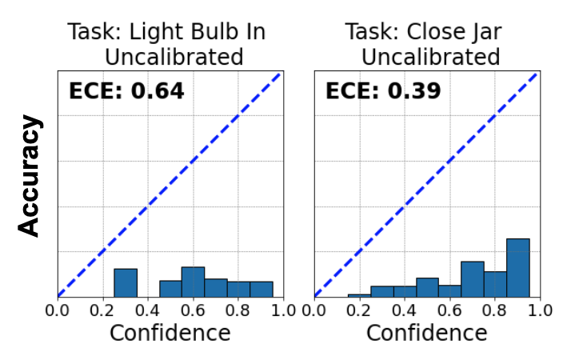
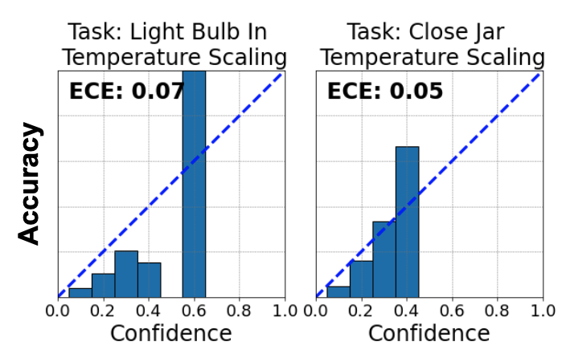
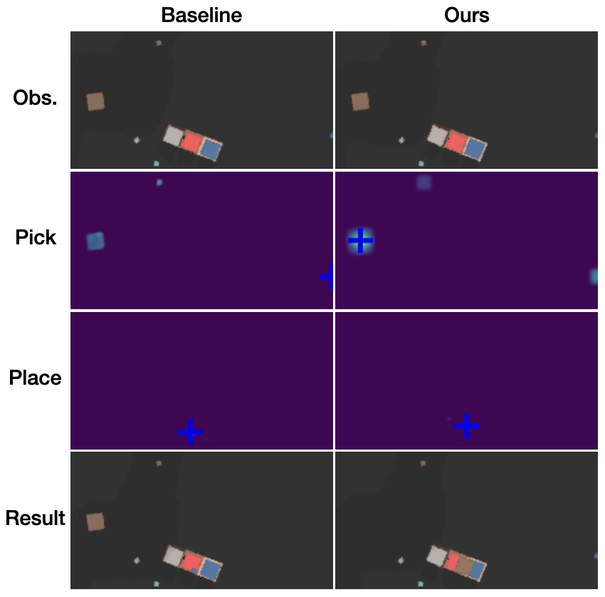

# 在部署预训练的语言条件模仿学习策略时，我们采取了不确定性感知的方法。

发布时间：2024年03月26日

`Agent` `机器人` `人工智能`

> Uncertainty-Aware Deployment of Pre-trained Language-Conditioned Imitation Learning Policies

# 摘要

> 通过在不同任务和机器人平台上的数据训练，大规模机器人策略展现出实现多功能机器人的巨大前景；但要让机器人在新环境中可靠地泛化能力，仍是一大难题。为解决这一问题，我们提出了一种新颖的不确定性感知部署策略，用于预训练的语言条件模仿学习代理。我们采用温度缩放技术对模型进行校准，并结合校准后的模型，通过整合候选动作的局部信息，做出有不确定性意识的决策。我们在模拟环境中利用三个预训练模型验证了这一方法，并证明了它能显著提升任务的完成率。相关代码已开放，可通过以下链接访问：https://github.com/BobWu1998/uncertainty_quant_all.git。

> Large-scale robotic policies trained on data from diverse tasks and robotic platforms hold great promise for enabling general-purpose robots; however, reliable generalization to new environment conditions remains a major challenge. Toward addressing this challenge, we propose a novel approach for uncertainty-aware deployment of pre-trained language-conditioned imitation learning agents. Specifically, we use temperature scaling to calibrate these models and exploit the calibrated model to make uncertainty-aware decisions by aggregating the local information of candidate actions. We implement our approach in simulation using three such pre-trained models, and showcase its potential to significantly enhance task completion rates. The accompanying code is accessible at the link: https://github.com/BobWu1998/uncertainty_quant_all.git

[Arxiv](https://arxiv.org/abs/2403.18222)