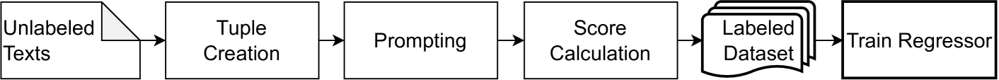

# "专家级标注师"：自动采用最佳-最差量表法进行情感强度建模标注

发布时间：2024年03月26日

`LLM应用` `自动化标注`

> "You are an expert annotator": Automatic Best-Worst-Scaling Annotations for Emotion Intensity Modeling

> 为新任务或领域构建模型时，语料库的标注成为限制因素。大型语言模型借助自动标注方法，尤其是在处理分类注释时，缓解了这一问题。但是，像情感强度预测这样的自然语言处理任务需要文本回归，而自动化连续标签分配的标注研究尚属空白。由于回归任务比分类更具挑战性，人类在从评分尺度中选择值时表现不佳，这促使人们开发了包括最佳最差尺度在内的比较性注释方法。这让人质疑，基于大型语言模型的注释方法是否在评分尺度注释任务上表现不如比较性注释任务。为了探究这一点，我们对情感强度预测进行了自动化处理，并对比了直接评分尺度预测、成对比较和最佳最差尺度。研究发现，最佳最差尺度的可靠性最高。在这些数据基础上经过精细调整的变换器回归器，其性能几乎与基于原始手动注释训练的模型持平。

> Labeling corpora constitutes a bottleneck to create models for new tasks or domains. Large language models mitigate the issue with automatic corpus labeling methods, particularly for categorical annotations. Some NLP tasks such as emotion intensity prediction, however, require text regression, but there is no work on automating annotations for continuous label assignments. Regression is considered more challenging than classification: The fact that humans perform worse when tasked to choose values from a rating scale lead to comparative annotation methods, including best-worst scaling. This raises the question if large language model-based annotation methods show similar patterns, namely that they perform worse on rating scale annotation tasks than on comparative annotation tasks. To study this, we automate emotion intensity predictions and compare direct rating scale predictions, pairwise comparisons and best-worst scaling. We find that the latter shows the highest reliability. A transformer regressor fine-tuned on these data performs nearly on par with a model trained on the original manual annotations.

[Arxiv](https://arxiv.org/abs/2403.17612)