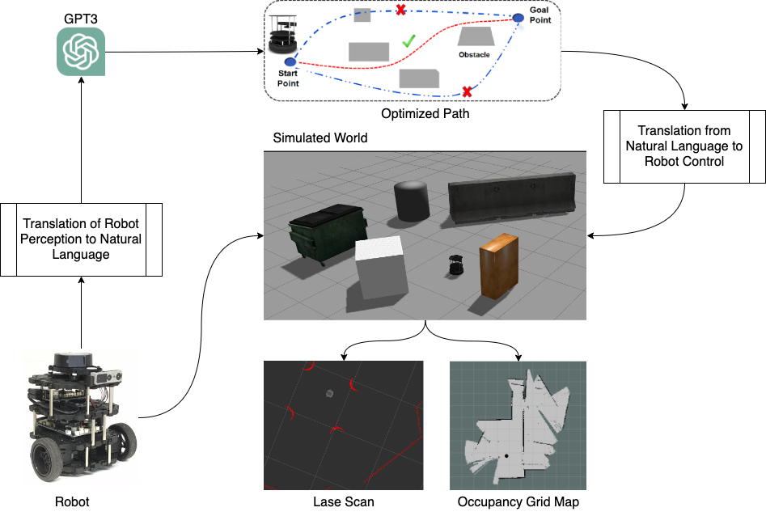
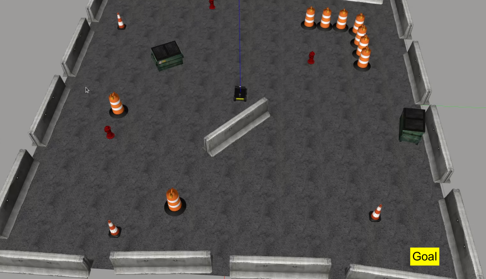
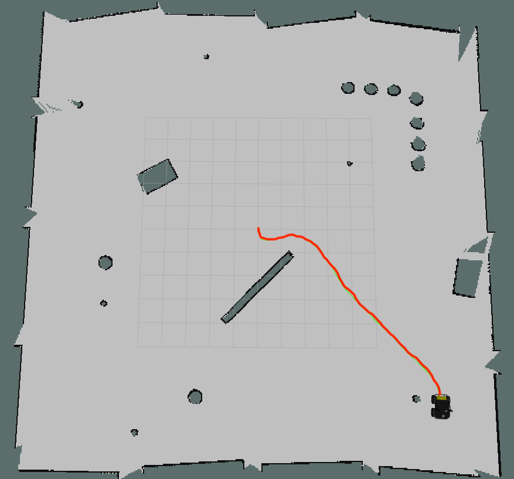
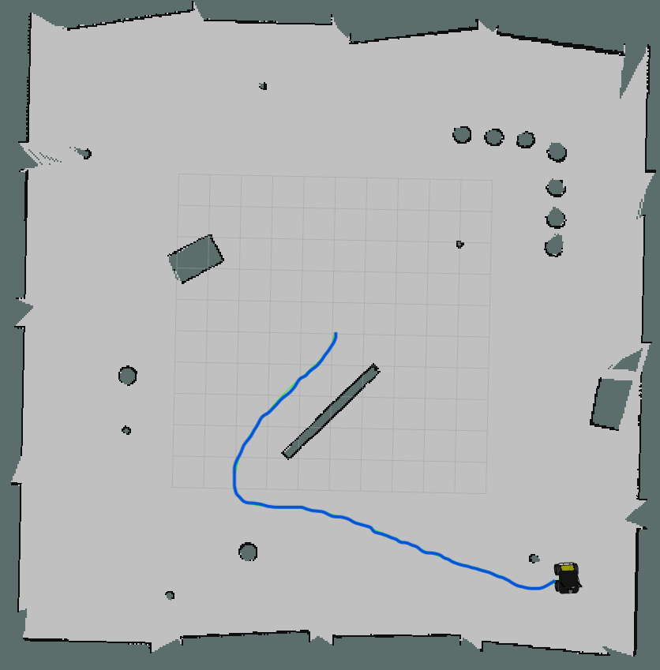
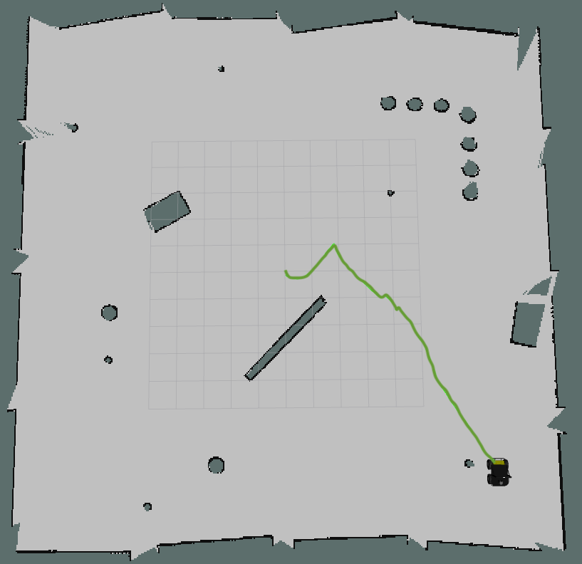
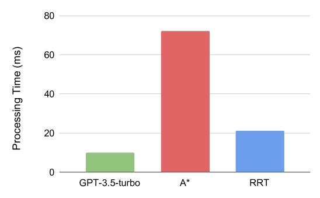
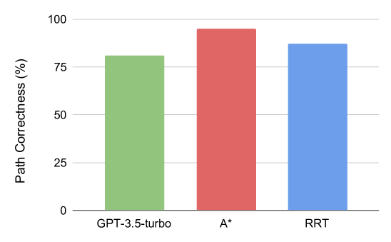
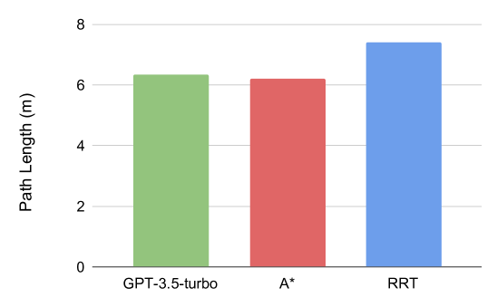

# 3P-LLM：借助大型语言模型实现自主机器人的概率导航路径规划

发布时间：2024年03月27日

`LLM应用` `机器人` `路径规划`

> 3P-LLM: Probabilistic Path Planning using Large Language Model for Autonomous Robot Navigation

# 摘要

> 大型语言模型（LLMs）蕴含着丰富的现实世界知识，对执行自然语言指令的机器人而言价值巨大。然而，语言模型缺乏实际经验，这限制了它们在特定情境下进行决策的能力。本研究探讨了利用LLM（OpenAI的GPT-3.5-turbo聊天机器人）进行机器人路径规划的可能性。针对传统路径规划方法在应对复杂环境和变化条件时的不足，本研究提出了新的解决方案。得益于LLM的高级自然语言处理能力，GPT-3.5-turbo能够实时提供精确、灵活的路径规划，相较于RRT和A*等先进规划算法，其表现更为出色。本研究为机器人系统采用LLM进行路径规划奠定了坚实的基础。

> Much worldly semantic knowledge can be encoded in large language models (LLMs). Such information could be of great use to robots that want to carry out high-level, temporally extended commands stated in natural language. However, the lack of real-world experience that language models have is a key limitation that makes it challenging to use them for decision-making inside a particular embodiment. This research assesses the feasibility of using LLM (GPT-3.5-turbo chatbot by OpenAI) for robotic path planning. The shortcomings of conventional approaches to managing complex environments and developing trustworthy plans for shifting environmental conditions serve as the driving force behind the research. Due to the sophisticated natural language processing abilities of LLM, the capacity to provide effective and adaptive path-planning algorithms in real-time, great accuracy, and few-shot learning capabilities, GPT-3.5-turbo is well suited for path planning in robotics. In numerous simulated scenarios, the research compares the performance of GPT-3.5-turbo with that of state-of-the-art path planners like Rapidly Exploring Random Tree (RRT) and A*. We observed that GPT-3.5-turbo is able to provide real-time path planning feedback to the robot and outperforms its counterparts. This paper establishes the foundation for LLM-powered path planning for robotic systems.

[Arxiv](https://arxiv.org/abs/2403.18778)