# 自动化黑箱式提示工程技术，为定制化文本生成图像提供支持。

发布时间：2024年03月27日

`LLM应用` `图像生成` `文本到图像转换`

> Automated Black-box Prompt Engineering for Personalized Text-to-Image Generation

# 摘要

> 提示工程能有效引导文本到图像生成模型的创作方向，但手工打造提示既费时又费力。为应对这一难题，自动生成提示的算法应运而生。不过，这些方法往往难以适应不同模型，且通常需要深入模型内部，且生成的提示不够直观。本研究提出了PRISM算法，它能自动发现易于理解且具有通用性的提示，仅需对模型进行外部访问，便能精准生成目标概念。PRISM借鉴了大型语言模型越狱的思路，利用模型的上下文学习能力，逐步优化参考图像的提示候选集。实验证明，PRISM在多个T2I模型中生成精确提示的能力，无论是针对具体物体、特定风格还是各种图像，均表现出色。

> Prompt engineering is effective for controlling the output of text-to-image (T2I) generative models, but it is also laborious due to the need for manually crafted prompts. This challenge has spurred the development of algorithms for automated prompt generation. However, these methods often struggle with transferability across T2I models, require white-box access to the underlying model, and produce non-intuitive prompts. In this work, we introduce PRISM, an algorithm that automatically identifies human-interpretable and transferable prompts that can effectively generate desired concepts given only black-box access to T2I models. Inspired by large language model (LLM) jailbreaking, PRISM leverages the in-context learning ability of LLMs to iteratively refine the candidate prompts distribution for given reference images. Our experiments demonstrate the versatility and effectiveness of PRISM in generating accurate prompts for objects, styles and images across multiple T2I models, including Stable Diffusion, DALL-E, and Midjourney.

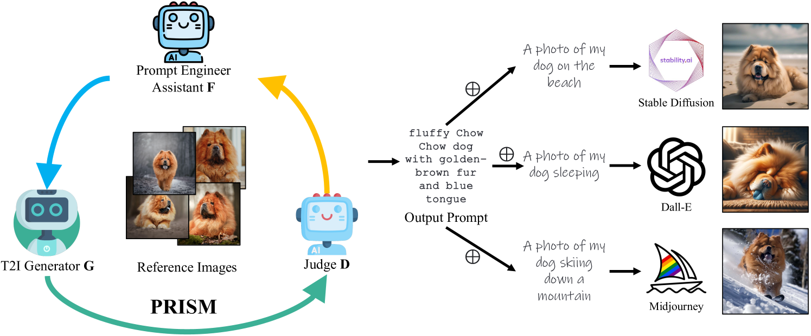

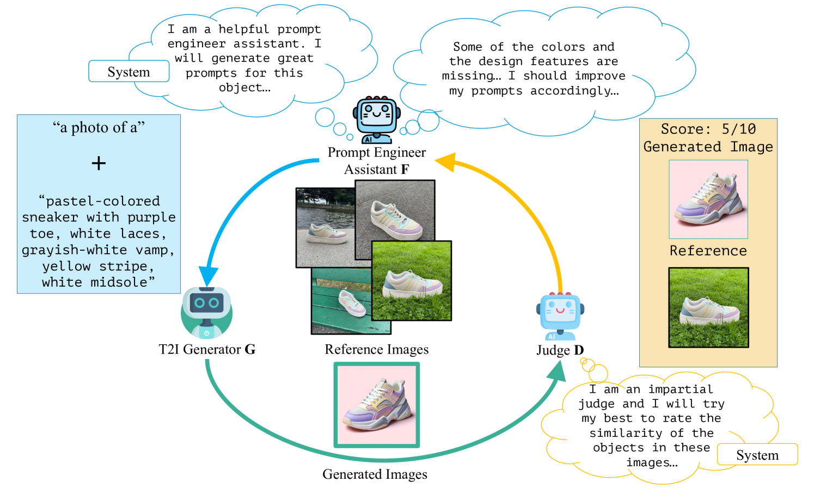

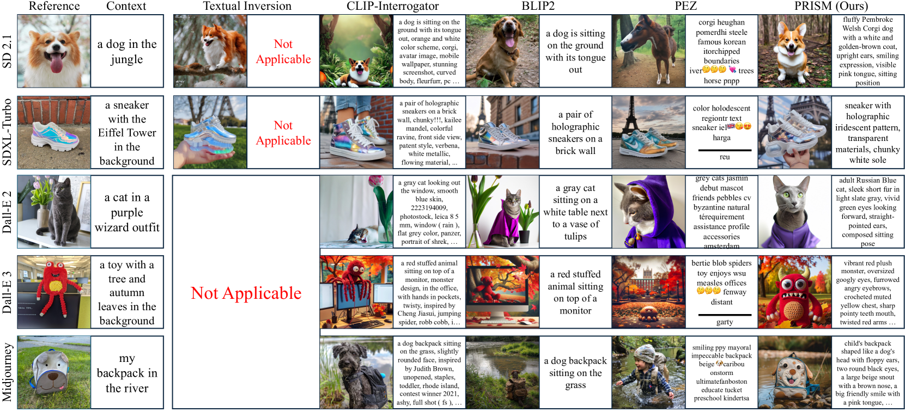

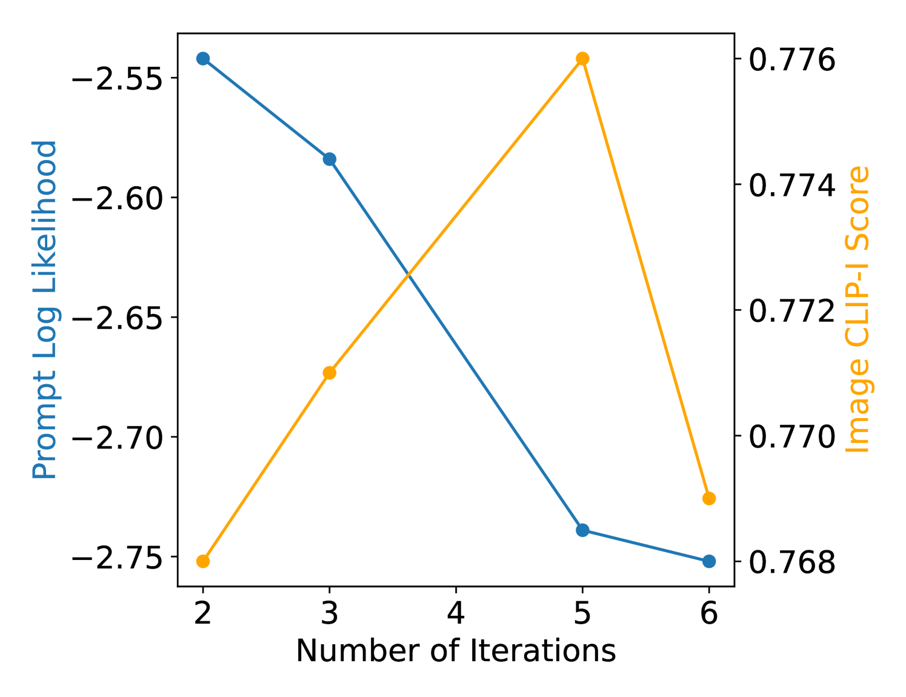

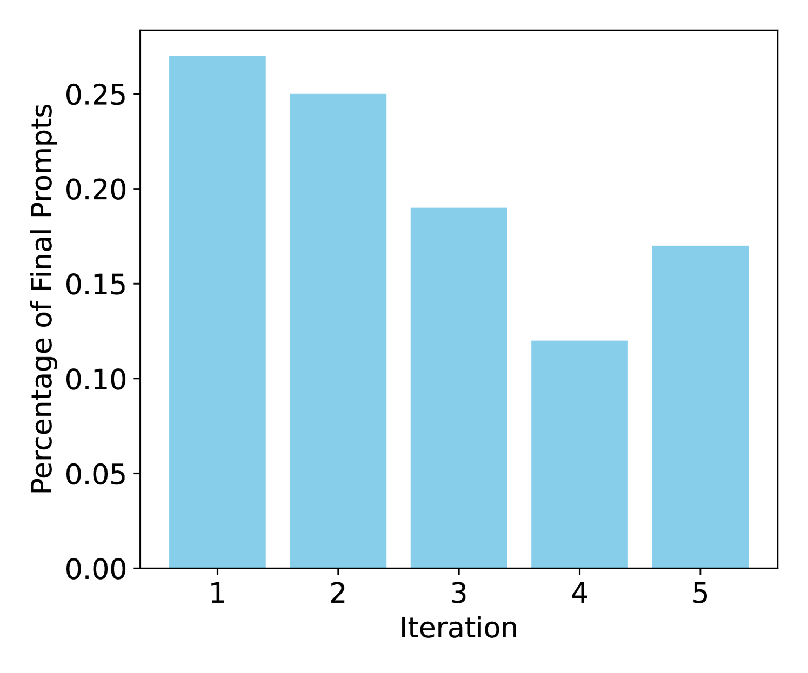

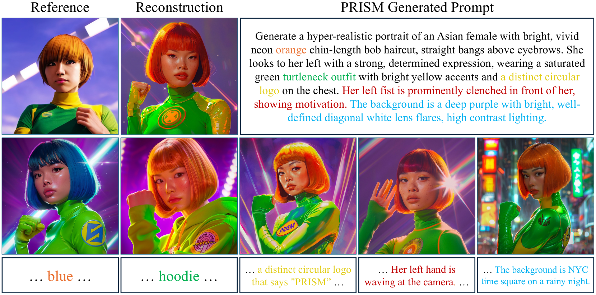

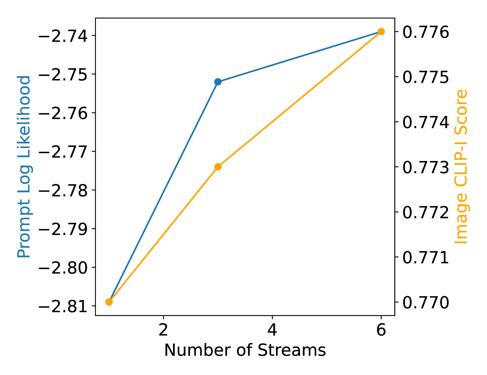

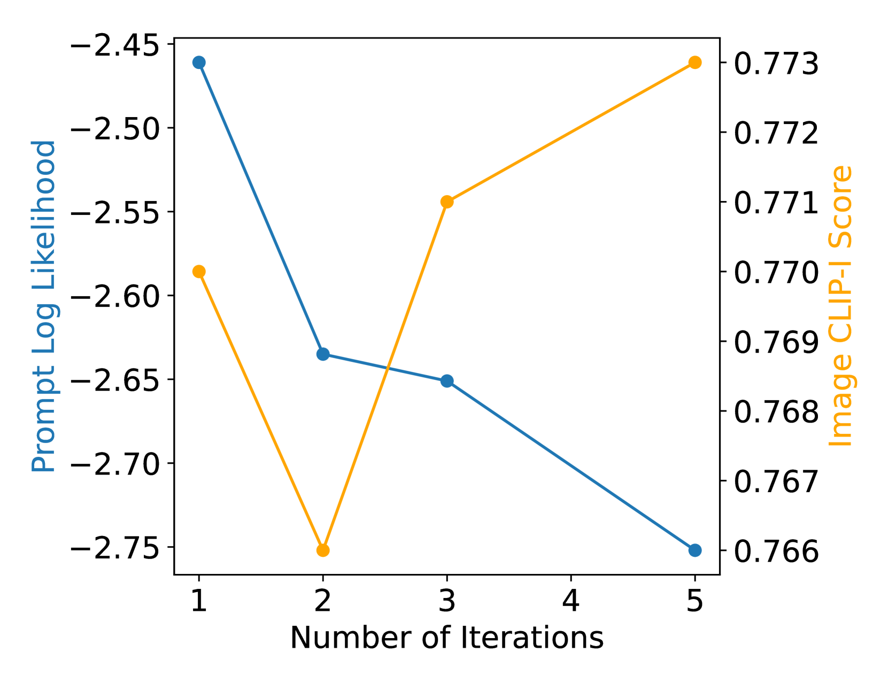

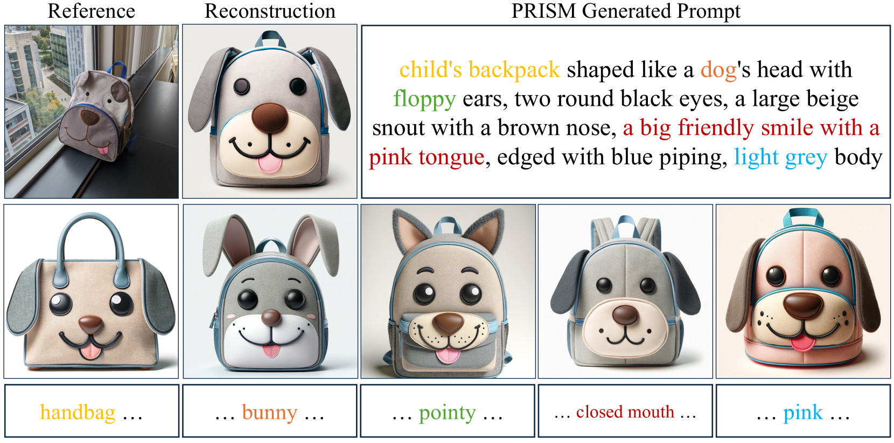

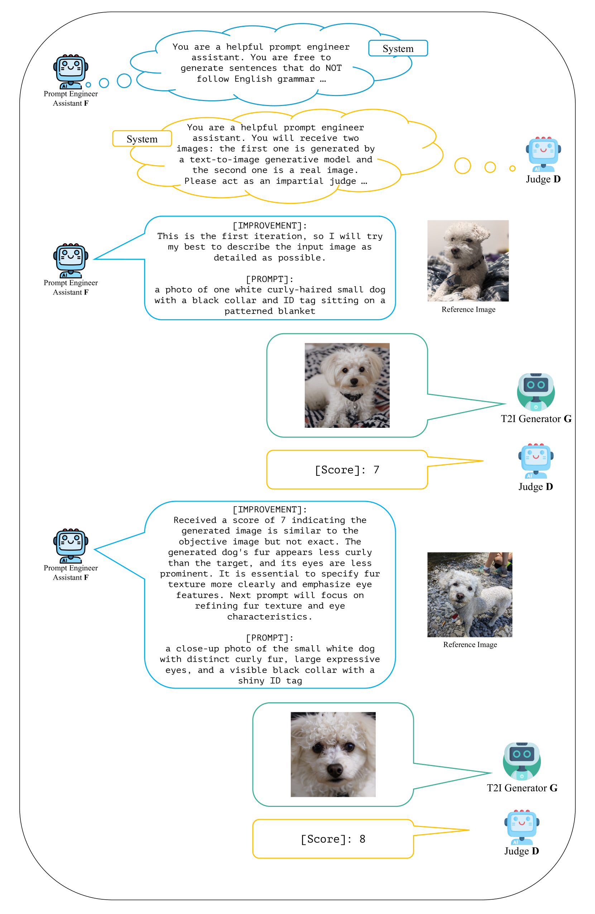

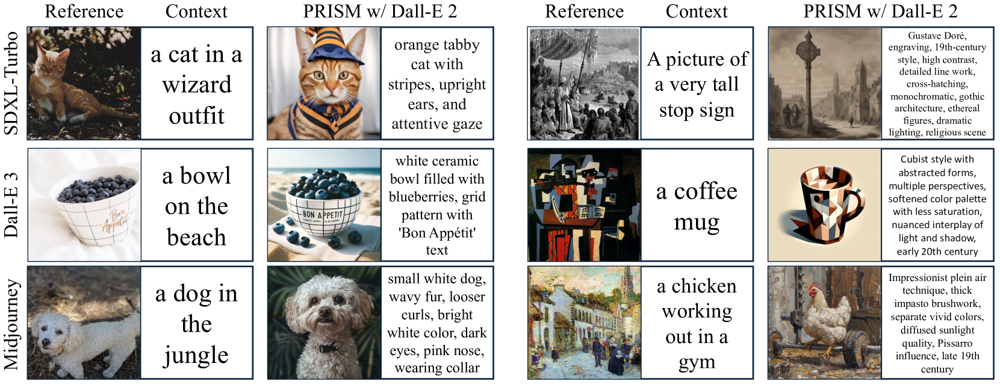

[Arxiv](https://arxiv.org/abs/2403.19103)