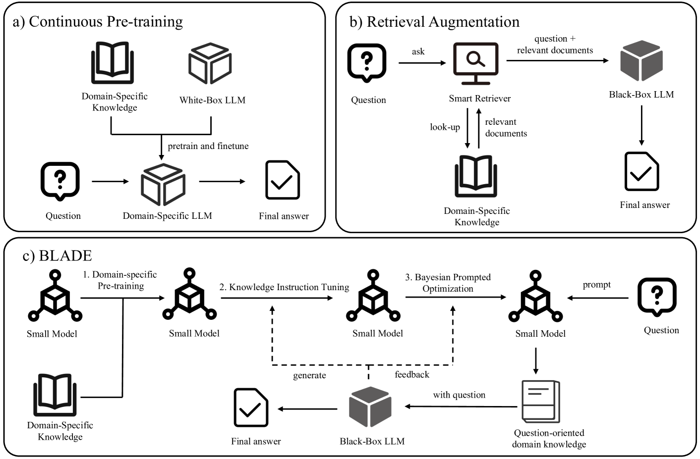
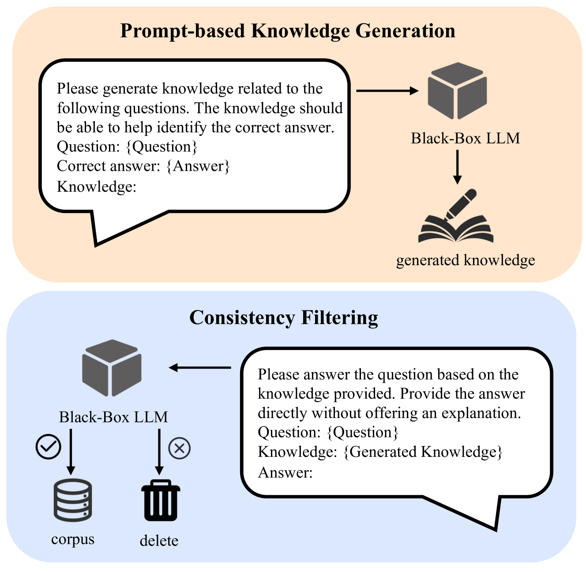
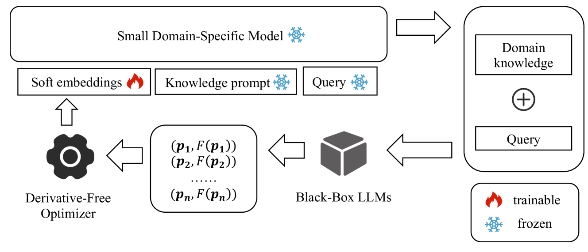
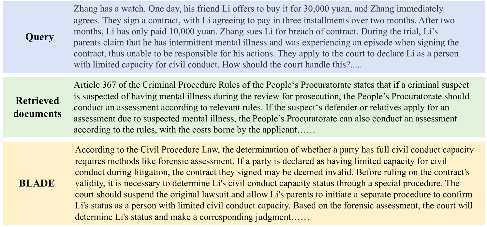

# BLADE 技术：借助小型领域定制模型，提升黑盒式大型语言模型的性能

发布时间：2024年03月27日

`LLM应用`

> BLADE: Enhancing Black-box Large Language Models with Small Domain-Specific Models

# 摘要

> 像ChatGPT和GPT-4这样的大型语言模型（LLMs）多才多艺，能够应对各式各样的任务。但这些基于开放领域数据训练的通用模型，往往缺少像法律、医疗等领域特定任务所需的专业知识。为弥补这一不足，先前的做法不外乎是持续用特定领域数据进行预训练，或是通过检索增强技术来辅助通用模型。遗憾的是，这些策略不是成本过高，就是实用性不足。针对这一挑战，我们引入了一种创新框架——BLADE，它通过引入小型特定领域模型来增强黑盒大型语言模型的能力。BLADE由一个黑盒LLM和一个小规模的特定领域语言模型组成，后者负责保留领域知识并提供专业洞见，而前者则贡献其强大的语言理解和推理能力。我们的方法分为三步走：首先，用特定领域的数据对小型模型进行预训练；其次，利用知识指导数据对模型进行精细调整；最后，通过联合贝叶斯优化，使通用和特定领域的模型达到最佳协同。在公共法律和医疗领域的基准测试中，BLADE的表现远超现有技术，显示出其作为一种高效且经济的解决方案，使通用LLMs能够更好地服务于专业领域的巨大潜力。

> Large Language Models (LLMs) like ChatGPT and GPT-4 are versatile and capable of addressing a diverse range of tasks. However, general LLMs, which are developed on open-domain data, may lack the domain-specific knowledge essential for tasks in vertical domains, such as legal, medical, etc. To address this issue, previous approaches either conduct continuous pre-training with domain-specific data or employ retrieval augmentation to support general LLMs. Unfortunately, these strategies are either cost-intensive or unreliable in practical applications. To this end, we present a novel framework named BLADE, which enhances Black-box LArge language models with small Domain-spEcific models. BLADE consists of a black-box LLM and a small domain-specific LM. The small LM preserves domain-specific knowledge and offers specialized insights, while the general LLM contributes robust language comprehension and reasoning capabilities. Specifically, our method involves three steps: 1) pre-training the small LM with domain-specific data, 2) fine-tuning this model using knowledge instruction data, and 3) joint Bayesian optimization of the general LLM and the small LM. Extensive experiments conducted on public legal and medical benchmarks reveal that BLADE significantly outperforms existing approaches. This shows the potential of BLADE as an effective and cost-efficient solution in adapting general LLMs for vertical domains.

[Arxiv](https://arxiv.org/abs/2403.18365)