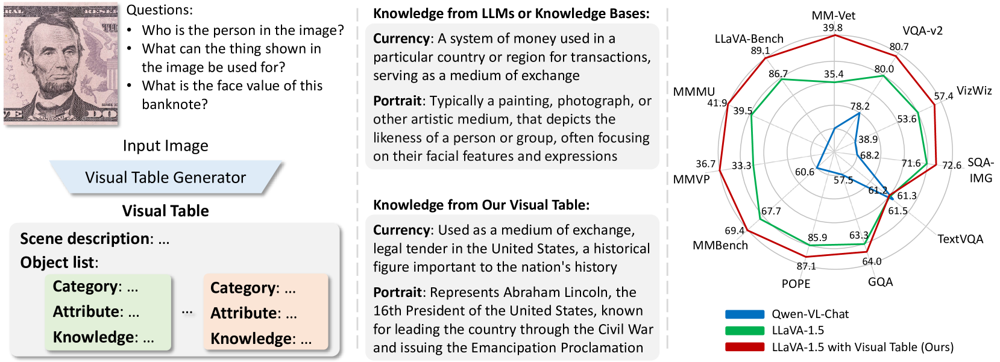
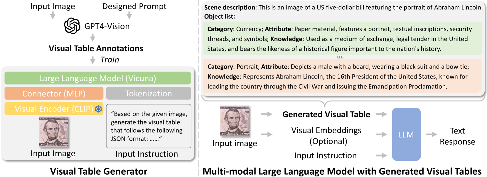
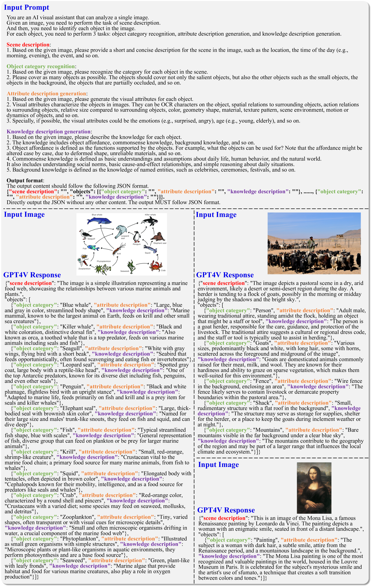

# 跳出嵌入框架：探索视觉表格在多模态模型中的新可能

发布时间：2024年03月27日

`LLM应用` `计算机视觉` `多模态学习`

> Beyond Embeddings: The Promise of Visual Table in Multi-Modal Models

# 摘要

> 视觉表学习作为计算机视觉领域的基础，已从依赖人工标注的监督学习演变为利用互联网上的图文配对。尽管多模态大型语言模型（MLLMs）取得了显著进展，但它们所依赖的视觉表示，例如CLIP嵌入，往往缺失对现实世界视觉推理至关重要的外部知识。本研究提出了一种创新的视觉表表示，专为MLLMs设计。它通过分层文本描述，捕捉整体视觉场景的细节，包括场景描述及针对各个对象的类别、属性和实例级知识。我们还开发了一个可扩展的生成器，用于创建视觉表，并利用GPT4V的小规模注释进行训练。经过广泛评估，我们发现，借助生成的视觉表，模型在多个基准测试中均能稳定超越当前最先进的MLLMs。当视觉表独立作为视觉表示时，模型的表现甚至能与基于CLIP视觉嵌入的顶尖MLLMs相媲美或更优。相关代码已在 https://github.com/LaVi-Lab/Visual-Table 上发布。

> Visual representation learning has been a cornerstone in computer vision, evolving from supervised learning with human-annotated labels to aligning image-text pairs from the Internet. Despite recent advancements in multi-modal large language models (MLLMs), the visual representations they rely on, such as CLIP embeddings, often lack access to external world knowledge critical for real-world visual reasoning. In this work, we propose Visual Table, a novel visual representation tailored for MLLMs. It provides hierarchical text descriptions of holistic visual scenes, consisting of a scene description and multiple object-centric descriptions that encompass categories, attributes, and knowledge at instance level. We further develop a scalable generator for visual table generation and train it on small-scale annotations from GPT4V. Extensive evaluations demonstrate that, with generated visual tables as additional visual representations, our model can consistently outperform the state-of-the-art (SOTA) MLLMs across diverse benchmarks. When visual tables serve as standalone visual representations, our model can closely match or even beat the SOTA MLLMs that are built on CLIP visual embeddings. Our code is available at https://github.com/LaVi-Lab/Visual-Table.

[Arxiv](https://arxiv.org/abs/2403.18252)