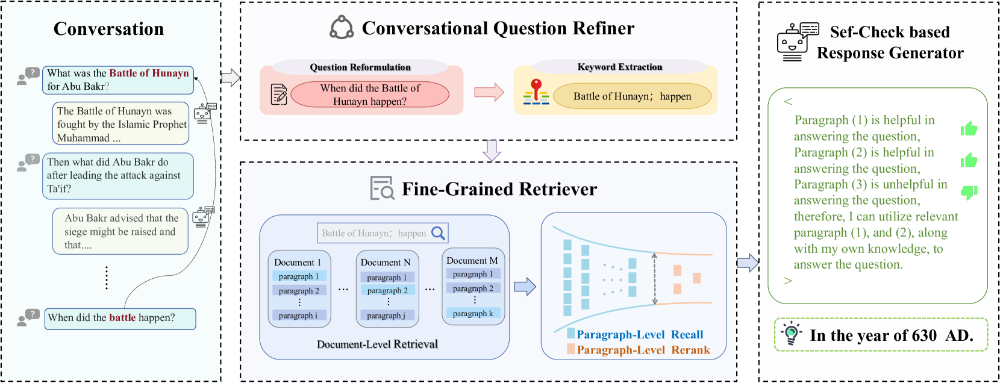

# 借助精确检索增强与自我核查手段，我们可以有效提升对话式问题回答系统的性能。

发布时间：2024年03月27日

`RAG` `对话式问答` `信息检索`

> Boosting Conversational Question Answering with Fine-Grained Retrieval-Augmentation and Self-Check

# 摘要

> 检索增强生成（RAG）致力于通过融合外部的海量且不断更新的知识，提升回答的可靠性与精确度。目前的研究多集中于利用RAG进行单一回合的问答，然而在复杂的对话场景中，如何使RAG适应问题与上下文的相互依赖性，尚未有深入探讨。本文提出了一种针对对话场景的RAG策略，它整合了细致的检索增强和自我校验机制，用于对话式问答（CQA）。具体来说，我们的系统由对话问题优化器、精准检索器和自我校验回应生成器三个部分构成，它们协同作用，以在对话情境中更好地理解问题并获取相关信息。大量实验验证了我们方法相较于现有顶尖技术的优势。此外，我们还推出了一个包含新特性的中文CQA数据集，如重构问题、关键词汇提取、检索文段及其实用性等，为RAG增强的CQA研究提供了便利。

> Retrieval-Augmented Generation (RAG) aims to generate more reliable and accurate responses, by augmenting large language models (LLMs) with the external vast and dynamic knowledge. Most previous work focuses on using RAG for single-round question answering, while how to adapt RAG to the complex conversational setting wherein the question is interdependent on the preceding context is not well studied. In this paper, we propose a conversation-level RAG approach, which incorporates fine-grained retrieval augmentation and self-check for conversational question answering (CQA). In particular, our approach consists of three components, namely conversational question refiner, fine-grained retriever and self-check based response generator, which work collaboratively for question understanding and relevant information acquisition in conversational settings. Extensive experiments demonstrate the great advantages of our approach over the state-of-the-art baselines. Moreover, we also release a Chinese CQA dataset with new features including reformulated question, extracted keyword, retrieved paragraphs and their helpfulness, which facilitates further researches in RAG enhanced CQA.

[Arxiv](https://arxiv.org/abs/2403.18243)