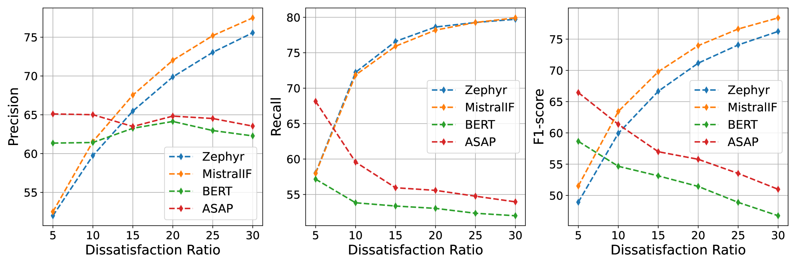
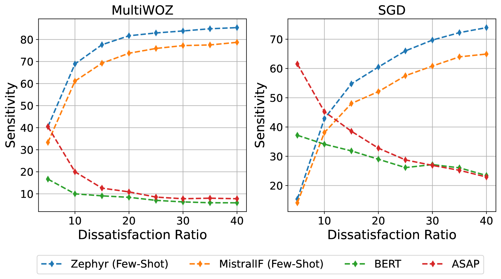

# CAUSE：在任务导向对话系统中，对用户满意度进行反事实评估的研究

发布时间：2024年03月27日

`LLM应用` `对话系统` `用户满意度评估`

> CAUSE: Counterfactual Assessment of User Satisfaction Estimation in Task-Oriented Dialogue Systems

# 摘要

> 在任务导向对话系统用户满意度评估的研究中，我们忽略了一个关键问题：现有评估标准往往只关注用户表示满意的对话，而对用户不满的对话识别能力却鲜有考量。这种数据偏差对模型性能的真实影响还是个未知数。为了平衡数据集，加入更多不满意的对话样本，需要额外的数据搜集和人工标注工作，这不仅成本高昂，而且耗时费力。本研究利用大型语言模型的强大生成能力，创造出能反映用户满意度的对话样本，以此来扩充原始对话集。通过人工审核确保这些生成样本的可信度。我们进一步在扩充后的数据集上，对两个开源的大型语言模型进行用户满意度估计的测试，并与当前最先进的微调模型进行比较。实验结果显示，开源的大型语言模型在处理测试集中不满标签增多的情况下，展现出比微调模型更强的鲁棒性。这一发现强调了在任务导向对话系统中，采用数据增强技术来提高用户满意度估计的重要性。我们还将这些经过人工筛选的反事实对话样本公开，希望能推动这一领域的未来研究。

> An important unexplored aspect in previous work on user satisfaction estimation for Task-Oriented Dialogue (TOD) systems is their evaluation in terms of robustness for the identification of user dissatisfaction: current benchmarks for user satisfaction estimation in TOD systems are highly skewed towards dialogues for which the user is satisfied. The effect of having a more balanced set of satisfaction labels on performance is unknown. However, balancing the data with more dissatisfactory dialogue samples requires further data collection and human annotation, which is costly and time-consuming. In this work, we leverage large language models (LLMs) and unlock their ability to generate satisfaction-aware counterfactual dialogues to augment the set of original dialogues of a test collection. We gather human annotations to ensure the reliability of the generated samples. We evaluate two open-source LLMs as user satisfaction estimators on our augmented collection against state-of-the-art fine-tuned models. Our experiments show that when used as few-shot user satisfaction estimators, open-source LLMs show higher robustness to the increase in the number of dissatisfaction labels in the test collection than the fine-tuned state-of-the-art models. Our results shed light on the need for data augmentation approaches for user satisfaction estimation in TOD systems. We release our aligned counterfactual dialogues, which are curated by human annotation, to facilitate further research on this topic.

[Arxiv](https://arxiv.org/abs/2403.19056)