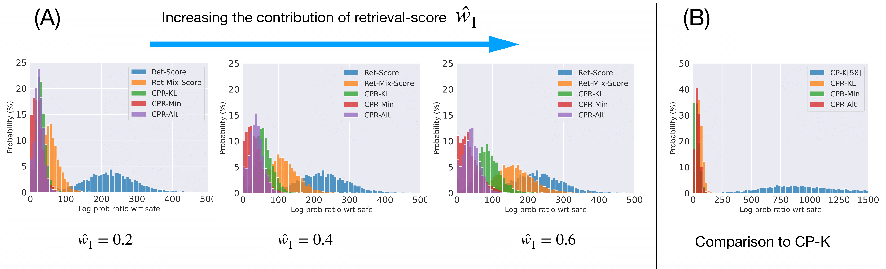
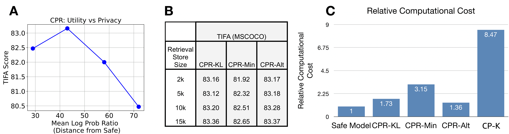

# CPR：结合检索技术的生成模型，助力版权保护

发布时间：2024年03月27日

`RAG` `图像生成` `版权保护`

> CPR: Retrieval Augmented Generation for Copyright Protection

# 摘要

> 检索增强生成（RAG）技术正崭露头角，它能够在无需训练的情况下，让模型适配私人用户数据，处理版权问题，并实现大规模的高效机器遗忘。然而，在图像生成方面，RAG可能导致模型输出中复制了检索样本的部分内容。为了降低私有信息泄露的风险，我们提出了一种新型方法——复制保护生成（CPR），它为扩散模型在混合私有环境中提供了严格的版权保护。CPR能够在一组检索图像的基础上生成输出，同时确保不会泄露这些示例的独特可识别信息。它通过在推理阶段合并公共和私有分布的扩散分数，从两者的混合分布中进行采样。我们证实，CPR符合近无访问性（NAF）原则，有效限制了潜在攻击者从生成图像中提取信息的能力。我们提供了两种版权保护算法：CPR-KL和CPR-Choose。与以往的基于拒绝采样的NAF方法不同，我们的方法通过单次反向扩散过程，高效实现了版权保护采样。我们的方法适用于任何预训练的条件扩散模型，例如Stable Diffusion或unCLIP。实际上，我们在unCLIP上应用CPR后，不仅提升了生成图像的质量和文本对图像的准确对齐（TIFA基准测试得分从81.4提升至83.17），还实现了版权归属、保护以及确定性、快速的遗忘功能。

> Retrieval Augmented Generation (RAG) is emerging as a flexible and robust technique to adapt models to private users data without training, to handle credit attribution, and to allow efficient machine unlearning at scale. However, RAG techniques for image generation may lead to parts of the retrieved samples being copied in the model's output. To reduce risks of leaking private information contained in the retrieved set, we introduce Copy-Protected generation with Retrieval (CPR), a new method for RAG with strong copyright protection guarantees in a mixed-private setting for diffusion models.CPR allows to condition the output of diffusion models on a set of retrieved images, while also guaranteeing that unique identifiable information about those example is not exposed in the generated outputs. In particular, it does so by sampling from a mixture of public (safe) distribution and private (user) distribution by merging their diffusion scores at inference. We prove that CPR satisfies Near Access Freeness (NAF) which bounds the amount of information an attacker may be able to extract from the generated images. We provide two algorithms for copyright protection, CPR-KL and CPR-Choose. Unlike previously proposed rejection-sampling-based NAF methods, our methods enable efficient copyright-protected sampling with a single run of backward diffusion. We show that our method can be applied to any pre-trained conditional diffusion model, such as Stable Diffusion or unCLIP. In particular, we empirically show that applying CPR on top of unCLIP improves quality and text-to-image alignment of the generated results (81.4 to 83.17 on TIFA benchmark), while enabling credit attribution, copy-right protection, and deterministic, constant time, unlearning.

[Arxiv](https://arxiv.org/abs/2403.18920)